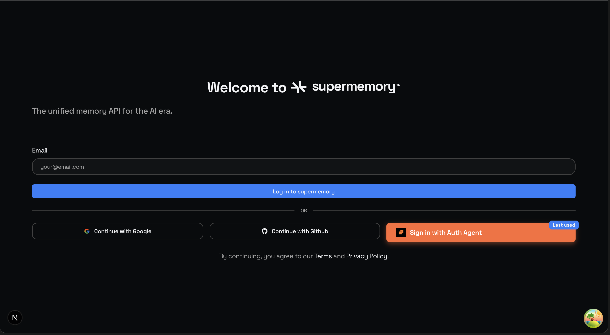

# Auth Agent OAuth Integration for Supermemory

<p align="center">
  
</p>

This PR adds [Auth Agent](https://auth-agent.com) OAuth 2.1 authentication to Supermemory, enabling AI agents to authenticate and access the platform.

## Why Auth Agent for Supermemory?

**Enable AI agents to autonomously manage memories on behalf of users.**

Instead of users manually adding memories, AI agents can:
- ✅ **Automatically dump memories** from conversations, browsing sessions, or workflows
- ✅ **Query and retrieve** memories for the user
- ✅ **Organize and tag** memories intelligently
- ✅ **Sync memories** across different contexts and platforms
- ✅ **Share memories** between users and their AI assistants

### Use Cases

1. **Automated Memory Collection**: Agents can add memories from web browsing, emails, meetings
2. **Intelligent Search**: Agents can query Supermemory to recall information for users
3. **Memory Management**: Agents can organize, tag, and curate memories
4. **Context Sharing**: Users can grant their AI assistants access to their memory store
5. **Agent-Specific Memories**: Scenario 3 allows agents to have their own memory store

## What is Auth Agent?

Auth Agent is an OAuth 2.1 authentication system specifically designed for AI agents. It allows AI agents (like Claude, GPT, Gemini) to securely authenticate with your application using industry-standard OAuth with PKCE.

## Implementation Overview

This PR implements **Scenario 1: Full Account Access** as a starting point. This allows agents to act on behalf of users with full access to their Supermemory account.

**However, you may want to consider other scenarios:**

### 📋 Integration Scenarios

| Scenario | Description | Best For |
|----------|-------------|----------|
| **Scenario 1: Full Account Access** *(Implemented)* | Agent uses user's existing account | Simple integration, agent acts as user |
| **Scenario 2: Contextual Profile** | Separate agent profile linked to user | Audit trail, agent reads user context |
| **Scenario 3: Fresh Profile** | Independent agent profile | Agent-specific memories, privacy |

** You can choose a different scenario or modify this implementation.**

See the [Auth Agent Integration Scenarios Guide](https://docs.auth-agent.com/guides/website-quickstart) for detailed comparison and implementation examples.

### What's Included in This PR

✅ **Official Auth Agent SDK Button** (`auth-agent-sdk@0.0.4`)
✅ **Complete OAuth 2.1 Flow with PKCE**
✅ **Token Exchange & User Info Retrieval**
✅ **Proper Error Handling**
✅ **Environment Variable Configuration**
✅ **Middleware Integration for Session Management**

## ⚠️ Important: This is a Starting Point

**This integration is functional but requires customization for your needs:**

1. ✏️ **Complete Better Auth Integration** - Link agent sessions to your auth system
2. 🔧 **Choose Your Scenario** - You may want Scenario 2 or 3 instead
3. 📝 **Add Audit Logging** - Track agent actions for security
4. 🔐 **Implement Permissions** - Control what agents can access
5. 🎨 **Customize UX** - Decide how to present agent auth to users
6. 🧪 **Test Thoroughly** - Verify security and functionality

**Feel free to modify anything to fit your architecture and requirements!**

## Setup Instructions

### 1. Register OAuth Client

1. Visit [https://auth-agent.com/console/website](https://auth-agent.com/console/website)
2. Click "Register New Client"
3. Provide:
   - **Client name**: "Supermemory"
   - **Redirect URIs**:
     - Production: `https://app.supermemory.ai/api/auth/auth-agent/callback`
     - Development: `http://localhost:3001/api/auth/auth-agent/callback`
4. Save your `client_id` and `client_secret` securely

### 2. Configure Environment Variables

Add to your `.env.local`:

```bash
# Auth Agent OAuth Configuration
NEXT_PUBLIC_AUTH_AGENT_ENABLED=true
NEXT_PUBLIC_AUTH_AGENT_CLIENT_ID=your_client_id_here
AUTH_AGENT_CLIENT_SECRET=your_client_secret_here
NEXT_PUBLIC_AUTH_AGENT_SERVER_URL=https://api.auth-agent.com
```

**Security Note**: Never commit `AUTH_AGENT_CLIENT_SECRET` to version control!

### 3. Complete Better Auth Integration

The callback handler includes TODO comments showing where to integrate with Better Auth. See `apps/web/app/api/auth/auth-agent/callback/route.ts` lines 102-121.

**You will need to:**
- Find or create users by email
- Create Better Auth sessions
- Store agent metadata (agentId, model) for audit logging
- Decide on permission model

### 4. Consider Other Scenarios

Review the [integration scenarios](https://docs.auth-agent.com/guides/website-quickstart) and decide if you want:
- **Scenario 2**: Separate agent profiles with read access to user data
- **Scenario 3**: Completely independent agent profiles for agent-specific memories

## How It Works (Current Implementation)

1. User clicks "Sign in with Auth Agent" button
2. Redirected to Auth Agent authorization page with PKCE
3. Agent authenticates automatically
4. Callback receives authorization code
5. Exchange code for access token
6. Call `/userinfo` to get user email
7. Find/create user in database
8. Create Better Auth session
9. Redirect to dashboard

## Files Changed

### Added
- `apps/web/app/api/auth/auth-agent/callback/route.ts` - OAuth callback handler (Scenario 1)
- `packages/ui/button/auth-agent-button.tsx` - Official SDK button re-export
- `AUTH_AGENT_INTEGRATION.md` - This documentation

### Modified
- `apps/web/.env.example` - Added Auth Agent environment variables
- `apps/web/app/layout.tsx` - Minor layout adjustments
- `apps/web/middleware.ts` - Added Auth Agent session recognition
- `packages/lib/auth-context.tsx` - Added Auth Agent session support
- `packages/ui/pages/login.tsx` - Added Auth Agent button
- `package.json` - Added `auth-agent-sdk@0.0.4` dependency

## Testing

### Manual Testing
1. Configure environment variables
2. Start dev server: `bun run dev`
3. Navigate to `http://localhost:3001/login`
4. Click "Sign in with Auth Agent"
5. Observe OAuth flow and callback handling

### Testing with AI Agents
Use [browser-use](https://github.com/browser-use/browser-use) or similar tools to test with actual AI agents.

## Production Deployment Checklist

- [ ] Register production OAuth client
- [ ] Add production redirect URI
- [ ] Set environment variables in production
- [ ] Complete Better Auth integration
- [ ] Choose final scenario (1, 2, or 3)
- [ ] Implement permission controls
- [ ] Add audit logging for agent actions
- [ ] Test with real AI agents (Claude, GPT, etc.)
- [ ] Update user documentation
- [ ] Security review

## Customization Ideas

### Switch to Scenario 2 (Contextual Profile)
If you want agents to have separate profiles but access user context:
- Modify callback to create agent profiles instead of direct user sessions
- Implement read-access permissions for user data
- Add agent attribution to actions

### Switch to Scenario 3 (Fresh Profile)
If you want agents to have their own independent memory store:
- Remove `/userinfo` call from callback
- Extract agent ID from JWT token
- Create independent agent accounts
- Perfect for "AI agent memory" feature!

### Add Permission System
- Create `agent_permissions` table
- Define what agents can/cannot do (read, write, delete)
- Implement permission checks in API routes

### Add Audit Logging
- Log all agent actions with agent ID
- Track memory additions, queries, modifications
- Show users what their agent has done

## Resources

- **Auth Agent Docs**: https://docs.auth-agent.com
- **Website Quickstart**: https://docs.auth-agent.com/guides/website-quickstart *(Must read!)*
- **API Reference**: https://docs.auth-agent.com/api-reference
- **Console**: https://auth-agent.com/console

## Support

If you have questions about this integration:
1. Review the [Auth Agent Documentation](https://docs.auth-agent.com)
2. Open an issue in the Auth Agent repository

---

**Note**: This implementation uses Scenario 1 as a starting point. I've done my best to provide a solid foundation, but you should review and customize it to fit Supermemory's specific architecture, security requirements, and use cases. The Auth Agent docs have excellent guides for all three scenarios!
