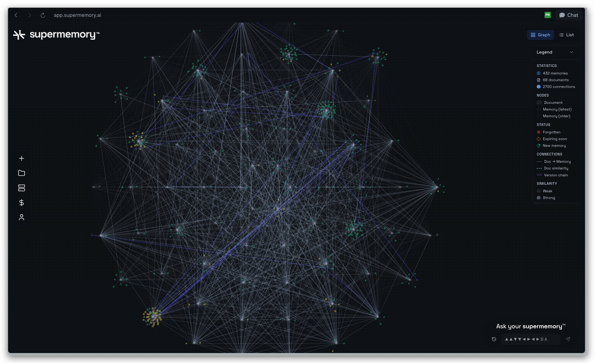
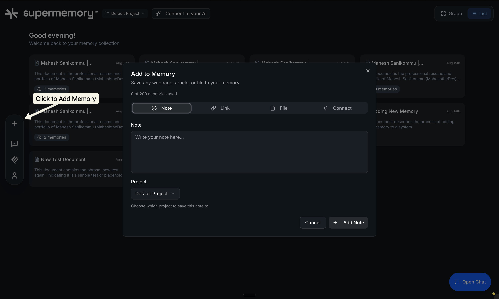
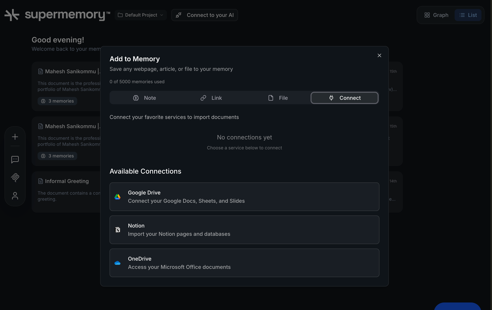
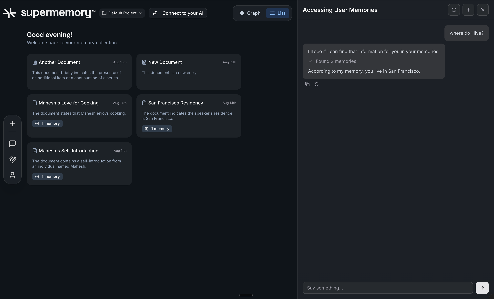

  <picture>
    <source srcset="apps/web/public/logo-fullmark.svg" media="(prefers-color-scheme: dark)">
    <source srcset="apps/web/public/logo-light-fullmark.svg" media="(prefers-color-scheme: light)">
    
  </picture>
    
  <em>Your AI second brain for saving and organizing everything that matters.</em>
    
  
  &nbsp;
  
  &nbsp;
  
  &nbsp;
  

    <strong>Building with Supermemory?</strong> Check out the <a href="https://console.supermemory.ai?utm_source=github&utm_medium=readme&utm_campaign=consumer_app">Developer Console</a> and <a href="https://docs.supermemory.ai?utm_source=github&utm_medium=readme&utm_campaign=consumer_app">Documentation</a> for API access.

    <strong>Want to self-host?</strong> See our <a href="https://supermemory.ai/docs/deployment/self-hosting#self-hosting">Self-Hosting Guide</a> for enterprise deployment options.

 

  

## Features

### Core Functionality

- **[Add Memories from Any Content](#add-memory)**: Easily add memories from URLs, PDFs, and plain text—just paste, upload, or link.
- **[Chat with Your Memories](#chat-memories)**: Converse with your stored content using natural language chat.
- **[Supermemory MCP Integration](#mcp-integration)**: Seamlessly connect with all major AI tools (Claude, Cursor, etc.) via Supermemory MCP.
- **[Browser Extension](#browser-extension)**: Save memories directly from your browser with integrations for ChatGPT, Claude, and Twitter/X.
- **[Raycast Extension](#raycast-extension)**: Add and search memories directly from Raycast with keyboard shortcuts.

## How do I use this?

Go to [app.supermemory.ai](https://app.supermemory.ai) and sign in with your account

1. Start Adding Memory with your choice of format (Note, Link, File)

  

2. You can also Connect to your favourite services (Notion, Google Drive, OneDrive)

  

3. Once Memories are added, you can chat with Supermemory by clicking on "Open Chat" and retrieve info from your saved memories

  

4. Add MCP to your AI Tools (by clicking on "Connect to your AI" and select the AI tool you are trying to integrate)

  

5. **Browser Extension**: Install the [Chrome/Edge extension](https://chromewebstore.google.com/detail/supermemory/afpgkkipfdpeaflnpoaffkcankadgjfc) to save memories directly from any webpage, integrate with ChatGPT and Claude conversations, and import from Twitter/X. Right-click on any content or use the extension popup to save memories instantly.

6. **Raycast Extension**: Install the [Raycast extension](https://www.raycast.com/supermemory/supermemory) to add and search memories directly from Raycast. Use the "Add Memory" command to quickly save content, or "Search Memories" to find and retrieve your saved information with keyboard shortcuts.

## Support

Have questions or feedback? We're here to help:

- Email: [support@supermemory.com](mailto:support@supermemory.com)
- Discord: [Join our Discord server](https://supermemory.link/discord)
- Documentation: [docs.supermemory.ai](https://docs.supermemory.ai)

## Contributing

We welcome contributions from developers of all skill levels! Whether you're fixing bugs, adding features, or improving documentation, your help makes supermemory better for everyone.

For detailed guidelines, development setup, coding standards, and the complete contribution workflow, please see our [**Contributing Guide**](CONTRIBUTING.md).

### Ways to Contribute

- 🐛 **Bug fixes** - Help us squash those pesky issues
- ✨ **New features** - Add functionality that users will love
- 🎨 **UI/UX improvements** - Make the interface more intuitive
- ⚡ **Performance optimizations** - Help us make supermemory faster

Check out our [Issues](https://github.com/supermemoryai/supermemory/issues) page for `good first issue` and `help wanted` labels to get started!

## Updates & Roadmap

Stay up to date with the latest improvements:

- [Changelog](https://docs.supermemory.ai/changelog/overview)
- [X](https://x.com/supermemoryai).
