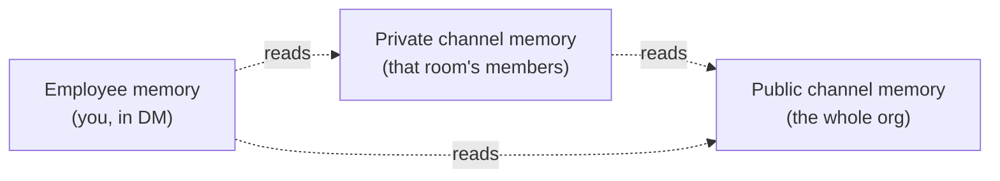

Company Brain isn't split into "a shared brain" and "a private brain." It's a graph: memory is written to the narrowest room a conversation happened in, and what a given conversation can *read* depends on where it's happening and who's asking. Nothing here is silent — every install, channel read, and temporary access grant requires an explicit accept from a real person.

## Three memories, not two

<CardGroup cols={3}>
  <Card title="Employee memory" icon="user">
    One per person. Built from your DMs with the bot and what it learns about you over time. Only visible from your own DM.
  </Card>
  <Card title="Private channel memory" icon="lock">
    One per private channel. Scoped to that room — visible to anyone in it, to no one outside it.
  </Card>
  <Card title="Public channel memory" icon="hash">
    One per organization. Anything durable from a public channel lands here. The whole org can draw on it.
  </Card>
</CardGroup>

A message writes to exactly one of these — whichever room it happened in.

## What a conversation can read

Writing is narrow; reading is broader, and it widens the more private the room is:

| Asking from | Can read |
|---|---|
| A public channel | Public channel memory |
| A private channel | That channel's memory + public channel memory |
| A DM with the bot | Your employee memory + public channel memory + every private channel memory you belong to |

A DM is the widest seat in the room precisely because it's the most private one — the bot answers you there with everything *you* could see, stitched together. A public channel is the opposite: the whole org can read it, so it only ever draws on what the whole org is allowed to know.

<Note>
If you're not in a private channel, its memory doesn't exist for you — not even by inference in a DM. The bot only ever reads with the asker's own access, so it can't surface something you couldn't otherwise see.
</Note>

**Example:** you DM the bot asking "what did we decide about the Acme deal?" It can draw on the public `#sales` channel, the private `#acme-deal` channel if you're in it, and anything it's learned about you directly — and it'll cite which one the answer came from. Ask the same question in `#general`, a public channel, and it can only answer from what `#general` and other public channels already know — the private `#acme-deal` context simply isn't in scope there.

## Tool access follows you, not the connection

Tools like GitHub and Linear can be connected two ways — **Organization (shared)**, set up once by an admin as a fallback the whole team can read from, or **Personal (yours)**, your own connection for your own reads and actions. Both show up on the same connections page; it's one tool catalog, connected at two possible scopes.

Whichever scope answered, the result is still bounded by what *you* could already see or do in that tool yourself — Company Brain never gets a standing key to "everything Linear knows." If you're not on a private Linear team, the bot can't surface those issues to you either, even through the org-shared connection.

| | Reads | Writes |
|---|---|---|
| **Behavior** | Try your personal connection first, then fall back to org-shared | Always run under your own connection |
| **Why** | Gives you the fullest access you're entitled to | Attributes the action to a real person, never a shared service account |

Admins can also act through the org-shared connection directly, for the cases where that's the point.

## Leasing: borrowing access for one request

Sometimes a request needs a tool neither you nor the org has connected — but a teammate has it connected personally. Rather than failing, Company Brain can ask that teammate directly: it posts a card in Slack asking them to approve or deny lending access for that one request.

- Nothing is granted silently — a real person has to accept the card.
- Access is short-lived and scoped to the single request that triggered it, not standing access to your account.
- The teammate can say no, and the request simply doesn't go through.

<Note>
Leasing is a fallback of last resort — it only comes up when nobody's connected the tool at the org level yet. See [Connectors](/company-brain/connectors) to close that gap for good.
</Note>

## API keys inherit the same graph

A scoped or agent API key can only reach what its owner could already reach by asking directly. A member can't mint a key that reads another member's employee memory or a private channel they're not in — the graph above applies identically whether a person is asking or a key is.

<CardGroup cols={2}>
  <Card title="Connectors" icon="plug" href="/company-brain/connectors">
    Set up the data and tool connections this page describes.
  </Card>
  <Card title="Automations & proactiveness" icon="wand-magic-sparkles" href="/company-brain/automations">
    How scheduled runs and unprompted replies respect the same graph.
  </Card>
</CardGroup>
