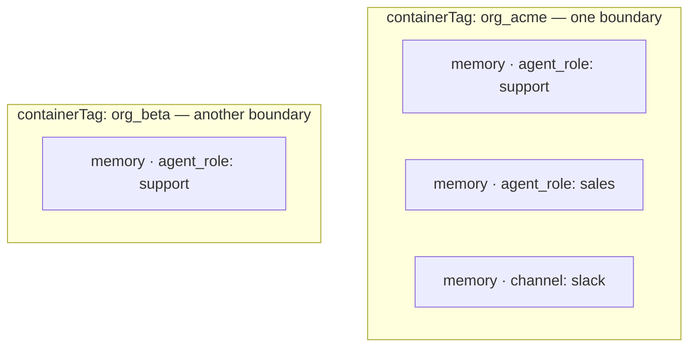

Almost every multi-tenancy question about supermemory has the same answer: give each tenant one container tag, put every other dimension in metadata, and mint scoped API keys so nothing you don't control can cross the line. This page shows you how to design that — and how to avoid the two mistakes almost everyone makes first.

Here's the shape of a correctly scoped write:

<CodeGroup>

```typescript TypeScript
import Supermemory from "supermemory";

const client = new Supermemory({ apiKey: process.env.SUPERMEMORY_API_KEY });

// POST /v3/documents
await client.add({
  content: "Sarah's being promoted to VP of Product in March",
  containerTag: "user_4f8a",              // the isolation boundary
  metadata: {
    agent_role: "hr-assistant",           // dimensions live here,
    channel: "slack",                     // never in the tag
  },
});
```

```python Python
from supermemory import Supermemory

client = Supermemory()

client.add(
    content="Sarah's being promoted to VP of Product in March",
    container_tag="user_4f8a",
    metadata={
        "agent_role": "hr-assistant",
        "channel": "slack",
    },
)
```

```bash cURL
curl -X POST "https://api.supermemory.ai/v3/documents" \
  -H "Authorization: Bearer $SUPERMEMORY_API_KEY" \
  -H "Content-Type: application/json" \
  -d '{
    "content": "Sarah'\''s being promoted to VP of Product in March",
    "containerTag": "user_4f8a",
    "metadata": { "agent_role": "hr-assistant", "channel": "slack" }
  }'
```

</CodeGroup>

The first write with a new tag creates the container automatically — there's nothing to provision. (The console calls a container a *space*; same thing. This page says container tag throughout.)

## The rule: tags isolate, metadata describes

A **container tag** is a hard data boundary. Each tag maps to its own namespace — memories, graph, and profile for one tag are stored and searched separately from every other tag. There is no shared index with a filter on top, which is why isolation is structural rather than best-effort: a search in `user_4f8a` physically cannot return `user_9c21`'s memories.

**Metadata** is how you slice *within* a boundary. Agent role, channel, deal stage, document source — these are dimensions of one tenant's data, and you filter on them at read time and write time.



So the decision procedure is one question: **would it ever be a data leak for these two things to see each other?** If yes, they're different container tags. If no — you'd merely like to filter them apart sometimes — it's metadata.

Two consequences worth internalizing:

- **Each container gets its own profile.** The [profile](/concepts/user-profiles) samples the container it belongs to, so per-user containers give you per-user derived understanding for free.
- **Search never crosses containers.** When you genuinely need results from two boundaries, you run [parallel queries and merge](#search-across-containers) — you don't widen the boundary.

Tags are opaque strings you choose: up to 100 characters, matching `^[a-zA-Z0-9_:-]+$`. Colons are allowed so you can build hierarchical tags like `org:acme:user:4f8a`. Derive tags deterministically from IDs you already have, so you can always reconstruct the right tag at query time without a lookup.

## Two anti-patterns that look right

Both of these come up constantly, and both fail quietly instead of loudly.

### One container per agent role

If you run a support agent and a sales agent for the same customer, it's tempting to write `containerTag: "support-agent"` and `containerTag: "sales-agent"`. Now the customer tells your support agent they're migrating off Postgres — and your sales agent, searching its own container, has never heard of it. You've built handoff silos: each agent remembers its own conversations and nothing else, because containers don't share anything by design.

Agent role is a dimension, not a boundary. The fix:

```typescript
// one container per tenant, role as metadata
await client.add({
  content: "Customer confirmed they're migrating off Postgres by Q3",
  containerTag: "org_acme",
  metadata: { agent_role: "support" },
});

// the sales agent reads the same container — optionally filtered
const results = await client.search.memories({
  q: "database migration plans",
  containerTag: "org_acme",
});
```

Every agent working for one tenant shares that tenant's container. The full pattern — filtered reads per role, handoff summaries — is in [the multi-agent recipe below](#multi-agent-handoff).

### Tagging with the wrong user ID

The other failure mode: your writes and reads derive the tag from *different* IDs. A common version is an auth provider mismatch — your ingestion path tags with the Clerk user ID (`user_2abc…`) while your search path uses your internal database ID. Both are valid tags, so nothing errors. Searches return zero results, writes vanish into a container nobody reads, and there's no exception anywhere to catch.

Pick one canonical ID per tenant, wrap tag construction in a single function, and use it on both paths:

```typescript
// the only place in your codebase that builds a tag
const memoryTag = (userId: string) => `user_${userId}`;
```

If you're seeing empty results for a user who definitely has memories, this is the first thing to check: list their documents with the tag your *write* path uses and compare.

## Enforce the boundary with scoped keys

Here's the question every security review asks: `containerTag` is a request parameter — **what stops a malicious developer (or a compromised client, or a prompt-injected agent) from changing it to someone else's tag?**

If the caller holds your org-wide API key: nothing. That key can read and write every container in your org. That's not a flaw in tags — it's what an org-wide key *is*. The rule that follows: your org key stays on your server, and anything closer to the user gets a **scoped key** instead.

A scoped key is bound to a container tag at creation — the API also accepts an array for keys that span a few containers, but one key per tenant is the pattern that keeps boundaries auditable. Mint one from your server:

```bash
# POST /v3/auth/scoped-key — call this with your org key, server-side
curl -X POST "https://api.supermemory.ai/v3/auth/scoped-key" \
  -H "Authorization: Bearer $SUPERMEMORY_API_KEY" \
  -H "Content-Type: application/json" \
  -d '{
    "containerTag": "user_4f8a",
    "expiresInDays": 30
  }'
```

The response includes the key and what it's allowed to touch:

```json
{
  "key": "sm_orgId_...",
  "id": "key-id",
  "name": "scoped_user_4f8a",
  "containerTag": "user_4f8a",
  "expiresAt": "2026-08-16T00:00:00.000Z",
  "allowedEndpoints": ["/v3/documents", "/v3/memories", "/v4/memories", "/v4/conversations", "/v3/search", "/v4/search", "/v4/profile", "…"]
}
```

The scoped key works like a normal API key, with the boundary enforced at the data layer:

- A request naming any other container tag gets `403 Forbidden`.
- A request that omits the tag is also rejected with a 403 — a scoped key must name its own container on every call, so there's no ambiguous default to get wrong.
- The key only reaches data endpoints — no account, billing, or key-management routes.

So the answer to the security review, in print: the malicious developer can change the parameter, and the API refuses the request. The boundary doesn't depend on your application code being correct — it depends on which key the caller holds.

The standard production pattern is to mint a scoped key per user session and hand it to the client, which then talks to supermemory directly. Set `expiresInDays` so leaked keys age out, and revoke immediately with `DELETE /v3/auth/scoped-key/:id` when you need to. Full parameters (rate limit overrides, naming) are in the [authentication reference](/authentication).

<Note>
Organization members can also be restricted to specific container tags in the console — the same 403 behavior, applied to humans instead of keys.
</Note>

## Filter writes and reads inside a container

Metadata works in both directions: it filters what comes back, and it scopes what context new memories are built from.

**Filtered reads** are the familiar half — pass `filters` to search:

<CodeGroup>

```typescript TypeScript
// POST /v4/search
const results = await client.search.memories({
  q: "what did the customer commit to?",
  containerTag: "org_acme",
  filters: {
    AND: [{ key: "agent_role", value: "sales" }],
  },
});
```

```python Python
results = client.search.memories(
    q="what did the customer commit to?",
    container_tag="org_acme",
    filters={"AND": [{"key": "agent_role", "value": "sales"}]},
)
```

```bash cURL
curl -X POST "https://api.supermemory.ai/v4/search" \
  -H "Authorization: Bearer $SUPERMEMORY_API_KEY" \
  -H "Content-Type: application/json" \
  -d '{
    "q": "what did the customer commit to?",
    "containerTag": "org_acme",
    "filters": { "AND": [{ "key": "agent_role", "value": "sales" }] }
  }'
```

</CodeGroup>

**Filtered writes** are the half people miss. By default, when you add content, supermemory uses the existing memories in the container as context for deriving new ones. In a container holding many deals, clients, or projects, that means notes about deal A can get interpreted against deal B's history — cross-deal pollution. `filterByMetadata` scopes the context. It's a REST parameter today — the TypeScript SDK typings don't expose it yet, so pass it on the endpoint directly:

```bash
curl -X POST "https://api.supermemory.ai/v3/documents" \
  -H "Authorization: Bearer $SUPERMEMORY_API_KEY" \
  -H "Content-Type: application/json" \
  -d '{
    "content": "Hartwell wants the renewal moved to net-60 terms",
    "containerTag": "org_acme",
    "metadata": { "deal": "hartwell-renewal" },
    "filterByMetadata": { "deal": "hartwell-renewal" }
  }'
```

The document's own metadata is written normally — `filterByMetadata` only controls which *existing* memories inform the new ones: scalar values match exactly, and array values match any.

One gotcha to know before it bites you: **metadata lives on documents, not on derived memories.** Memory search results won't carry metadata unless you ask for the source documents — pass `include: { documents: true }` when you need it. And if you want to steer *what gets extracted* per container (not what's retrieved), that's `entityContext` — covered in [customization](/concepts/customization).

The full filter grammar — operators, negation, nesting, limits — lives in [hybrid search](/concepts/hybrid-search).

## Five recipes

### Per-user memory in a SaaS

The default architecture. One container per user, tag derived from your own auth's canonical user ID:

```typescript
const tag = `user_${session.user.id}`;

await client.add({
  content: message.content,
  containerTag: tag,
  customId: conversationId,   // same conversation, same document
});

// POST /v4/profile — per-user understanding, no extra setup
const { profile } = await client.profile({ containerTag: tag });
```

Because each container maintains its own profile, per-user personalization comes with the boundary. Mint a scoped key per session if your client talks to supermemory directly. The complete worked system — key minting, profile injection, deletion — is in [the multi-tenant SaaS pattern](/patterns/multi-tenant-saas).

### One container per client (agencies)

You run one supermemory organization; each of your clients is a container: `client_hartwell`, `client_meridian`. This is a real data boundary — one client's memories never inform another's — and it makes the commercial mechanics clean: you can meter, report, and delete per client. Container tags have no per-tag cost and big containers carry no performance penalty, so there's no reason to pool clients. Per-client usage breakdown for rebilling: {/* CONFIRM: per-container usage breakdown surface (console or /v3/analytics) */} track ingestion per container. If a client gets direct API access, hand them a scoped key for their own container — they can't reach the others even on purpose.

### Shared org memory + private user memory

The hybrid every team product needs: facts the whole org should know, plus facts that belong to one person. Two containers, not one:

```typescript
// shared knowledge → the org container
await client.add({
  content: "We ship releases on Thursdays; hotfixes anytime",
  containerTag: "org_acme",
  metadata: { team: "platform" },
});

// private facts → the user's container
await client.add({
  content: "Priya prefers async standups and no meetings before 10am",
  containerTag: "user_priya",
});
```

At recall time, query both containers in parallel and merge — the code is in [the next section](#search-across-containers). Writes route by one question: should everyone in the org retrieve this? Yes → org container. No → user container. There's no per-memory ACL inside a container, so anything you put in `org_acme` is retrievable by anyone you let query `org_acme` — the container *is* the permission.

### A fleet of devices

Per-device memory for hardware, kiosks, or edge agents: one container per device, and a scoped key minted at provisioning time that ships *on* the device.

```bash
curl -X POST "https://api.supermemory.ai/v3/auth/scoped-key" \
  -H "Authorization: Bearer $SUPERMEMORY_API_KEY" \
  -H "Content-Type: application/json" \
  -d '{ "containerTag": "device_kx7-0042", "expiresInDays": 90, "name": "kiosk-42-field-key" }'
```

The interesting property: devices are the environment where keys get extracted. With a scoped key, a compromised device exposes exactly one device's memories — the key physically can't query the fleet. Use `expiresInDays` as your rotation schedule and revoke the one key when a device is retired or stolen.

### Multi-agent handoff

Multiple agents serving one tenant share that tenant's container (the anti-pattern above, done right). Three moving parts:

1. **Shared container, role in metadata.** Every agent writes to `org_acme` with `metadata: { agent_role: "..." }`.
2. **Filtered reads per role** where an agent should only see its own lane; unfiltered reads where it needs the whole picture.
3. **A handoff-summary memory with a stable `customId`.** When one agent hands off to another, it writes a summary of state; the stable ID means each handoff updates the same document instead of piling up near-duplicates:

```typescript
await client.add({
  content: "Handoff: customer verified, refund approved for $240, awaiting card confirmation",
  containerTag: "org_acme",
  customId: "handoff_ticket_8813",   // same id on every update → one document
  metadata: { agent_role: "orchestrator", stage: "refund" },
});
```

The next agent searches the container, finds the current handoff state, and picks up mid-task. The full pattern — episode scoping, cleanup, orchestrator flows — is in [multi-agent memory](/patterns/multi-agent).

## Search across containers

v4 search takes exactly one `containerTag` per query. That's not an API gap — it's the isolation doing its job. There's no cross-container index to query, so "search two containers" means two queries, run in parallel, merged by you:

```typescript
const q = "what's our refund policy for annual plans?";

// two POST /v4/search calls, concurrently
const [org, personal] = await Promise.all([
  client.search.memories({ q, containerTag: "org_acme" }),
  client.search.memories({ q, containerTag: "user_priya" }),
]);

const merged = [
  ...org.results.map((r) => ({ ...r, source: "team" as const })),
  ...personal.results.map((r) => ({ ...r, source: "personal" as const })),
].sort((a, b) => (b.similarity ?? 0) - (a.similarity ?? 0));
```

This costs you nothing meaningful: the queries run concurrently, so latency is one search, not two. And because you made each call, you know exactly which boundary every result came from — useful when your UI wants to label "team memory" vs "your memory".

You'll see a plural `containerTags` array on some v3 endpoints — document search and bulk delete take it, and on `add` it's accepted but deprecated. Write new code with the singular `containerTag`, and treat cross-container reads as parallel queries like the above. The v3/v4 seam is mapped in [versioning](/versioning).

## Limits and immutability

- **Capacity:** a container holds up to 10M items {/* CONFIRM: 10M */}, and large containers don't get slower — there's no performance penalty for putting a big tenant in one container. Don't shard a tenant across tags for scale reasons; you'd only be breaking your own boundary.
- **Tags are immutable.** A container tag can't be renamed after creation — the tag string is the container's identity. Decide your naming convention before production data lands. If you end up with two tags that should be one (a migration, or the dual-ID mistake above), consolidate them with the merge endpoint under `/v3/container-tags`.
- **Naming:** ≤100 characters, `^[a-zA-Z0-9_:-]+$`. Spaces, slashes, and `@` are rejected at request time.

## Delete a tenant (the GDPR path)

When a user invokes their right to erasure — or a client contract ends — the container boundary is also the deletion boundary. Bulk-delete everything under the tag. There's no SDK helper for this yet, so call the endpoint directly:

```bash
# DELETE /v3/documents/bulk — removes every document in the container
curl -X DELETE "https://api.supermemory.ai/v3/documents/bulk" \
  -H "Authorization: Bearer $SUPERMEMORY_API_KEY" \
  -H "Content-Type: application/json" \
  -d '{ "containerTags": ["user_4f8a"] }'
```

This removes the user's documents and the memories derived from them {/* CONFIRM: derived memories and profile fully cleared by bulk delete */}. If the user also had a scoped key, revoke it with `DELETE /v3/auth/scoped-key/:id` — revocation is immediate.

<Warning>
Deletion is permanent — there's no recovery, so gate this behind your own confirmation flow. And note that deleting documents does **not** restore used quota; you're billed at ingestion, not for storage held.
</Warning>

For targeted removal of individual facts rather than a whole tenant, use forget — it needs a memory ID or the exact content, and `forget-matching` handles agentic mass-forgetting with a dry-run mode. See [memory operations](/memory-operations).

---

That's the whole model: one tag per tenant, metadata for the dimensions inside it, and a scoped key so the boundary holds even when the code on the other side of it is wrong.

## Where next

<Columns cols={2}>
  <Card title="Multi-tenant SaaS pattern" href="/patterns/multi-tenant-saas">
    The full worked system: per-user containers, session-minted scoped keys, profile injection, deletion.
  </Card>
  <Card title="Multi-agent memory" href="/patterns/multi-agent">
    Shared containers, filtered reads per role, and handoff summaries in depth.
  </Card>
  <Card title="Hybrid search" href="/concepts/hybrid-search">
    The complete filter grammar and every search tuning knob.
  </Card>
  <Card title="Authentication" href="/authentication">
    Scoped key parameters, rate-limit overrides, and revocation.
  </Card>
</Columns>
