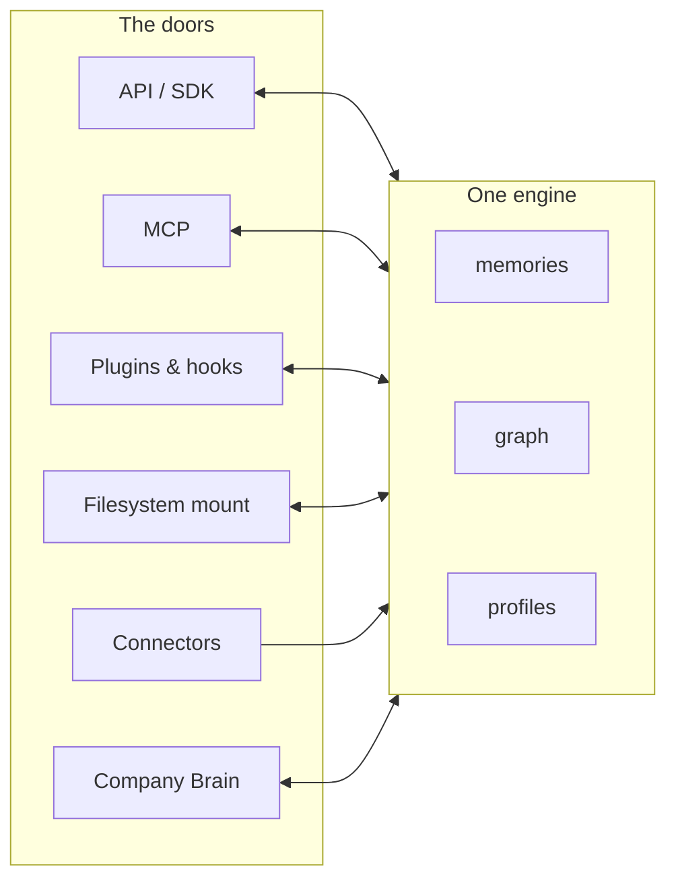

Supermemory is one engine with several doors. The API/SDKs, MCP, plugins & hooks, the filesystem mount (SMFS), connectors, and Company Brain all read and write the same store: one set of memories, one [graph](/concepts/graph-memory), one set of [profiles](/concepts/user-profiles).

That gives you a guarantee worth building on: **anything ingested through any door is retrievable through every other door.** A Notion page synced by a connector is searchable from your app's API calls, visible to Claude Desktop over MCP, and injected into your coding agent by a plugin hook. Same memories, same graph, same profiles — and the same [container tags](/concepts/permissioning) govern access through all of them.



No door is a separate product, and no door has its own memory. Mounting the filesystem isn't a second store — it's a view onto the same engine. The MCP server isn't "supermemory for tools" — it's the same engine, reached over MCP. If you take one thing from this page, take that.

## Pick a door

Which door depends on what's doing the remembering — your code, your AI tools, or nothing at all (content that should flow in on its own).

| Door | Reach for it when | Direction |
|---|---|---|
| [API / SDK](/quickstart) | You're building a product and want control over what's stored, when it's recalled, and how it's injected. The production path. | Read + write |
| [MCP](/supermemory-mcp/mcp) | You want your AI tools — Claude, Cursor, ChatGPT — to have memory without writing code. | Read + write |
| [Plugins & hooks](/integrations/claude-code) | You want coding agents (Claude Code, Codex, OpenCode) to remember across sessions, automatically. | Read + write |
| [Filesystem mount](/smfs/overview) | Your agents think in files. Mount memory as a directory and let them `ls`, `cat`, and `grep` it — token-efficient bulk context. | Read + write |
| [Connectors](/connectors/overview) | Content should flow in on its own — Notion, Google Drive, Gmail, OneDrive — with no ingestion code. | Write only |
| [Company Brain](/patterns/company-brain) | Your team (including non-engineers) should be able to ask questions of everything above. The team-facing surface on top of the engine. | Read + write |

Two rows deserve a second sentence.

**Plugins use hooks, not MCP tools — because agents forget to call tools.** An MCP search tool only helps when the agent decides to invoke it, and in practice agents skip that step constantly. Hooks fire on every prompt, so relevant memories get injected whether or not the agent thinks to ask. If you're choosing between the MCP door and the plugin door for a coding agent, pick the plugin.

**Connectors are a one-way door.** They bring content in on a sync schedule; you recall it through any of the other doors. There's no "search via connector" — that's what the read doors are for.

<Note>
Looking for the model proxy (`api.supermemory.ai/v3/https://...`)? It's deprecated and isn't a door anymore. Migrate to the [AI SDK wrapper](/integrations/ai-sdk) or plain SDK calls — the changelog has the migration note.
</Note>

## Combine doors — the normal case

Most real setups use two or three doors at once: a connector ingests, the API serves your app, MCP serves your IDE. Because it's one engine, this needs no glue code. Here's one fact traveling in through one door and out through three.

Your teammate writes a decision in Notion: *"We're sunsetting the legacy billing API on March 1."*

**In: the connector door.** You connected Notion once, scoped to your team's container tag:

<CodeGroup>

```typescript TypeScript
import Supermemory from "supermemory";

const client = new Supermemory({ apiKey: process.env.SUPERMEMORY_API_KEY });

const connection = await client.connections.create("notion", {
  redirectUrl: "https://yourapp.com/callback",
  containerTags: ["team_billing"],
});

// send the user here to authorize — the link expires in 1 hour
console.log(connection.authLink);
```

```python Python
from supermemory import Supermemory

client = Supermemory()  # reads SUPERMEMORY_API_KEY

connection = client.connections.create(
    "notion",
    redirect_url="https://yourapp.com/callback",
    container_tags=["team_billing"],
)

# send the user here to authorize — the link expires in 1 hour
print(connection.auth_link)
```

```bash cURL
# POST /v3/connections/{provider}
curl -X POST "https://api.supermemory.ai/v3/connections/notion" \
  -H "Authorization: Bearer $SUPERMEMORY_API_KEY" \
  -H "Content-Type: application/json" \
  -d '{
    "redirectUrl": "https://yourapp.com/callback",
    "containerTags": ["team_billing"]
  }'
```

</CodeGroup>

The connector syncs the page, and the ingestion pipeline derives the memory — the sunset date, tied to the billing API entity in the graph, with provenance back to the Notion page. One caveat: this isn't instant. Connectors sync on connect, then roughly every 4 hours (webhook-triggered where the provider supports it) — the [sync lifecycle](/connectors/sync-lifecycle) covers the exact cadence per provider. If you need a document now, trigger a manual sync from the [console](https://console.supermemory.ai).

**Out, door one: your app, via the API.** Once processing hits `done`, the fact is searchable:

<CodeGroup>

```typescript TypeScript
// POST /v4/search
const results = await client.search.memories({
  q: "when is the legacy billing API going away?",
  containerTag: "team_billing",
});

console.log(results.results[0].memory);
```

```python Python
# POST /v4/search
results = client.search.memories(
    q="when is the legacy billing API going away?",
    container_tag="team_billing",
)

print(results.results[0].memory)
```

```bash cURL
curl -X POST "https://api.supermemory.ai/v4/search" \
  -H "Authorization: Bearer $SUPERMEMORY_API_KEY" \
  -H "Content-Type: application/json" \
  -d '{
    "q": "when is the legacy billing API going away?",
    "containerTag": "team_billing"
  }'
```

</CodeGroup>

The result is the derived memory, not the raw Notion page:

```json
{
  "results": [
    {
      "memory": "The legacy billing API is being sunset on March 1.",
      ...
    }
  ],
  ...
}
```

**Out, door two: Claude Desktop, via MCP.** With the [MCP server](/supermemory-mcp/mcp) connected to the same account, asking Claude "what's the plan for the old billing API?" makes it call the search tool against the same store. No re-ingestion, no export — the memory the connector created is the memory MCP finds. {/* CONFIRM: hosted MCP container-tag scoping — how the MCP session maps to team_billing */}

**Out, door three: your coding agent, via a plugin.** With the [Claude Code plugin](/integrations/claude-code) installed, the hook injects relevant memories when you start working on billing code — so the agent knows about the March 1 sunset before it suggests building against the legacy endpoint. You never asked it to check. That's the point of hooks.

One write, three reads, zero synchronization code. That's the one-engine guarantee doing its job.

## Know which account is which

Two websites, one recurring support question. Here's the map:

| Surface | URL | Who it's for | What you do there |
|---|---|---|---|
| Console | [console.supermemory.ai](https://console.supermemory.ai) | Developers | Create and scope API keys, manage your org and billing, set up connectors, watch usage |
| App | [app.supermemory.ai](https://app.supermemory.ai) | End users | Chat with your memories — the consumer product, which is itself one more door into the engine |

The console is where every developer workflow starts: **API Keys → Create API Key** gets you the `sm_...` key that the SDK, curl examples, plugins, and SMFS mounts all use. The app can also issue API keys, and plugins accept a key from either surface. {/* CONFIRM: app and console share one login/account */}

The MCP server is the exception on auth: it supports OAuth, so tools like Claude Desktop can connect without you handling a key at all. Under the hood it's still your account, still the same engine.

If you're multi-tenant, one more thing matters here: an API key can be [scoped to specific container tags](/concepts/permissioning), so a key minted for one tenant physically can't read another tenant's memories — no matter which door it's used through. Scoping is enforced by the engine, not by the door.

That's the whole model: one engine, and you pick doors per situation, not per product. Add a connector without touching your API integration; add MCP without migrating anything — every door you open sees everything the others already stored.

## Where next

- [How supermemory works](/concepts/how-it-works) — what happens between a document going in and a memory coming out
- [Permissioning](/concepts/permissioning) — container tags, metadata, and scoped keys across every door
- [Connectors overview](/connectors/overview) — the catalog, per-connector setup, and sync behavior
- [Patterns](/patterns/overview) — worked systems that combine these doors on purpose
