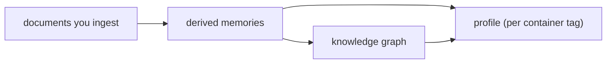

Every container tag has a profile: supermemory's current understanding of the entity that container is about, derived from everything you've ingested there. You don't write it, update it, or manage it. You fetch it:

<CodeGroup>

```typescript TypeScript
import Supermemory from "supermemory";

const client = new Supermemory({ apiKey: process.env.SUPERMEMORY_API_KEY });

const { profile } = await client.profile({
  containerTag: "user_4f8a",
});
```

```python Python
from supermemory import Supermemory

client = Supermemory()

result = client.profile(container_tag="user_4f8a")
```

```bash cURL
curl -X POST "https://api.supermemory.ai/v4/profile" \
  -H "Authorization: Bearer $SUPERMEMORY_API_KEY" \
  -H "Content-Type: application/json" \
  -d '{"containerTag": "user_4f8a"}'
```

</CodeGroup>

And you get back two arrays of plain sentences:

```json
{
  "profile": {
    "static": [
      "Sarah is a senior engineer at Meridian, working on the payments platform",
      "Sarah prefers short, technical answers with code over prose",
      "Sarah works from Lisbon, usually async"
    ],
    "dynamic": [
      "[Recent] Sarah's being promoted to VP of Product",
      "[Recent] Sarah is migrating the billing service off the legacy queue",
      "[2026-07-14] Sarah hit a deadlock in the payout worker and is still debugging it"
    ]
  }
}
```

That's the whole interface. The interesting part is where those sentences come from, and what to do with them.

## The profile samples the container

A profile isn't a record you populate — it's derived. When you [add content](/add-memories), the ingestion pipeline extracts memories, connects them into the [graph](/concepts/graph-memory), and continuously distills the container's memories into a compact summary of the entity behind them. The profile *samples the container*: it's the engine's answer to "given everything in here, what should an assistant know about this entity right now?"



Two consequences fall out of that:

**One container tag, one profile.** The profile is scoped to exactly one container. It never reads across container tags — a profile call for `user_4f8a` can't surface anything derived from another user's container, full stop. That's the same isolation boundary that governs [search and writes](/concepts/permissioning), and it's why the standard pattern is one container tag per user.

**Everything in the container is fair game.** If you put ten users' conversations in one container, the profile blends all ten — because as far as the engine can tell, that's one entity. It can bite you in a subtler way too: ingest a user's email and the profile can pick up facts about the people they *correspond with*, not just the user. The fix is `entityContext` — tell the engine who the container is about ("This container is about Sarah Chen, a Meridian employee; other people mentioned are her contacts, not the subject") and extraction prioritizes accordingly. See [Customization](/concepts/customization).

## Static vs dynamic

The two arrays split by how long-lived a fact is, not by topic:

- **`static`** — durable facts: who they are, what they do, standing preferences. This is the stuff that's true next month.
- **`dynamic`** — recent episodes and current state: what they're working on, what happened lately. Entries carry `[Recent]` or `[YYYY-MM-DD]` prefixes so your model can weigh recency; strip them if you only want the text.

Static populates as the engine sees the same durable facts hold up across ingestions — a brand-new container won't have a settled static section after one message, and early on you'll mostly see dynamic entries. <!-- CONFIRM: exact static-population timing/threshold --> Older dynamic context doesn't pile up forever either: it gets periodically consolidated into denser summaries, so the profile stays compact instead of growing with the container.

Beyond the lifespan axis, you can define **buckets** — topical categories like `preferences` or `goals` that a classifier assigns memories to at ingestion time. Every org starts with a built-in `preferences` bucket; you define more in the console, and request them with `include: ["buckets"]` on the profile call. Buckets and `filterPrompt` (your rules for what's worth remembering at all) are the two levers that shape what lands in a profile — bucket descriptions steer where facts get filed, `filterPrompt` steers what gets extracted in the first place. Mechanics for both are in the [profile API reference](/user-profiles) and [Customization](/concepts/customization).

## Combine profile with search

Pass `q` and the same call also runs a search in that container, returned alongside the profile:

<CodeGroup>

```typescript TypeScript
const result = await client.profile({
  containerTag: "user_4f8a",
  q: "billing migration",
});

result.profile.static;            // who Sarah is
result.profile.dynamic;           // what she's up to
result.searchResults?.results;    // memories matching "billing migration"
```

```python Python
result = client.profile(
    container_tag="user_4f8a",
    q="billing migration",
)

result.profile.static
result.profile.dynamic
result.search_results.results if result.search_results else []
```

```bash cURL
curl -X POST "https://api.supermemory.ai/v4/profile" \
  -H "Authorization: Bearer $SUPERMEMORY_API_KEY" \
  -H "Content-Type: application/json" \
  -d '{"containerTag": "user_4f8a", "q": "billing migration"}'
```

</CodeGroup>

`searchResults` only appears when you pass `q`. This is the one-round-trip context call: broad understanding plus query-specific memories, instead of a profile fetch and a separate [search](/search).

## Inject it without wrecking your prompt cache

The profile is built to sit in a prompt: plain sentences, and compact — it stays within roughly a 1k-token budget rather than growing with the container. But *where* you put each piece matters, because prompt caching works on stable prefixes.

The pattern that works:

- **Static profile goes in the system prompt.** It changes rarely, so the prefix stays byte-identical across turns and your provider's prompt cache keeps hitting.
- **Dynamic context (and `q` results) get appended to the user message.** They change turn to turn — put them in the system prompt and you bust the cache on every message.

To wire that up:

```typescript
async function buildMessages(userId: string, userMessage: string) {
  const result = await client.profile({ containerTag: userId, q: userMessage });

  const system = `You are a personal assistant.

About this user:
${result.profile.static?.join("\n") ?? "No profile yet."}`;

  const memories = result.searchResults?.results
    ?.map((r) => r.memory)
    .join("\n");

  // dynamic + search context ride with the message, not the cached prefix
  const user = `${userMessage}

<context>
${result.profile.dynamic?.join("\n") ?? ""}
${memories ?? ""}
</context>`;

  return [
    { role: "system", content: system },
    { role: "user", content: user },
  ];
}
```

If you're on the Vercel AI SDK, `withSupermemory` does this injection for you — see the [AI SDK integration](/integrations/ai-sdk).

<Note>
The profile call is a read — it doesn't count as ingestion, so calling it on every message costs you latency, not quota. It's fast enough to sit in the hot path. <!-- CONFIRM: profile latency ~100ms publishable -->
</Note>

## What profiles are not

**Not a key-value store.** There's no API to set a profile field, and that's deliberate — the profile is derived understanding, so it stays consistent with the memories underneath it. If you need to assert a fact, ingest it ("Sarah's preferred language is Portuguese") and the profile absorbs it.

**Not cross-user data.** A profile can't aggregate across users, and you shouldn't try to make it — a shared "everyone" container gives you a mushy profile of no one. For team-wide knowledge, use a shared container for the *content* and per-user containers for the *people*; the [multi-tenant pattern](/patterns/multi-tenant-saas) shows the split.

**Not a replacement for search.** The profile answers "who is this entity" in ~1k tokens. Specific recall — "what did Sarah say about the payout worker" — is a [search](/concepts/hybrid-search) question. Use both: profile as the standing context, search (or the `q` param) for the details a given message needs.

That's it — your assistant opens every conversation already knowing who it's talking to.

## Where next

- [Profile API reference](/user-profiles) — every parameter, buckets, response schema
- [Permissioning](/concepts/permissioning) — container tags, isolation, scoped keys
- [Customization](/concepts/customization) — `entityContext`, `filterPrompt`, and shaping extraction
- [AI SDK integration](/integrations/ai-sdk) — automatic profile injection with `withSupermemory`
