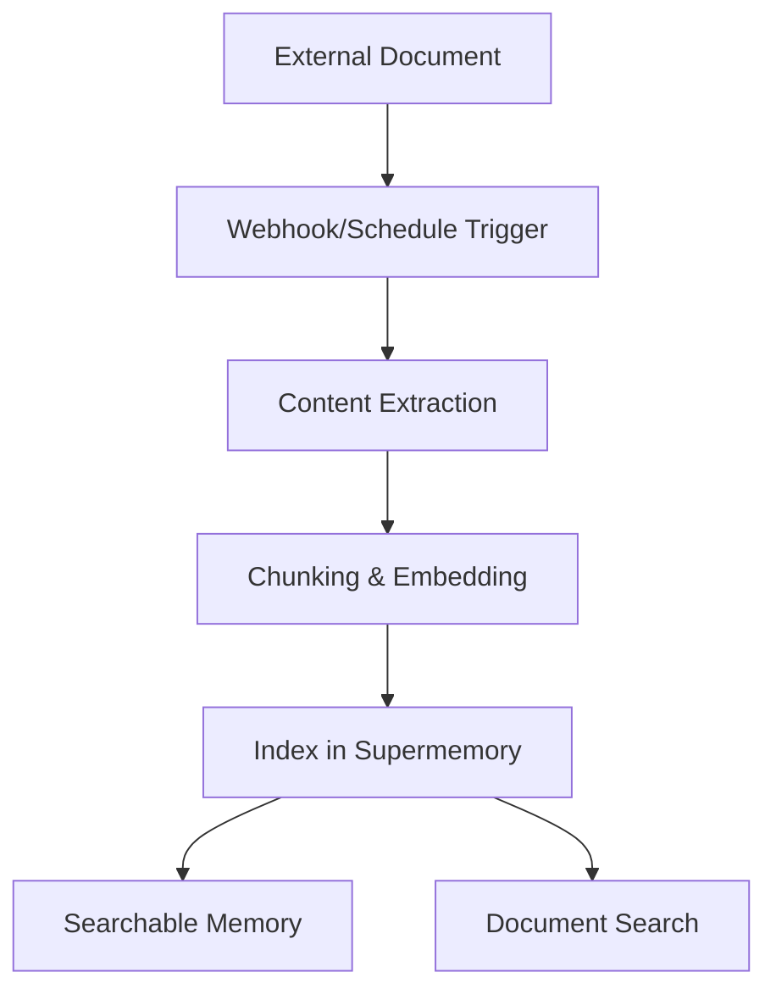

Connect external platforms to automatically sync documents into Supermemory. Supported connectors include Google Drive, Notion, OneDrive, and Web Crawler with real-time synchronization and intelligent content processing.

## Supported Connectors

<CardGroup cols={2}>
  <Card title="Google Drive" icon="google-drive" href="/connectors/google-drive">
    **Google Docs, Slides, Sheets**

    Real-time sync via webhooks. Supports shared drives, nested folders, and collaborative documents.
  </Card>

  <Card title="Notion" icon="notion" href="/connectors/notion">
    **Pages, Databases, Blocks**

    Instant sync of workspace content. Handles rich formatting, embeds, and database properties.
  </Card>

  <Card title="OneDrive" icon="microsoft" href="/connectors/onedrive">
    **Word, Excel, PowerPoint**

    Scheduled sync every 4 hours. Supports personal and business accounts with file versioning.
  </Card>

  <Card title="Web Crawler" icon="globe" href="/connectors/web-crawler">
    **Web Pages, Documentation**

    Crawl websites automatically with robots.txt compliance. Scheduled recrawling keeps content up to date.
  </Card>
</CardGroup>

## Quick Start

### 1. Create Connection

<CodeGroup>

```typescript Typescript
import Supermemory from 'supermemory';

const client = new Supermemory({
  apiKey: process.env.SUPERMEMORY_API_KEY!
});

const connection = await client.connections.create('notion', {
  redirectUrl: 'https://yourapp.com/callback',
  containerTags: ['user-123', 'workspace-alpha'],
  documentLimit: 5000,
  metadata: { department: 'sales' }
});

// Redirect user to complete OAuth
console.log('Auth URL:', connection.authLink);
console.log('Expires in:', connection.expiresIn);
// Output: Auth URL: https://api.notion.com/v1/oauth/authorize?...
// Output: Expires in: 1 hour
```

```python Python
from supermemory import Supermemory
import os

client = Supermemory(api_key=os.environ.get("SUPERMEMORY_API_KEY"))

connection = client.connections.create(
    'notion',
    redirect_url='https://yourapp.com/callback',
    container_tags=['user-123', 'workspace-alpha'],
    document_limit=5000,
    metadata={'department': 'sales'}
)

# Redirect user to complete OAuth
print(f'Auth URL: {connection.auth_link}')
print(f'Expires in: {connection.expires_in}')
# Output: Auth URL: https://api.notion.com/v1/oauth/authorize?...
# Output: Expires in: 1 hour
```

```bash cURL
curl -X POST "https://api.supermemory.ai/v3/connections/notion" \
  -H "Authorization: Bearer $SUPERMEMORY_API_KEY" \
  -H "Content-Type: application/json" \
  -d '{
    "redirectUrl": "https://yourapp.com/callback",
    "containerTags": ["user-123", "workspace-alpha"],
    "documentLimit": 5000,
    "metadata": {"department": "sales"}
  }'

# Response: {
#   "authLink": "https://api.notion.com/v1/oauth/authorize?...",
#   "expiresIn": "1 hour",
#   "id": "conn_abc123",
#   "redirectsTo": "https://yourapp.com/callback"
# }
```

</CodeGroup>

### 2. Handle OAuth Callback

After user completes OAuth, the connection is automatically established and sync begins.

### 3. Monitor Sync Status

<CodeGroup>

```typescript Typescript
import Supermemory from 'supermemory';

const client = new Supermemory({
  apiKey: process.env.SUPERMEMORY_API_KEY!
});

// List all connections using SDK
const connections = await client.connections.list({
  containerTags: ['user-123', 'workspace-alpha']
});

connections.forEach(conn => {
  console.log('Connection:', conn.id);
  console.log('Provider:', conn.provider);
  console.log('Email:', conn.email);
  console.log('Created:', conn.createdAt);
});

// List synced documents (memories) using SDK
const memories = await client.memories.list({
  containerTags: ['user-123', 'workspace-alpha']
});

console.log(`Synced ${memories.memories.length} documents`);
// Output: Synced 45 documents
```

```python Python
from supermemory import Supermemory
import os

client = Supermemory(api_key=os.environ.get("SUPERMEMORY_API_KEY"))

# List all connections using SDK
connections = client.connections.list(
    container_tags=['user-123', 'workspace-alpha']
)

for conn in connections:
    print(f'Connection: {conn.id}')
    print(f'Provider: {conn.provider}')
    print(f'Email: {conn.email}')
    print(f'Created: {conn.created_at}')

# List synced documents (memories) using SDK
memories = client.memories.list(container_tags=['user-123', 'workspace-alpha'])

print(f'Synced {len(memories.memories)} documents')
# Output: Synced 45 documents
```

```bash cURL
# List all connections
curl -X POST "https://api.supermemory.ai/v3/connections/list" \
  -H "Authorization: Bearer $SUPERMEMORY_API_KEY" \
  -H "Content-Type: application/json" \
  -d '{"containerTags": ["user-123", "workspace-alpha"]}'

# Response: [{"id": "conn_abc", "provider": "notion", "email": "user@example.com", ...}]

# List synced documents
curl -X POST "https://api.supermemory.ai/v3/documents/list" \
  -H "Authorization: Bearer $SUPERMEMORY_API_KEY" \
  -H "Content-Type: application/json" \
  -d '{"containerTags": ["user-123", "workspace-alpha"]}'

# Response: {"results": [...], "totalCount": 45}
```

</CodeGroup>

## How Connectors Work

### Authentication Flow

1. **Create Connection**: Call `/v3/connections/{provider}` to get OAuth URL (or direct connection for web-crawler)
2. **User Authorization**: Redirect user to complete OAuth flow (not required for web-crawler)
3. **Automatic Setup**: Connection established, sync begins immediately
4. **Continuous Sync**: Real-time updates via webhooks + scheduled sync every 4 hours (or scheduled recrawling for web-crawler)

### Document Processing Pipeline



### Sync Mechanisms

| Provider | Real-time Sync | Scheduled Sync | Manual Sync |
|----------|---------------|----------------|-------------|
| **Google Drive** | ✅ Webhooks (7-day expiry) | ✅ Every 4 hours | ✅ On-demand |
| **Notion** | ✅ Webhooks | ✅ Every 4 hours | ✅ On-demand |
| **OneDrive** | ✅ Webhooks (30-day expiry) | ✅ Every 4 hours | ✅ On-demand |
| **Web Crawler** | ❌ Not supported | ✅ Scheduled recrawling (7+ days) | ✅ On-demand |


## Connection Management

### List All Connections

<CodeGroup>

```typescript Typescript
import Supermemory from 'supermemory';

const client = new Supermemory({
  apiKey: process.env.SUPERMEMORY_API_KEY!
});

const connections = await client.connections.list({
  containerTags: ['org-123']
});
```

```python Python
from supermemory import Supermemory
import os

client = Supermemory(api_key=os.environ.get("SUPERMEMORY_API_KEY"))

connections = client.connections.list(container_tags=['org-123'])

for conn in connections:
    print(f"{conn.provider}: {conn.email} ({conn.id})")
    print(f"Documents: {conn.document_limit or 'unlimited'}")
    print(f"Expires: {conn.expires_at or 'never'}")
# Output: notion: user@company.com (conn_abc123)
# Output: Documents: 5000
# Output: Expires: never
```

```bash cURL
curl -X POST "https://api.supermemory.ai/v3/connections/list" \
  -H "Authorization: Bearer $SUPERMEMORY_API_KEY" \
  -H "Content-Type: application/json" \
  -d '{"containerTags": ["org-123"]}'

# Response: [
#   {
#     "id": "conn_abc123",
#     "provider": "notion",
#     "email": "user@company.com",
#     "documentLimit": 5000,
#     "createdAt": "2024-01-15T10:30:00.000Z"
#   }
# ]
```

</CodeGroup>

### Delete Connections

<CodeGroup>

```typescript Typescript
import Supermemory from 'supermemory';

const client = new Supermemory({
  apiKey: process.env.SUPERMEMORY_API_KEY!
});

// Delete by connection ID using SDK
const result = await client.connections.delete(connectionId);

console.log('Deleted:', result.id, result.provider);
// Output: Deleted: conn_abc123 notion
```

```python Python
from supermemory import Supermemory
import os

client = Supermemory(api_key=os.environ.get("SUPERMEMORY_API_KEY"))

# Delete by connection ID using SDK
result = client.connections.delete(connection_id)

print(f"Deleted: {result.id} {result.provider}")
# Output: Deleted: conn_abc123 notion
```

```bash cURL
curl -X DELETE "https://api.supermemory.ai/v3/connections/conn_abc123" \
  -H "Authorization: Bearer $SUPERMEMORY_API_KEY"

# Response: {
#   "id": "conn_abc123",
#   "provider": "notion"
# }
```

</CodeGroup>
