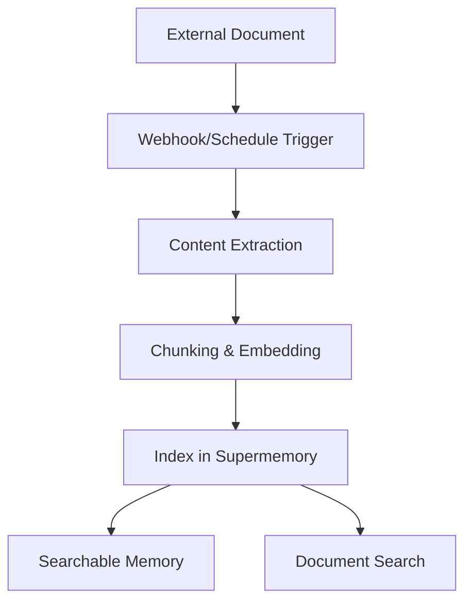

Connect external platforms to automatically sync documents into supermemory. Supported connectors include Google Drive, Gmail, Notion, OneDrive, GitHub, Granola and Web Crawler with real-time synchronization and intelligent content processing.

Every connector belongs to one namespace. The namespace goes in the URL (`/ns/{namespace}/connectors`) and is a top-level `namespace` key in every SDK call.

## Supported connectors

<CardGroup cols={2}>
  <Card title="Google Drive" icon="/images/google-drive-icon.svg" href="/connectors/google-drive">
    **Google Docs, Slides, Sheets**

    Real-time sync via webhooks. Supports shared drives, nested folders, and collaborative documents.
  </Card>

  <Card title="Gmail" icon="/icons/hugeicons/mail-01.svg" href="/connectors/gmail">
    **Email Threads**

    Real-time sync via Pub/Sub webhooks. Syncs threads with full conversation history and metadata.
  </Card>

  <Card title="Notion" icon="/images/notion-icon.svg" href="/connectors/notion">
    **Pages, Databases, Blocks**

    Instant sync of workspace content. Handles rich formatting, embeds, and database properties.
  </Card>

  <Card title="OneDrive" icon="/images/microsoft-icon.svg" href="/connectors/onedrive">
    **Word, Excel, PowerPoint**

    Scheduled sync every 4 hours. Supports personal and business accounts with file versioning.
  </Card>
  
  
  <Card title="GitHub" icon="/images/github-icon.svg" href="/connectors/github">
    **GitHub Repositories**

    Real-time incremental sync via webhooks. Supports documentation files in repositories.
  </Card>

  <Card title="Granola" icon="/images/granola.svg" href="/connectors/granola">
    **Meeting notes and transcripts**

    Syncs AI meeting notes, summaries, attendees, and transcripts from your Granola workspace.
  </Card>

  <Card title="Web Crawler" icon="/icons/hugeicons/globe-02.svg" href="/connectors/web-crawler">
    **Web Pages, Documentation**

    Crawl websites automatically with robots.txt compliance. Scheduled recrawling keeps content up to date.
  </Card>
</CardGroup>

## Quick start

### 1. Create a Connector

<CodeGroup>

```typescript Typescript
import { Supermemory } from "supermemory"

const supermemory = new Supermemory({ apiKey: process.env.SUPERMEMORY_API_KEY })

const connector = await supermemory.connectors.create("user-123", {
  provider: "notion",
  redirectUrl: "https://yourapp.com/callback"
  documentLimit: 5000,
})

// Send the user to authorization.url to finish OAuth
console.log("Connector:", connector.id)
console.log("Auth URL:", connector.authorization?.url)
console.log("Expires at:", connector.authorization?.expiresAt)
// Output: Auth URL: https://api.notion.com/v1/oauth/authorize?...
```

```python Python
from supermemory import Supermemory
import os

client = Supermemory(api_key=os.environ.get("SUPERMEMORY_API_KEY"))

connector = client.connectors.create(
    "user-123",
    request={
        "provider": "notion",
        "redirectUrl": "https://yourapp.com/callback",
        "documentLimit": 5000,
    },
)

# Send the user to authorization.url to finish OAuth
print(f"Connector: {connector.id}")
print(f"Auth URL: {connector.authorization.url}")
print(f"Expires at: {connector.authorization.expires_at}")
# Output: Auth URL: https://api.notion.com/v1/oauth/authorize?...
```

```bash cURL
curl -X POST "https://api.supermemory.ai/ns/user-123/connectors" \
  -H "Authorization: Bearer $SUPERMEMORY_API_KEY" \
  -H "Content-Type: application/json" \
  -d '{
    "provider": "notion",
    "redirectUrl": "https://yourapp.com/callback",
    "documentLimit": 5000
  }'

# Response: {
#   "id": "PTzGiUYei7pgzg5buzZHgA",
#   "authorization": {
#     "url": "https://api.notion.com/v1/oauth/authorize?...",
#     "expiresAt": "2024-01-15T11:30:00.000Z"
#   }
# }
```

</CodeGroup>

### 2. Handle OAuth callback

Send the user to `authorization.url` before `authorization.expiresAt`. When the user authorizes, the provider returns them to your `redirectUrl` and the first sync starts. A pending OAuth connector is not visible in list or get until the user finishes authorization.

Config providers (Web Crawler, S3, Granola) return `authorization: null` and start syncing immediately.

### 3. Monitor sync status

<CodeGroup>

```typescript Typescript
import { Supermemory } from "supermemory"

const supermemory = new Supermemory({ apiKey: process.env.SUPERMEMORY_API_KEY })

// Read one connector with its recent sync runs
const connector = await supermemory.connectors.get("user-123", "PTzGiUYei7pgzg5buzZHgA", {
  include: "syncs",
})

console.log("Provider:", connector.provider)
console.log("Account:", connector.account)
console.log("Last sync:", connector.latestRun?.system.status, connector.latestRun?.error)
console.log("Last synced at:", connector.system.lastSuccessfulSyncAt)
console.log("Documents:", connector.documentCount)
console.log("Recent runs:", connector.syncs)

// List the documents the connector synced into the namespace
const docs = await supermemory.list("user-123", "documents")
console.log(`Synced ${docs.pagination.totalItems} documents`)
// Output: Synced 45 documents
```

```python Python
from supermemory import Supermemory
import os

client = Supermemory(api_key=os.environ.get("SUPERMEMORY_API_KEY"))

# Read one connector with its recent sync runs
connector = client.connectors.get("user-123", "PTzGiUYei7pgzg5buzZHgA", include=["syncs"])

print(f"Provider: {connector.provider}")
print(f"Account: {connector.account}")
print(f"Last sync: {connector.latest_run.system.status} {connector.latest_run.error}")
print(f"Last synced at: {connector.system.last_successful_sync_at}")
print(f"Documents: {connector.document_count}")
print(f"Recent runs: {connector.syncs}")

# List the documents the connector synced into the namespace
docs = client.list("user-123", "documents")
print(f"Synced {docs.pagination.total_items} documents")
# Output: Synced 45 documents
```

```bash cURL
# Read one connector with its recent sync runs
curl "https://api.supermemory.ai/ns/user-123/connectors/PTzGiUYei7pgzg5buzZHgA?include=syncs" \
  -H "Authorization: Bearer $SUPERMEMORY_API_KEY"

# Response: {
#   "id": "PTzGiUYei7pgzg5buzZHgA",
#   "provider": "notion",
#   "namespace": "user-123",
#   "account": "user@example.com",
#   "documentLimit": 5000,
#   "documentCount": 45,
#   "latestRun": { "errorCode": null, "error": null, "system": { "status": "completed", "startedAt": "...", "completedAt": "..." } },
#   "system": { "status": "active", "createdAt": "2024-01-15T10:30:00.000Z", "lastSuccessfulSyncAt": "2024-01-15T10:45:00.000Z" },
#   "syncs": [...]
# }

# List synced documents in the namespace
curl -X POST "https://api.supermemory.ai/ns/user-123/list/documents" \
  -H "Authorization: Bearer $SUPERMEMORY_API_KEY" \
  -H "Content-Type: application/json" \
  -d '{}'

# Response: {"documents": [...], "pagination": {"totalItems": 45, ...}}
```

</CodeGroup>

## How connectors work

### Authentication flow

1. **Create Connector**: Call `POST /ns/{namespace}/connectors` with a `provider`. OAuth providers return an `authorization` link; config providers (Web Crawler, S3, Granola) take a `config` object and return `authUrl: null`
2. **User Authorization**: Send the user to `authorization.url` when the provider requires it
3. **Automatic Setup**: Connector established, sync begins immediately
4. **Continuous Sync**: Real-time updates via webhooks + scheduled sync every 4 hours (or scheduled recrawling for Web Crawler)

### Document processing pipeline


```mermaid
graph TD
    A[External Document] --> B[Webhook/Schedule Trigger]
    B --> C[Content Extraction]
    C --> D[Chunking & Embedding]
    D --> E[Index in Supermemory]

    E --> F[Searchable Memory]
    E --> G[Document Search]
```

### Sync mechanisms

| Provider | Real-time Sync | Scheduled Sync | Manual Sync |
|----------|---------------|----------------|-------------|
| **Google Drive** | ✅ Webhooks (7-day expiry) | ✅ Every 4 hours | ✅ On-demand |
| **Gmail** | ✅ Pub/Sub (7-day expiry) | ✅ Every 4 hours | ✅ On-demand |
| **Notion** | ✅ Webhooks | ✅ Every 4 hours | ✅ On-demand |
| **OneDrive** | ✅ Webhooks (30-day expiry) | ✅ Every 4 hours | ✅ On-demand |
| **GitHub** | ✅ Webhooks | ✅ Every 4 hours | ✅ On-demand |
| **Granola** | ❌ Not supported | ❌ Not supported | ✅ On-demand |
| **Web Crawler** | ❌ Not supported | ✅ Scheduled recrawling (7+ days) | ✅ On-demand |


## Connector Management

### List Connectors

<CodeGroup>

```typescript Typescript
import { Supermemory } from "supermemory"

const supermemory = new Supermemory({ apiKey: process.env.SUPERMEMORY_API_KEY })

// Connectors in one namespace
const { connectors } = await supermemory.connectors.list("org-123")

for (const connector of connectors) {
  console.log(`${connector.provider}: ${connector.account} (${connector.id})`)
  console.log(`Documents: ${connector.documentCount} of ${connector.documentLimit}`)
  console.log(`Last sync: ${connector.latestRun?.system.status ?? "never"}`)
}

// Connectors across every namespace in the organization
const all = await supermemory.connectors.listAll()
```

```python Python
from supermemory import Supermemory
import os

client = Supermemory(api_key=os.environ.get("SUPERMEMORY_API_KEY"))

# Connectors in one namespace
connectors = client.connectors.list("org-123").connectors

for connector in connectors:
    print(f"{connector.provider}: {connector.account} ({connector.id})")
    print(f"Documents: {connector.document_count} of {connector.document_limit}")
    print(f"Last sync: {connector.latest_run.system.status if connector.latest_run else 'never'}")

# Connectors across every namespace in the organization
all_connectors = client.connectors.list_all()
```

```bash cURL
# Connectors in one namespace
curl "https://api.supermemory.ai/ns/org-123/connectors" \
  -H "Authorization: Bearer $SUPERMEMORY_API_KEY"

# Response: {
#   "connectors": [
#     {
#       "id": "PTzGiUYei7pgzg5buzZHgA",
#       "provider": "notion",
#       "namespace": "org-123",
#       "account": "user@company.com",
#       "documentLimit": 5000,
#       "documentCount": 45,
#       "latestRun": { "system": { "status": "completed", ... }, "error": null },
#       "system": { "status": "active", "createdAt": "2024-01-15T10:30:00.000Z", "lastSuccessfulSyncAt": "2024-01-15T10:45:00.000Z" }
#     }
#   ],
#   "pagination": { "currentPage": 1, "limit": 50, "totalItems": 1, "totalPages": 1 }
# }

# Connectors across every namespace in the organization
curl "https://api.supermemory.ai/connectors" \
  -H "Authorization: Bearer $SUPERMEMORY_API_KEY"
```

</CodeGroup>

### Trigger a Sync

A connector syncs on its own schedule. Start one now with `connectors.sync`. The call returns `409` while a sync for that connector is already running.

<CodeGroup>

```typescript Typescript
const run = await supermemory.connectors.sync("org-123", "PTzGiUYei7pgzg5buzZHgA")

console.log(run.status)
// Output: queued
```

```bash cURL
curl -X POST "https://api.supermemory.ai/ns/org-123/connectors/PTzGiUYei7pgzg5buzZHgA/sync" \
  -H "Authorization: Bearer $SUPERMEMORY_API_KEY"

# Response: {"id": "PTzGiUYei7pgzg5buzZHgA", "status": "queued"}
```

</CodeGroup>

### Update a Connector

Change the document limit, or the selection for providers that support one, with `connectors.update`. A new selection replaces the old one. See [Managing Connector Selection](/connectors/managing-resources).

<CodeGroup>

```typescript Typescript
const connector = await supermemory.connectors.update("org-123", "PTzGiUYei7pgzg5buzZHgA", {
  documentLimit: 8000,
})

console.log(connector.documentLimit)
// Output: 8000
```

```bash cURL
curl -X PATCH "https://api.supermemory.ai/ns/org-123/connectors/PTzGiUYei7pgzg5buzZHgA" \
  -H "Authorization: Bearer $SUPERMEMORY_API_KEY" \
  -H "Content-Type: application/json" \
  -d '{"documentLimit": 8000}'

# Response: the updated connector object
```

</CodeGroup>

### Delete Connectors

`DELETE /ns/{namespace}/connectors/{id}` accepts an optional `deleteDocuments` query parameter:

| Parameter | Type | Default | Description |
| --- | --- | --- | --- |
| `deleteDocuments` | boolean | `true` | When `true`, all documents imported by the connector are permanently deleted. When `false`, the connector is removed but documents are kept. |

<Note>
Setting `deleteDocuments=false` is useful when you want to disconnect an integration without losing the memories that were already imported.
</Note>

<CodeGroup>

```typescript Typescript
import { Supermemory } from "supermemory"

const supermemory = new Supermemory({ apiKey: process.env.SUPERMEMORY_API_KEY })

// Delete the connector and all imported documents (default)
await supermemory.connectors.delete("user-123", "PTzGiUYei7pgzg5buzZHgA")

// Delete the connector but keep imported documents
await supermemory.connectors.delete("user-123", "PTzGiUYei7pgzg5buzZHgA", {
  deleteDocuments: false,
})
```

```python Python
from supermemory import Supermemory
import os

client = Supermemory(api_key=os.environ.get("SUPERMEMORY_API_KEY"))

# Delete the connector and all imported documents (default)
client.connectors.delete("user-123", "PTzGiUYei7pgzg5buzZHgA")

# Delete the connector but keep imported documents
client.connectors.delete("user-123", "PTzGiUYei7pgzg5buzZHgA", delete_documents=False)
```

```bash cURL
# Delete the connector and all imported documents (default)
curl -X DELETE "https://api.supermemory.ai/ns/user-123/connectors/PTzGiUYei7pgzg5buzZHgA" \
  -H "Authorization: Bearer $SUPERMEMORY_API_KEY"

# Delete the connector but keep imported documents
curl -X DELETE "https://api.supermemory.ai/ns/user-123/connectors/PTzGiUYei7pgzg5buzZHgA?deleteDocuments=false" \
  -H "Authorization: Bearer $SUPERMEMORY_API_KEY"
```

</CodeGroup>

<Note>
There is no delete-by-provider route in v5. Find the connector with `connectors.list(namespace)` and delete it by `id`.
</Note>

## Custom OAuth applications

By default, Supermemory uses its own OAuth applications to connect to third-party providers. You can use your own OAuth app credentials for tighter control over data access, which is useful for enterprise customers. Custom OAuth credentials are an organization setting and are not part of the v5 connector routes.

1. Create the OAuth application on the provider's developer console:
   - Google: [console.developers.google.com/apis/credentials/oauthclient](https://console.developers.google.com/apis/credentials/oauthclient)
   - Notion: [notion.so/my-integrations](https://www.notion.so/my-integrations)
   - OneDrive: [Azure Portal → App registrations](https://portal.azure.com/#view/Microsoft_AAD_RegisteredApps/ApplicationsMenu)
2. For Google Drive specifically: choose application type **Web application**, and enable the Google Drive API under "APIs and Services" in the Cloud Console. Google also requires verification/approval before custom keys work in production.
3. Set the redirect URL to `https://api.supermemory.ai/v3/connections/auth/callback/{provider}` (for example, `.../auth/callback/google-drive`).

<Warning>
Enabling custom keys for a provider applies to all new connectors for that provider. Existing connectors will need to be re-authorized.
</Warning>
