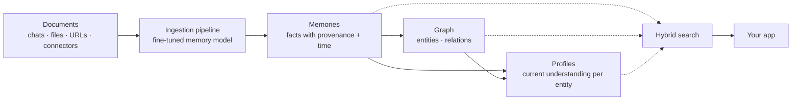
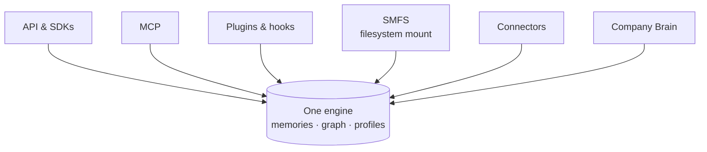

Supermemory is a context engine. You feed it everything — chat sessions, files, URLs, connector data — and it derives memories, a knowledge graph, and live profiles. When your app needs context, supermemory serves the right slice back in ~300ms.

Here's the whole loop in two calls:

<CodeGroup>

```typescript TypeScript
import Supermemory from "supermemory";

const client = new Supermemory({ apiKey: process.env.SUPERMEMORY_API_KEY });

await client.add({
  content: "Sarah's being promoted to VP of Product",
  containerTag: "user_4f8a",
});

const results = await client.search.memories({
  q: "who's getting promoted?",
  containerTag: "user_4f8a",
});
```

```python Python
from supermemory import Supermemory

client = Supermemory()

client.add(
    content="Sarah's being promoted to VP of Product",
    container_tag="user_4f8a",
)

results = client.search.memories(
    q="who's getting promoted?",
    container_tag="user_4f8a",
)
```

```bash cURL
# add — POST /v3/documents
curl -X POST "https://api.supermemory.ai/v3/documents" \
  -H "Authorization: Bearer $SUPERMEMORY_API_KEY" \
  -H "Content-Type: application/json" \
  -d '{"content": "Sarah'\''s being promoted to VP of Product", "containerTag": "user_4f8a"}'

# search — POST /v4/search
curl -X POST "https://api.supermemory.ai/v4/search" \
  -H "Authorization: Bearer $SUPERMEMORY_API_KEY" \
  -H "Content-Type: application/json" \
  -d '{"q": "who'\''s getting promoted?", "containerTag": "user_4f8a"}'
```

</CodeGroup>

You didn't chunk anything, embed anything, or write a schema. That's the point: supermemory decides what's worth remembering, how facts connect, and which of them are still true.

## How it thinks about your data

You ingest **documents** — any content, from a one-line chat message to a 200-page PDF. The ingestion pipeline (a custom fine-tuned memory model, not an off-the-shelf embedder) derives **memories**: individual facts with provenance and time attached. Memories interconnect into a **graph** of entities and relations. And for each entity, supermemory maintains a **profile** — its current derived understanding, ready to drop into a system prompt. You recall all of it through **hybrid search**: semantic, keyword, and graph combined.



Isolation comes from **container tags** (you may see "space" as a synonym — same thing): one tag per user, tenant, or project, and nothing crosses the boundary. **Metadata** slices *within* a boundary — agent role, channel, stage. [Scoped API keys](/concepts/permissioning) enforce the boundary at the key level, so a leaked key can't read another tenant.

## What makes it different

Most memory layers are a vector store that retrieves the nearest chunk. Supermemory is built differently, and each difference shows up in what you can ship:

- **A full context engine.** A custom memory model plus a custom data engine handle extraction, deduplication, and consolidation — you send raw content and get structured understanding back. See [Architecture](/concepts/architecture).
- **Memory that handles time.** Facts carry temporal validity; new statements supersede old ones, and explicit time-bound intent ("remind me for a week from now") creates expiring memories. See [Graph Memory](/concepts/graph-memory).
- **User profiles.** Each container tag gets a live profile of static and dynamic facts — derived, not hand-written, and sized to a ~1k-token budget so it's prompt-cache-friendly. See [User Profiles](/concepts/user-profiles).
- **Hybrid search you can tune.** Semantic + keyword + graph in one query, with `rewriteQuery`, `rerank`, and `threshold` knobs when defaults aren't enough. See [Hybrid Search](/concepts/hybrid-search).
- **Real permissioning.** Container tags for hard isolation, metadata filters for dimensions inside it, scoped keys to enforce both. See [Permissioning](/concepts/permissioning).

## Why retrieval alone isn't memory

Say a user talks to your agent over six weeks:

```text
Day 1:  "I love my Adidas sneakers"
Day 30: "My Adidas broke after a month, terrible quality"
Day 31: "I'm switching to Puma"
Day 45: "What sneakers should I buy?"
```

A vector store answers day 45 by finding the most similar text. "I love my Adidas sneakers" is the closest match to a sneaker question — so your agent recommends Adidas to someone who quit the brand two weeks earlier.

Supermemory tracks the progression instead: the day-1 preference was invalidated by day 30, and the day-31 statement is what's true now. Ask it:

<CodeGroup>

```typescript TypeScript
const results = await client.search.memories({
  q: "what sneakers does this user like?",
  containerTag: "user_4f8a",
});
```

```python Python
results = client.search.memories(
    q="what sneakers does this user like?",
    container_tag="user_4f8a",
)
```

```bash cURL
# POST /v4/search
curl -X POST "https://api.supermemory.ai/v4/search" \
  -H "Authorization: Bearer $SUPERMEMORY_API_KEY" \
  -H "Content-Type: application/json" \
  -d '{"q": "what sneakers does this user like?", "containerTag": "user_4f8a"}'
```

</CodeGroup>

And you get back what's true now:

```json
{
  "results": [
    {
      "memory": "Switched from Adidas to Puma after quality issues",
      "similarity": 0.89,
      "updatedAt": "2026-06-30T…"
    },
    …
  ]
}
```

The outdated Adidas preference is **not** returned as if it were still true — it's been superseded. If you want the history anyway (superseded facts are useful for "why" questions), pass `include: { forgottenMemories: true }` and you'll get them back, marked as forgotten.

RAG answers "what do I know?". Memory answers "what's true about this user *right now*?". Supermemory does both — the same search endpoint reaches document chunks when you need raw retrieval. The full comparison is in [Memory vs RAG](/concepts/memory-vs-rag).

## One engine, many doors

The API and SDKs, MCP, plugins and hooks, the SMFS filesystem mount, connectors, and Company Brain are all doors into the same engine — one store of memories, one graph, one set of profiles. Anything ingested through any door is retrievable through every other door.



- **[API & SDKs](/quickstart)** — TypeScript, Python, and REST. The primitives everything else is built on.
- **[MCP](/supermemory-mcp/setup)** — give Claude, Cursor, or any MCP client persistent memory.
- **[Plugins & hooks](/integrations/ai-sdk)** — `withSupermemory` wraps your model so memory happens automatically per request.
- **[SMFS](/smfs/overview)** — mount memory as a filesystem for coding agents; each mount is scoped to one container tag.
- **[Connectors](/connectors/overview)** — sync Google Drive, Notion, OneDrive, and more on a schedule.
- **[Company Brain](/patterns/company-brain)** — team knowledge across all of the above, no code required.

So there's no "which product am I using?" decision. A memory added through MCP shows up in an API search. A document synced from Notion is on your team's Company Brain. Pick doors by workflow, not by feature.

## Does it actually work?

- **Benchmarks:** supermemory is [state of the art](https://supermemory.ai/research) on LongMemEval and LoCoMo. <!-- CONFIRM: ConvoMem result + exact figures for the benchmark table -->
- **Latency:** profile reads ~100ms; search P50 ~300ms, P99 ~400ms. <!-- CONFIRM: publishable latency figures -->
- **Don't take our word for it:** [MemoryBench](/memorybench/quickstart) is our open benchmarking harness — run it against your own workload and reproduce the results yourself.

<Note>
Search doesn't add to your bill — you're charged on ingestion, and recall is essentially free. The billing model is covered in [Usage and Billing](/trust/usage-and-billing).
</Note>

## Pick your door

<Columns cols={2}>
  <Card title="Build with the API" icon="code" href="/quickstart">
    Add your first memory, search it, and wire context into your app.
  </Card>
  <Card title="Give your tools memory" icon="plug" href="/supermemory-mcp/setup">
    Connect Claude, Cursor, or any MCP client — or drop in the [AI SDK plugin](/integrations/ai-sdk).
  </Card>
  <Card title="Give your team memory" icon="users" href="/patterns/company-brain">
    Company Brain: shared memory across your docs, drives, and conversations.
  </Card>
  <Card title="Run it yourself" icon="server" href="/self-hosting/overview">
    Self-host supermemory on your own infrastructure.
  </Card>
</Columns>
