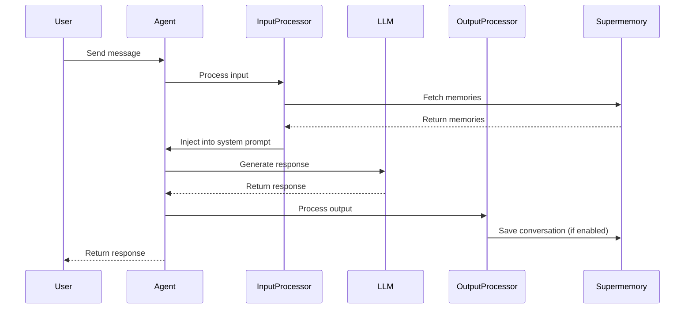

Integrate Supermemory with [Mastra](https://mastra.ai) to give your AI agents persistent memory. Use the `withSupermemory` wrapper for zero-config setup or processors for fine-grained control.

<Card title="@supermemory/tools on npm" icon="npm" href="https://www.npmjs.com/package/@supermemory/tools">
    Check out the NPM page for more details
</Card>

## Installation

```bash
npm install @supermemory/tools @mastra/core
```

## Quick Start

Wrap your agent config with `withSupermemory` to add memory capabilities:

```typescript
import { Agent } from "@mastra/core/agent"
import { withSupermemory } from "@supermemory/tools/mastra"
import { openai } from "@ai-sdk/openai"

// Create agent with memory-enhanced config
const agent = new Agent(withSupermemory(
  {
    id: "my-assistant",
    name: "My Assistant",
    model: openai("gpt-4o"),
    instructions: "You are a helpful assistant.",
  },
  "user-123",  // containerTag - scopes memories to this user
  {
    mode: "full",
    addMemory: "always",
    threadId: "conv-456",
  }
))

const response = await agent.generate("What do you know about me?")
```

<Note>
  **Memory saving is disabled by default.** The wrapper only retrieves existing memories. To automatically save conversations:

  ```typescript
  const agent = new Agent(withSupermemory(
    { id: "my-assistant", model: openai("gpt-4o"), ... },
    "user-123",
    {
      addMemory: "always",
      threadId: "conv-456"  // Required for conversation grouping
    }
  ))
  ```
</Note>

---

## How It Works

The Mastra integration uses Mastra's native [Processor](https://mastra.ai/docs/agents/processors) interface:

1. **Input Processor** - Fetches relevant memories from Supermemory and injects them into the system prompt before the LLM call
2. **Output Processor** - Optionally saves the conversation to Supermemory after generation completes



---

## Configuration Options

| Option | Type | Default | Description |
|--------|------|---------|-------------|
| `apiKey` | `string` | `SUPERMEMORY_API_KEY` env | Your Supermemory API key |
| `baseUrl` | `string` | `https://api.supermemory.ai` | Custom API endpoint |
| `mode` | `"profile" \| "query" \| "full"` | `"profile"` | Memory search mode |
| `addMemory` | `"always" \| "never"` | `"never"` | Auto-save conversations |
| `threadId` | `string` | - | Conversation ID for grouping messages |
| `verbose` | `boolean` | `false` | Enable debug logging |
| `promptTemplate` | `function` | - | Custom memory formatting |

---

## Memory Search Modes

**Profile Mode (Default)** - Retrieves the user's complete profile without query-based filtering:

```typescript
const agent = new Agent(withSupermemory(config, "user-123", { mode: "profile" }))
```

**Query Mode** - Searches memories based on the user's message:

```typescript
const agent = new Agent(withSupermemory(config, "user-123", { mode: "query" }))
```

**Full Mode** - Combines profile AND query-based search for maximum context:

```typescript
const agent = new Agent(withSupermemory(config, "user-123", { mode: "full" }))

### Mode Comparison

| Mode | Description | Use Case |
|------|-------------|----------|
| `profile` | Static + dynamic user facts | General personalization |
| `query` | Semantic search on user message | Specific Q&A |
| `full` | Both profile and search | Chatbots, assistants |

---

## Saving Conversations

Enable automatic conversation saving with `addMemory: "always"`. A `threadId` is required to group messages:

```typescript
const agent = new Agent(withSupermemory(
  { id: "my-assistant", model: openai("gpt-4o"), instructions: "..." },
  "user-123",
  {
    addMemory: "always",
    threadId: "conv-456",
  }
))

// All messages in this conversation are saved
await agent.generate("I prefer TypeScript over JavaScript")
await agent.generate("My favorite framework is Next.js")
```

<Warning>
  Without a `threadId`, the output processor will log a warning and skip saving. Always provide a `threadId` when using `addMemory: "always"`.
</Warning>

---

## Custom Prompt Templates

Customize how memories are formatted and injected:

```typescript
import { Agent } from "@mastra/core/agent"
import { withSupermemory } from "@supermemory/tools/mastra"
import type { MemoryPromptData } from "@supermemory/tools/mastra"

const claudePrompt = (data: MemoryPromptData) => `
<context>
  <user_profile>
    ${data.userMemories}
  </user_profile>
  <relevant_memories>
    ${data.generalSearchMemories}
  </relevant_memories>
</context>
`.trim()

const agent = new Agent(withSupermemory(
  { id: "my-assistant", model: openai("gpt-4o"), instructions: "..." },
  "user-123",
  {
    mode: "full",
    promptTemplate: claudePrompt,
  }
))
```

---

## Direct Processor Usage

For advanced use cases, use processors directly instead of the wrapper:

### Input Processor Only

Inject memories without saving conversations:

```typescript
import { Agent } from "@mastra/core/agent"
import { createSupermemoryProcessor } from "@supermemory/tools/mastra"
import { openai } from "@ai-sdk/openai"

const agent = new Agent({
  id: "my-assistant",
  name: "My Assistant",
  model: openai("gpt-4o"),
  inputProcessors: [
    createSupermemoryProcessor("user-123", {
      mode: "full",
      verbose: true,
    }),
  ],
})
```

### Output Processor Only

Save conversations without memory injection:

```typescript
import { Agent } from "@mastra/core/agent"
import { createSupermemoryOutputProcessor } from "@supermemory/tools/mastra"
import { openai } from "@ai-sdk/openai"

const agent = new Agent({
  id: "my-assistant",
  name: "My Assistant",
  model: openai("gpt-4o"),
  outputProcessors: [
    createSupermemoryOutputProcessor("user-123", {
      addMemory: "always",
      threadId: "conv-456",
    }),
  ],
})
```

### Both Processors

Use the factory function for shared configuration:

```typescript
import { Agent } from "@mastra/core/agent"
import { createSupermemoryProcessors } from "@supermemory/tools/mastra"
import { openai } from "@ai-sdk/openai"

const { input, output } = createSupermemoryProcessors("user-123", {
  mode: "full",
  addMemory: "always",
  threadId: "conv-456",
  verbose: true,
})

const agent = new Agent({
  id: "my-assistant",
  name: "My Assistant",
  model: openai("gpt-4o"),
  inputProcessors: [input],
  outputProcessors: [output],
})
```

---

## Using RequestContext

Mastra's `RequestContext` can provide `threadId` dynamically:

```typescript
import { Agent } from "@mastra/core/agent"
import { RequestContext, MASTRA_THREAD_ID_KEY } from "@mastra/core/request-context"
import { withSupermemory } from "@supermemory/tools/mastra"
import { openai } from "@ai-sdk/openai"

const agent = new Agent(withSupermemory(
  { id: "my-assistant", model: openai("gpt-4o"), instructions: "..." },
  "user-123",
  {
    mode: "full",
    addMemory: "always",
    // threadId not set - will use RequestContext
  }
))

// Set threadId dynamically via RequestContext
const ctx = new RequestContext()
ctx.set(MASTRA_THREAD_ID_KEY, "dynamic-thread-id")

await agent.generate("Hello!", { requestContext: ctx })
```

---

## Verbose Logging

Enable detailed logging for debugging:

```typescript
const agent = new Agent(withSupermemory(
  { id: "my-assistant", model: openai("gpt-4o"), instructions: "..." },
  "user-123",
  { verbose: true }
))

// Console output:
// [supermemory] Starting memory search { containerTag: "user-123", mode: "profile" }
// [supermemory] Found 5 memories
// [supermemory] Injected memories into system prompt { length: 1523 }
```

---

## Working with Existing Processors

The wrapper correctly merges with existing processors in the config:

```typescript
// Supermemory processors are merged correctly:
// - Input: [supermemory, myLogging] (supermemory runs first)
// - Output: [myAnalytics, supermemory] (supermemory runs last)
const agent = new Agent(withSupermemory(
  {
    id: "my-assistant",
    model: openai("gpt-4o"),
    inputProcessors: [myLoggingProcessor],
    outputProcessors: [myAnalyticsProcessor],
  },
  "user-123"
))
```

---

## API Reference

### `withSupermemory`

Enhances a Mastra agent config with memory capabilities.

```typescript
function withSupermemory<T extends AgentConfig>(
  config: T,
  containerTag: string,
  options?: SupermemoryMastraOptions
): T
```

**Parameters:**
- `config` - The Mastra agent configuration object
- `containerTag` - User/container ID for scoping memories
- `options` - Configuration options

**Returns:** Enhanced config with Supermemory processors injected

### `createSupermemoryProcessor`

Creates an input processor for memory injection.

```typescript
function createSupermemoryProcessor(
  containerTag: string,
  options?: SupermemoryMastraOptions
): SupermemoryInputProcessor
```

### `createSupermemoryOutputProcessor`

Creates an output processor for conversation saving.

```typescript
function createSupermemoryOutputProcessor(
  containerTag: string,
  options?: SupermemoryMastraOptions
): SupermemoryOutputProcessor
```

### `createSupermemoryProcessors`

Creates both processors with shared configuration.

```typescript
function createSupermemoryProcessors(
  containerTag: string,
  options?: SupermemoryMastraOptions
): {
  input: SupermemoryInputProcessor
  output: SupermemoryOutputProcessor
}
```

### `SupermemoryMastraOptions`

```typescript
interface SupermemoryMastraOptions {
  apiKey?: string
  baseUrl?: string
  mode?: "profile" | "query" | "full"
  addMemory?: "always" | "never"
  threadId?: string
  verbose?: boolean
  promptTemplate?: (data: MemoryPromptData) => string
}
```

---

## Environment Variables

```bash
SUPERMEMORY_API_KEY=your_supermemory_key
```

---

## Error Handling

Processors gracefully handle errors without breaking the agent:

- **API errors** - Logged and skipped; agent continues without memories
- **Missing API key** - Throws immediately with helpful error message
- **Missing threadId** - Warns in console; skips saving

```typescript
// Missing API key throws immediately
const agent = new Agent(withSupermemory(
  { id: "my-assistant", model: openai("gpt-4o"), instructions: "..." },
  "user-123",
  { apiKey: undefined } // Will check SUPERMEMORY_API_KEY env
))
// Error: SUPERMEMORY_API_KEY is not set
```

---

## Next Steps

<CardGroup cols={2}>
  <Card title="Vercel AI SDK" icon="triangle" href="/integrations/ai-sdk">
    Use with Vercel AI SDK for streamlined development
  </Card>

  <Card title="User Profiles" icon="user" href="/user-profiles">
    Learn about user profile management
  </Card>
</CardGroup>
