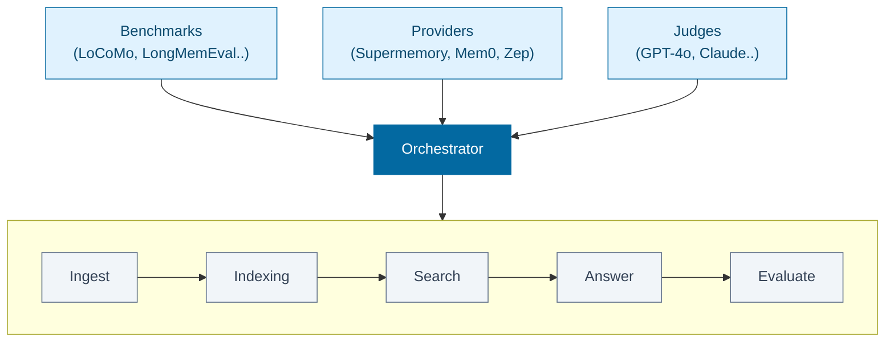
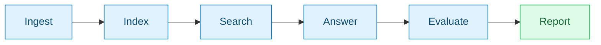

## System Overview



## Core Components

| Component | Role |
|-----------|------|
| **Benchmarks** | Load test data and provide questions with ground truth answers |
| **Providers** | Memory services being evaluated (handle ingestion and search) |
| **Judges** | LLM-based evaluators that score answers against ground truth |

See [Integrations](/memorybench/integrations) for all supported benchmarks, providers, and models.

## Pipeline



| Phase | What Happens |
|-------|--------------|
| **Ingest** | Load benchmark sessions → Push to provider |
| **Index** | Wait for provider indexing |
| **Search** | Query provider → Retrieve context |
| **Answer** | Build prompt → Generate answer via LLM |
| **Evaluate** | Compare to ground truth → Score via judge |
| **Report** | Aggregate scores → Output accuracy + latency |

Each phase checkpoints independently. Failed runs resume from last successful point.

## Advanced Checkpointing

Runs persist to `data/runs/{runId}/`:

```
data/runs/my-run/
├── checkpoint.json    # Run state and progress
├── results/           # Search results per question
└── report.json        # Final report
```

Re-running same ID resumes. Use `--force` to restart.

## File Structure

```
src/
├── cli/commands/             # run, compare, test, serve, status...
├── orchestrator/phases/      # ingest, search, answer, evaluate, report
├── benchmarks/
│   └── <name>/index.ts       # e.g. locomo/, longmemeval/, convomem/
├── providers/
│   └── <name>/
│       ├── index.ts          # Provider implementation
│       └── prompts.ts        # Custom prompts (optional)
├── judges/                   # openai.ts, anthropic.ts, google.ts
└── types/                    # provider.ts, benchmark.ts, unified.ts
```
