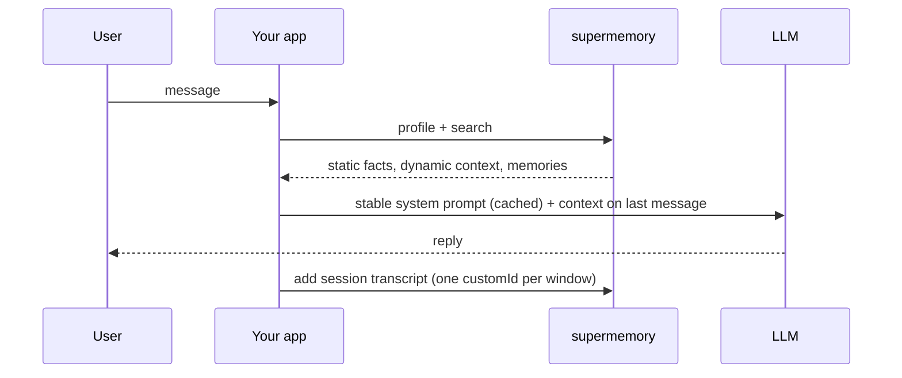

An AI companion talks to the same person every day, for months. That's thousands of turns, most of them small talk, a few of them load-bearing — and your companion has to surface the right one at the right moment without dragging the whole history into every prompt.

Four decisions decide whether that works: how you ingest conversations, what you let the memory learn from, how you retrieve per message, and where you inject the result. Get these right and your token bill stays flat while the relationship compounds.



One container tag per user — `user_4f8a` gets their own graph, their own [profile](/concepts/user-profiles), their own isolation boundary. If you're running many users, the [multi-tenant pattern](/patterns/multi-tenant-saas) covers scoped keys; this page covers everything inside one user's world.

## Ingest sessions, not turns

The most common companion mistake is adding every message as its own memory. Turn-by-turn ingestion gives the extraction model no context — "yeah, that one" becomes an orphaned fact — and it costs more, because you're billed on ingestion, not retrieval.

Instead, buffer the conversation and add it as one document per **session window**: close the window at ~50 turns or ~4 hours, whichever comes first. Format it as a labeled markdown transcript — markdown ingests better than raw JSON:

```ts
const transcript = turns
  .map((t) => `**${t.role === "user" ? "User" : "Companion"}:** ${t.content}`)
  .join("\n\n")
```

Then add the whole window with a `customId` that names the session:

<CodeGroup>

```ts TypeScript
await client.add({
  content: transcript,
  containerTag: "user_4f8a",
  customId: "session_user_4f8a_1752742800",
  metadata: { type: "chat_session" },
})
```

```python Python
client.add(
    content=transcript,
    container_tag="user_4f8a",
    custom_id="session_user_4f8a_1752742800",
    metadata={"type": "chat_session"},
)
```

```bash cURL
curl -X POST "https://api.supermemory.ai/v3/documents" \
  -H "Authorization: Bearer $SUPERMEMORY_API_KEY" \
  -H "Content-Type: application/json" \
  -d '{
    "content": "**User:** I finally told my sister about the move.\n\n**Companion:** That took courage. How did she take it?",
    "containerTag": "user_4f8a",
    "customId": "session_user_4f8a_1752742800",
    "metadata": { "type": "chat_session" }
  }'
```

</CodeGroup>

The extraction model reads the full arc of the session and derives memories with real provenance — who said what, when, and how it connects to what it already knows. A few minutes after ingestion, background consolidation ([dreaming](/concepts/how-it-works)) links the new facts into the graph.

You don't have to wait for the window to close before the session becomes memory. Flush the growing transcript every few turns with the **same** `customId` — the re-add updates that session's document instead of creating a duplicate. <!-- CONFIRM: re-add with same customId updates the document in place --> That gives you near-live memory during long sessions without turn-by-turn cost.

<Note>
One session window = one document. Don't be tempted to make it one document per day or per week — a 4-hour window is roughly the span a human would recall as "one conversation," and the extraction quality tracks that intuition.
</Note>

## Learn from both sides of the conversation

Extract from both the user's turns **and** your companion's. This surprises people — isn't the user the only source of truth? No: your companion's turns carry commitments ("I'll check in about the interview on Friday"), running jokes, nicknames it coined, advice it gave. A companion that forgets its own promises reads as broken faster than one that forgets a user fact. The labeled transcript above is what makes this work — the role labels let the memory model attribute each claim to the right speaker.

But there's a hygiene rule attached: **don't let supermemory learn your companion's unconfirmed claims as facts about the user.** LLMs guess. If your companion says "You've always been anxious around your father" and the user never said anything of the sort, an unlabeled transcript teaches the memory that it's true — and now the hallucination is load-bearing, retrieved and reinforced in every future session.

Two defenses, use both:

1. **Keep the role labels.** A claim inside a `**Companion:**` turn gets attributed to the companion, not stored as the user's own statement. Raw concatenated text loses this.
2. **Prune unconfirmed assertions before you flush.** When the companion asserts something about the user and the user's next turn doesn't confirm it, cut or soften that line in the transcript you ingest. A cheap classifier pass — or even a regex for second-person assertions followed by a deflecting reply — catches most of it.

If you find the memory model still picking up things you don't want (or skipping things you do), you can steer what gets extracted — see [customization](/concepts/customization).

## Retrieve in layers: profile first, search on demand

You don't need to search on every message. Supermemory maintains a [profile](/concepts/user-profiles) per container tag — the current derived understanding of this user, split into `static` (long-term facts) and `dynamic` (recent context). It fits in a ~1k-token budget and answers most turns on its own:

<CodeGroup>

```ts TypeScript
const { profile } = await client.profile({
  containerTag: "user_4f8a",
})
```

```python Python
result = client.profile(container_tag="user_4f8a")
profile = result.profile
```

```bash cURL
curl -X POST "https://api.supermemory.ai/v4/profile" \
  -H "Authorization: Bearer $SUPERMEMORY_API_KEY" \
  -H "Content-Type: application/json" \
  -d '{"containerTag": "user_4f8a"}'
```

</CodeGroup>

For `user_4f8a`, that returns:

```json
{
  "profile": {
    "static": [
      "Lives in Austin, moving to Denver in August for a new job",
      "Has a strained but improving relationship with her sister",
      "…"
    ],
    "dynamic": [
      "Told her sister about the move yesterday; felt relieved",
      "…"
    ]
  }
}
```

Reach for search when the message references something specific the profile won't carry — a person, an event, "that restaurant we talked about." Memory search returns distilled one-sentence facts, not raw document chunks, so five results cost you a fraction of the tokens a RAG-style chunk retrieval would:

<CodeGroup>

```ts TypeScript
const results = await client.search.memories({
  q: query,
  containerTag: "user_4f8a",
  limit: 5,
  rewriteQuery: true,
  include: { relatedMemories: true },
})
```

```python Python
results = client.search.memories(
    q=query,
    container_tag="user_4f8a",
    limit=5,
    rewrite_query=True,
    include={"relatedMemories": True},
)
```

```bash cURL
curl -X POST "https://api.supermemory.ai/v4/search" \
  -H "Authorization: Bearer $SUPERMEMORY_API_KEY" \
  -H "Content-Type: application/json" \
  -d '{
    "q": "what happened with her sister",
    "containerTag": "user_4f8a",
    "limit": 5,
    "rewriteQuery": true,
    "include": { "relatedMemories": true }
  }'
```

</CodeGroup>

`include.relatedMemories` pulls in graph-connected facts the query didn't literally match — for a companion, that's the difference between recalling "her sister lives in Portland" and recalling the whole thread of that relationship. `rewriteQuery` generates parallel query rewrites and merges the results; it adds latency but no extra cost, and it's what makes temporal phrasing like "what did we talk about last week" resolve correctly.

And since billing is on ingestion — search is essentially free — searching every message is a latency decision (~300ms), not a cost one. The layered approach exists to keep your *prompt* small, not your bill.

## Search the conversation, not the last message

The naive move is to use the user's latest message as the search query. Half the time that message is "haha yeah" or "what about her?" — and the embedding of "what about her?" retrieves nothing useful.

The fix is conversation-scoped querying: use the last message when it stands on its own, and widen to the last few turns when it doesn't:

```ts
function buildQuery(turns: Turn[]): string {
  const last = turns.at(-1)!
  // substantive message — query with it directly
  if (last.content.split(/\s+/).length >= 4) return last.content
  // short or deictic — widen to the recent window so "her" resolves
  return turns.slice(-3).map((t) => t.content).join("\n")
}
```

Don't swing to the other extreme and query with the whole session — a 40-turn blob buries the signal the same way a two-word fragment starves it. The recent window is the scope that works. `rewriteQuery` picks up the remaining slack: it expands the widened query into variants, so "what about her?" plus two turns of context becomes a real question about the sister.

## Inject without breaking prompt caching

Where you put the retrieved context decides whether provider prompt caching works for you or against you. The rule: **stable content in the system prompt, per-message content on the last user message.**

Your persona plus `profile.static` changes rarely — that's your cacheable prefix. `profile.dynamic` and search results change every message — if you put them in the system prompt, every turn is a cache miss on your longest block of tokens. Append them to the latest user message instead:

```ts
const messages = [
  {
    role: "system",
    // byte-stable across turns → provider prompt cache keeps hitting
    content: `${persona}\n\nWhat you know about them:\n${profile.static.join("\n")}`,
  },
  ...history,
  {
    role: "user",
    content: [
      lastUserMessage,
      "",
      "<context>",
      ...profile.dynamic,
      ...results.results.map((r) => r.memory),
      "</context>",
    ].join("\n"),
  },
]
```

When a static fact changes — the user actually moves to Denver — the system prompt changes with it and you eat one cache miss. That's the correct trade: static facts change on the scale of weeks, dynamic context changes every message, and this layout charges you full price only for the former.

<Note>
If you're on the Vercel AI SDK, `withSupermemory` from [`@supermemory/tools`](/integrations/ai-sdk) does profile injection for you — you pass a `containerTag` and `customId` and it handles the wiring.
</Note>

That's the whole loop — your companion now remembers month three the way it remembered day one, and your prompt is the same size on both days.

## Where next

<Columns cols={2}>
  <Card title="Ingestion best practices" href="/patterns/ingestion">
    Session windows, dedup on re-adds, and why markdown beats JSON — the full ingestion guide.
  </Card>
  <Card title="User profiles" href="/concepts/user-profiles">
    How static and dynamic facts are derived, and what the profile does and doesn't include.
  </Card>
  <Card title="Hybrid search" href="/concepts/hybrid-search">
    What rewriteQuery, rerank, and threshold actually do under the hood.
  </Card>
  <Card title="Multi-tenant SaaS" href="/patterns/multi-tenant-saas">
    Running thousands of companions: per-user containers and scoped keys.
  </Card>
</Columns>
