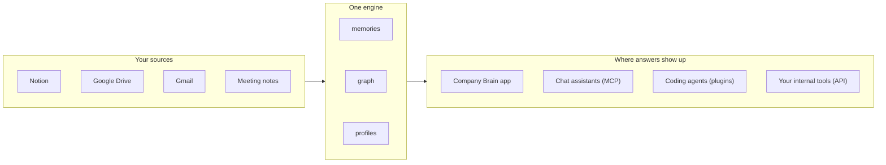

A company brain is your team's shared memory. You connect the sources where work already happens — Notion, Google Drive, Gmail, your meeting notes — and supermemory derives memories from them, links them into a [graph](/concepts/graph-memory), and answers questions from all of it. Anyone on your team can ask. So can any AI tool your team uses.

You don't need to be an engineer to read this page. There's one code section at the end, for the engineer on your team — everything before it is about what a company brain is, what it gives you back, and how to scope it so it actually works.

## What you actually get back

The fair question to ask of any "team knowledge" product: nice interface, but what's the functional output? For a company brain, it's three things.

**Answers, not document lists.** Ask "what did we decide about the pricing change?" and you get the decision — what was decided, when, and which sources it came from. That's different from search that returns ten documents mentioning "pricing" and leaves the reading to you. The engine stores [memories](/concepts/how-it-works) — individual facts with provenance and time — so "what's the *latest* decision" beats "what's the closest matching paragraph."

**The same memory inside every tool your team uses.** This is the output that matters most, and the easiest to miss: a company brain isn't another tab to check. Through [MCP](/supermemory-mcp/mcp), your team's chat assistants can recall it. Through [plugins](/concepts/surfaces), coding agents get it injected automatically. Through the API, your internal tools read the same store. Context shows up where the work happens.

**A maintained understanding, not a pile of files.** As sources sync, the engine keeps a current picture of your org's entities — projects, customers, decisions, people — and how they connect. New information updates that picture instead of stacking another copy next to it.

Here's the shape of the whole thing:



You enable Company Brain for your organization from the supermemory app, connect sources, and invite your team. <!-- CONFIRM: enablement flow and plan availability -->

## It's a door, not a separate product

Company Brain runs on the same engine as everything else in supermemory — one store of memories, one graph, one set of [profiles](/concepts/user-profiles). It doesn't have its own storage, and nothing about it is walled off from the other [surfaces](/concepts/surfaces).

That's a guarantee worth building around: a Notion page synced last night is answerable in the Company Brain interface, recallable by a chat assistant over MCP, and searchable from a script your engineer wrote this morning. And it works in the other direction too — a memory added through the API shows up in the brain your team asks questions of. One engine, many doors.

## Scope brains per team, not one for the whole org

The tempting first move is one giant brain: connect everything, org-wide, and let everyone ask it anything. That fails, predictably. When a single scope holds legal contracts, sales calls, frontend standups, and three years of email, every question has thousands of plausibly relevant memories competing to be the answer. Recall gets mushy, and a derived profile of "the entire company" is too diluted to say anything useful.

What works is a brain per team, per function, or per agent — each with its own [container tag](/concepts/permissioning), supermemory's isolation boundary. The sales brain holds sales context and answers sales questions crisply. The support brain knows the product's failure modes without wading through recruiting threads. A rule of thumb: **if two teams would answer the same question differently, they need different brains.**

Cross-team questions still work — you query the handful of relevant containers in parallel and merge the results, which is exactly how cross-container search is designed to work. What you give up is accidental blending; what you keep is precision inside each scope.

<Note>
Container tags are immutable after creation, and splitting one over-broad brain later means re-ingesting everything. Decide your scoping — per team, per function, per agent — before you connect sources and backfill.
</Note>

## Permissions follow the sources

The non-negotiable rule for shared memory: someone who can't open a document in the source shouldn't be able to get its contents out of the brain. Memory that leaks across access boundaries is worse than no memory.

The way you enforce this maps directly onto scoping. Content synced from a shared team drive belongs in that team's container. Content from a private or restricted source gets its own container rather than being mixed into a broader one — the container boundary *is* the access boundary, and memories in one container never influence answers from another. For anything programmatic, [scoped API keys](/concepts/permissioning) restrict a key to specific container tags, so the boundary is enforced server-side rather than by whoever wrote the calling code. <!-- CONFIRM: automatic per-user permission inheritance from connector source ACLs -->

One honest limitation to plan around: a container is an all-or-nothing boundary, **not** a per-document ACL. If a source mixes broadly shared and tightly restricted content, don't sync it into one container and hope — split the sync, or leave the restricted part out. [Connector](/connectors/overview) sync scopes let you pick folders rather than syncing everything.

## A system of record, not a system of actions

Your chat assistant's built-in memory is part of a system of actions: it remembers things so that one assistant, inside that one product, can act a little better for one person. That's a fine shape for personal use. It's the wrong shape for a company.

A company brain is a system of record. The differences are structural, not cosmetic:

| | Assistant-native memory | Company brain |
| --- | --- | --- |
| Who it belongs to | One person, inside one product | Your organization |
| Who can read it | That assistant, when it decides to | Every tool and teammate, through any door |
| Provenance | None — you can't ask where a "memory" came from | Every memory traces to its source, with time |
| When you switch tools | It stays behind | The record comes with you — new tools read the same engine |

The practical consequence: a new hire's coding agent knows what the team decided last quarter on day one, because the knowledge lives in the org's record, not in someone else's chat history.

## Query it from code

Everything above is available to your engineers with no extra setup, because the brain is a container in the same engine they already build against. To ask the growth team's brain a question from a script:

<CodeGroup>

```typescript TypeScript
import Supermemory from "supermemory";

const client = new Supermemory({ apiKey: process.env.SUPERMEMORY_API_KEY });

const results = await client.search.memories({
  q: "what did we decide about the pricing change?",
  containerTag: "team_growth",
  limit: 10,
});

results.results.forEach((result) => {
  console.log(result.memory, result.similarity);
});
```

```python Python
from supermemory import Supermemory

client = Supermemory()

results = client.search.memories(
    q="what did we decide about the pricing change?",
    container_tag="team_growth",
    limit=10,
)

for result in results.results:
    print(result.memory, result.similarity)
```

```bash cURL
# POST /v4/search
curl -X POST "https://api.supermemory.ai/v4/search" \
  -H "Authorization: Bearer $SUPERMEMORY_API_KEY" \
  -H "Content-Type: application/json" \
  -d '{
    "q": "what did we decide about the pricing change?",
    "containerTag": "team_growth",
    "limit": 10
  }'
```

</CodeGroup>

<!-- CONFIRM: python — search.memories kwargs mirrored from published search page -->

And the reverse works too: `client.memories.add({ content, containerTag: "team_growth" })` puts a memory into the same brain the team is asking questions of. If they want to feed it programmatically — internal tools, ETL from systems without a connector — the [ingestion patterns](/patterns/ingestion) page covers how to do that well.

That's the whole idea: the same engine your engineers build on, with a door your entire team can walk through.

## Where next

- [Connectors](/connectors/overview) — which sources sync today, and what each one's limits are
- [Permissioning](/concepts/permissioning) — container tags, metadata, and scoped keys as one security model
- [Ways to use supermemory](/concepts/surfaces) — all the doors into the engine, and which to pick when
- [Multi-agent systems](/patterns/multi-agent) — when the "team" asking questions is a fleet of agents
