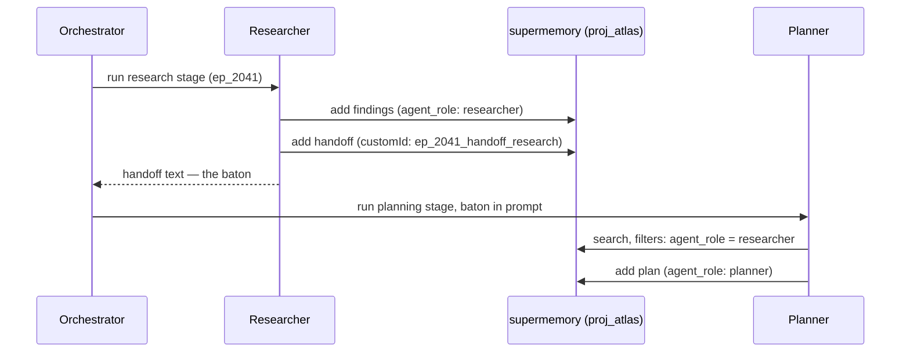

You're running a fleet: a researcher that digs, a planner that sequences, a writer that ships, an orchestrator herding all three. They need to build on each other's work — and each one should read only the slice it needs. In supermemory, the fleet gets one brain. One [container tag](/concepts/permissioning) for the project, metadata for everything else:

<CodeGroup>

```typescript TypeScript
import Supermemory from "supermemory";

const client = new Supermemory({ apiKey: process.env.SUPERMEMORY_API_KEY });

// the researcher writes what it found
await client.add({
  content: "Competitor pricing scan: Vanta starts at $7,500/yr, Drata is quote-only, both gate SSO behind enterprise tiers...",
  containerTag: "proj_atlas",
  customId: "ep_2041_research_notes",
  metadata: { agent_role: "researcher", stage: "research", episode: "ep_2041" },
});

// the planner reads only what the researcher produced
const research = await client.search.memories({
  q: "what did we learn about competitor pricing?",
  containerTag: "proj_atlas",
  filters: { AND: [{ key: "agent_role", value: "researcher" }] },
});
```

```python Python
from supermemory import Supermemory

client = Supermemory()

# the researcher writes what it found
client.add(
    content="Competitor pricing scan: Vanta starts at $7,500/yr, Drata is quote-only, both gate SSO behind enterprise tiers...",
    container_tag="proj_atlas",
    custom_id="ep_2041_research_notes",
    metadata={"agent_role": "researcher", "stage": "research", "episode": "ep_2041"},
)

# the planner reads only what the researcher produced
research = client.search.memories(
    q="what did we learn about competitor pricing?",
    container_tag="proj_atlas",
    filters={"AND": [{"key": "agent_role", "value": "researcher"}]},
)
```

```bash cURL
# write → POST /v3/documents
curl -X POST "https://api.supermemory.ai/v3/documents" \
  -H "Authorization: Bearer $SUPERMEMORY_API_KEY" \
  -H "Content-Type: application/json" \
  -d '{
    "content": "Competitor pricing scan: Vanta starts at $7,500/yr, Drata is quote-only...",
    "containerTag": "proj_atlas",
    "customId": "ep_2041_research_notes",
    "metadata": {"agent_role": "researcher", "stage": "research", "episode": "ep_2041"}
  }'

# filtered read → POST /v4/search
curl -X POST "https://api.supermemory.ai/v4/search" \
  -H "Authorization: Bearer $SUPERMEMORY_API_KEY" \
  -H "Content-Type: application/json" \
  -d '{
    "q": "what did we learn about competitor pricing?",
    "containerTag": "proj_atlas",
    "filters": {"AND": [{"key": "agent_role", "value": "researcher"}]}
  }'
```

</CodeGroup>

That's the whole pattern in miniature. The rest of this page works it through: why one container (and why one-per-agent breaks), how to tag and filter, how handoffs survive restarts, and how to sweep up after an episode.

## Give the fleet one container

The first design most teams reach for is a container per agent: `atlas_researcher`, `atlas_planner`, `atlas_writer`. It feels tidy. It's the single most common mistake we see in multi-agent setups, and it always fails the same way.

Container tags are **isolation boundaries**. Memories in one container never connect to memories in another — the [graph](/concepts/graph-memory) builds inside a container, and each container gets its own derived profile. Split your fleet across containers and the planner literally cannot see what the researcher learned. Facts that should link ("the researcher found Vanta's pricing" ↔ "the plan undercuts Vanta") sit in separate universes. Cross-agent questions turn into N parallel searches you merge by hand, and no single profile understands the project.

The container tag answers exactly one question: *what must never mix?* For a fleet, that's the project — or the tenant the fleet serves — never the agent. Everything else is a dimension inside the boundary, and dimensions are metadata:

| Question | Where it goes |
| --- | --- |
| Which project (or tenant) is this? | `containerTag: "proj_atlas"` |
| Which agent wrote this? | `metadata.agent_role: "researcher"` |
| Which pipeline stage? | `metadata.stage: "research"` |
| Which run is this from? | `metadata.episode: "ep_2041"` |

If two agents should be able to build on each other's knowledge, they belong in the same container. If you'd ever want to filter by it but never need to wall it off, it's metadata.

<Note>
Container tags are immutable after creation, and both `containerTag` and `customId` are capped at 100 characters — alphanumeric, hyphens, underscores, and colons. Pick your naming scheme before the first agent writes anything.
</Note>

## Tag every write with role, stage, and episode

Each agent writes its full output — findings, drafts, decisions, not only conclusions — and stamps it with the same three metadata keys. Consistency here is what makes every later read cheap:

<CodeGroup>

```typescript TypeScript
// the planner ships its plan into the same container
await client.add({
  content: "# Launch plan for Atlas\n\nWeek 1: undercut Vanta's entry tier at $5,900...",
  containerTag: "proj_atlas",
  customId: "ep_2041_plan_v1",
  metadata: { agent_role: "planner", stage: "planning", episode: "ep_2041" },
});
```

```python Python
client.add(
    content="# Launch plan for Atlas\n\nWeek 1: undercut Vanta's entry tier at $5,900...",
    container_tag="proj_atlas",
    custom_id="ep_2041_plan_v1",
    metadata={"agent_role": "planner", "stage": "planning", "episode": "ep_2041"},
)
```

```bash cURL
# POST /v3/documents
curl -X POST "https://api.supermemory.ai/v3/documents" \
  -H "Authorization: Bearer $SUPERMEMORY_API_KEY" \
  -H "Content-Type: application/json" \
  -d '{
    "content": "# Launch plan for Atlas\n\nWeek 1: undercut Vanta entry tier at $5,900...",
    "containerTag": "proj_atlas",
    "customId": "ep_2041_plan_v1",
    "metadata": {"agent_role": "planner", "stage": "planning", "episode": "ep_2041"}
  }'
```

</CodeGroup>

Metadata values can be strings, numbers, booleans, or arrays of strings — no nested objects. Markdown content ingests better than raw JSON, so have agents write prose and headings, not serialized state. The [ingestion guide](/patterns/ingestion) covers the write path in depth.

You can scope the write itself, too. By default, new memories are derived with the whole container as context. If you want the researcher's new memories to build only on prior research — not on the writer's drafts — add `filterByMetadata` to the write:

```bash cURL
# POST /v3/documents — derive new memories only from matching context
curl -X POST "https://api.supermemory.ai/v3/documents" \
  -H "Authorization: Bearer $SUPERMEMORY_API_KEY" \
  -H "Content-Type: application/json" \
  -d '{
    "content": "Follow-up: Vanta quietly added a $3,000 startup tier last month...",
    "containerTag": "proj_atlas",
    "metadata": {"agent_role": "researcher", "stage": "research", "episode": "ep_2041"},
    "filterByMetadata": {"agent_role": "researcher"}
  }'
```

`filterByMetadata` isn't in the `supermemory@4.x` TS typings yet — the backend accepts it, so send it over REST until it lands. See [filtered writes](/add-memories#filtered-writes) for how the context scoping works.

## Filter reads per role

Reads mirror writes. Each agent searches the shared container with a filter matching what it's allowed — or needs — to see. The planner reads research; the writer reads research *and* plans:

<CodeGroup>

```typescript TypeScript
// the writer needs both upstream roles for this episode
const context = await client.search.memories({
  q: "pricing decisions and the reasoning behind them",
  containerTag: "proj_atlas",
  filters: {
    AND: [
      { key: "episode", value: "ep_2041" },
      { OR: [
        { key: "agent_role", value: "researcher" },
        { key: "agent_role", value: "planner" },
      ]},
    ],
  },
  limit: 10,
});
```

```python Python
context = client.search.memories(
    q="pricing decisions and the reasoning behind them",
    container_tag="proj_atlas",
    filters={
        "AND": [
            {"key": "episode", "value": "ep_2041"},
            {"OR": [
                {"key": "agent_role", "value": "researcher"},
                {"key": "agent_role", "value": "planner"},
            ]},
        ]
    },
    limit=10,
)
```

```bash cURL
# POST /v4/search
curl -X POST "https://api.supermemory.ai/v4/search" \
  -H "Authorization: Bearer $SUPERMEMORY_API_KEY" \
  -H "Content-Type: application/json" \
  -d '{
    "q": "pricing decisions and the reasoning behind them",
    "containerTag": "proj_atlas",
    "filters": {"AND": [
      {"key": "episode", "value": "ep_2041"},
      {"OR": [
        {"key": "agent_role", "value": "researcher"},
        {"key": "agent_role", "value": "planner"}
      ]}
    ]},
    "limit": 10
  }'
```

</CodeGroup>

Results come back with the metadata attached, so you always know which agent a memory came from:

```json
{
  "results": [
    {
      "id": "mem_9c21",
      "memory": "Vanta's entry tier is $7,500/yr; the launch plan undercuts it at $5,900",
      "metadata": { "agent_role": "planner", "stage": "planning", "episode": "ep_2041" },
      "similarity": 0.87,
      "updatedAt": "2026-07-16T09:14:00Z"
    }
  ],
  "total": 6,
  "timing": 312
}
```

And here's the payoff of sharing one container: drop the filter and you get the fleet's collective knowledge in one query. The orchestrator asks "what's blocking launch?" and gets researcher facts, planner decisions, and writer status in a single ranked list — because they were never walled off from each other.

For standing context, layer your reads: pull the project profile first, then search for the specific question. The profile is the container's current derived understanding, budgeted to fit in about 1k tokens, so every agent can prepend it cheaply:

<CodeGroup>

```typescript TypeScript
const { profile } = await client.profile({ containerTag: "proj_atlas" });
// profile.static and profile.dynamic → the fleet's shared understanding of the project
```

```python Python
result = client.profile(container_tag="proj_atlas")
# result.profile.static and result.profile.dynamic → the fleet's shared understanding of the project
```

```bash cURL
# POST /v4/profile
curl -X POST "https://api.supermemory.ai/v4/profile" \
  -H "Authorization: Bearer $SUPERMEMORY_API_KEY" \
  -H "Content-Type: application/json" \
  -d '{"containerTag": "proj_atlas"}'
```

</CodeGroup>

## Hand off with a stable customId

Filtered search gives the next agent everything upstream — but "everything" is the wrong handoff. At each stage boundary, write one compact handoff summary: what was decided, what's open, what the next agent should not redo. Give it a **stable, deterministic customId** built from the episode and stage:

<CodeGroup>

```typescript TypeScript
// researcher is done — write the baton
await client.add({
  content: `# Research handoff — Atlas ep_2041

## Decided
- Target Vanta's entry tier; ignore Drata (quote-only, slow cycle)

## Open questions
- Does Vanta's new $3,000 startup tier change our floor?

## Don't redo
- Full pricing scan complete as of this episode`,
  containerTag: "proj_atlas",
  customId: "ep_2041_handoff_research",
  metadata: { agent_role: "researcher", stage: "handoff", episode: "ep_2041" },
});
```

```python Python
client.add(
    content=handoff_markdown,
    container_tag="proj_atlas",
    custom_id="ep_2041_handoff_research",
    metadata={"agent_role": "researcher", "stage": "handoff", "episode": "ep_2041"},
)
```

```bash cURL
# POST /v3/documents — same customId updates in place
curl -X POST "https://api.supermemory.ai/v3/documents" \
  -H "Authorization: Bearer $SUPERMEMORY_API_KEY" \
  -H "Content-Type: application/json" \
  -d '{
    "content": "# Research handoff — Atlas ep_2041\n\n## Decided\n- Target Vanta entry tier...",
    "containerTag": "proj_atlas",
    "customId": "ep_2041_handoff_research",
    "metadata": {"agent_role": "researcher", "stage": "handoff", "episode": "ep_2041"}
  }'
```

</CodeGroup>

The stable `customId` is what makes this durable. Re-ingesting with the same `customId` updates the document instead of creating a sibling — so a retried stage, a crashed-and-restarted agent, or a revised summary never leaves duplicate handoffs polluting search. It also means the orchestrator can *edit a subagent's memory*: review the researcher's handoff, correct it, and re-add it under the same `customId`. The fleet's record of the handoff is whatever was written last.

The full loop looks like this:



Notice the baton goes through the orchestrator, not through search. Memory is **not** your message bus: ingestion is asynchronous — a document moves through a processing pipeline before its memories are searchable, and there are no strict ordering guarantees between concurrent writes. Pass the handoff text directly to the next agent in its prompt, and write it to supermemory in parallel. The memory copy is for durability: restarted agents, next week's episode, and cross-role searches all find it there.

## Clean up when the episode ends

Default to keeping episode memories. Cross-episode recall is most of the payoff — next month's researcher already knows Vanta's pricing moved, because last month's episode is in the container. But scratch runs, eval sweeps, and abandoned episodes deserve deletion, and the `episode` metadata key makes that surgical: list the episode's documents by filter, then delete them.

<CodeGroup>

```typescript TypeScript
// find everything ep_2041 wrote...
const { memories } = await client.documents.list({
  containerTags: ["proj_atlas"],
  filters: { AND: [{ key: "episode", value: "ep_2041" }] },
  limit: 100,
});

// ...and remove it
await Promise.all(memories.map((m) => client.documents.delete(m.id)));
```

```python Python
page = client.documents.list(
    container_tags=["proj_atlas"],
    filters={"AND": [{"key": "episode", "value": "ep_2041"}]},
    limit=100,
)
for m in page.memories:
    client.documents.delete(m.id)
```

```bash cURL
# list the episode's documents → POST /v3/documents/list
curl -X POST "https://api.supermemory.ai/v3/documents/list" \
  -H "Authorization: Bearer $SUPERMEMORY_API_KEY" \
  -H "Content-Type: application/json" \
  -d '{
    "containerTags": ["proj_atlas"],
    "filters": {"AND": [{"key": "episode", "value": "ep_2041"}]},
    "limit": 100
  }'

# then bulk delete by the returned ids → DELETE /v3/documents/bulk
curl -X DELETE "https://api.supermemory.ai/v3/documents/bulk" \
  -H "Authorization: Bearer $SUPERMEMORY_API_KEY" \
  -H "Content-Type: application/json" \
  -d '{"ids": ["doc_8f2a", "doc_8f2b", "doc_8f2c"]}'
```

</CodeGroup>

<!-- CONFIRM: deleting a document also removes the memories derived from it — verify before stating explicitly -->

<Warning>
Document deletes are permanent — there's no recovery. Run the list step first and check what matched before you delete, especially with broad filters.
</Warning>

The listing paginates (`page`, `limit`), so loop until `pagination` says you're done for episodes with more than a page of documents. For semantic cleanup — "forget everything about the abandoned pricing experiment" rather than "delete episode ep_2041" — use [forget-matching](/memory-operations#forget-matching) with `dryRun: true` first.

That's the whole pattern: one container, three honest metadata keys, handoffs that upsert, episodes you can sweep. Your agents now share one brain — and each one reads only the slice it needs.

## Where next

- [Agent task memory](/patterns/agent-task-memory) — when your agents do tasks, not conversations, and you need recall you can regression-test
- [Multi-tenant SaaS](/patterns/multi-tenant-saas) — running a fleet per customer: per-tenant containers and scoped keys on top of this pattern
- [Organizing & filtering](/concepts/hybrid-search) — the full filter syntax: negation, numeric operators, array contains
- [Ingestion best practices](/patterns/ingestion) — what to feed the engine so the fleet's recall stays sharp and cheap
