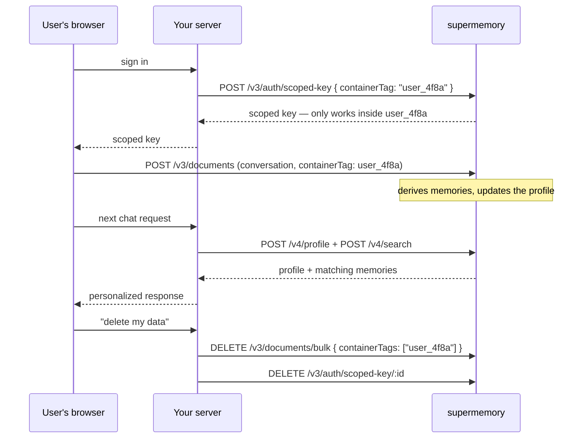

You're building a product where every user gets an assistant that remembers them — and user A's memories must never surface in user B's context. This page is the full worked system: one container per user, a scoped key minted when their session starts, writes and reads that can't cross the boundary, the profile injected into your system prompt, and a deletion path you can point your DPO at.

Here's the whole system up front — the rest of the page builds it piece by piece:



<!-- CONFIRM: runnable example repo link — spec calls for a linked repo; add once the cookbook example ships -->

## Give every user a container

A [container tag](/concepts/permissioning) is a real isolation boundary, not a label. Memories in one container never influence search results, profiles, or memory generation in another. So the partitioning rule for multi-tenant apps is one line — one container tag per user:

```ts
const containerTag = `user_${user.id}`; // your internal id, not your auth provider's
```

Two decisions here that are hard to undo later:

**Use your internal user ID, and only that.** A team shipped save and search against different IDs — writes went to a container named after their Clerk `user_id`, reads queried one named after their internal ID. Both calls succeeded. Search returned zero results, silently, for every user. Pick one ID, wrap it in a helper, and never construct a tag inline twice.

**Pick the scheme before you backfill.** Container tags are immutable after creation — there's no rename. If you start with `user_4f8a` and later want `tenant_acme:user_4f8a`, you're re-ingesting everything. Decide up front whether your boundary is the user, the workspace, or both (more on running two containers per user [below](#keep-shared-and-private-memory-separate)).

There's no per-container size penalty, so don't shard a user across containers for performance — one user, one tag, however much they ingest.

## Mint a scoped key per session

Your root API key can read every user's memories. It should never leave your server. What ships to the browser (or a user-facing agent) is a scoped key: a key restricted to exactly one container tag, enforced server-side. Even a hostile client holding it can't search, write, or pull a profile outside its own container — and it can't mint or revoke other keys either.

When a user signs in, mint one:

<CodeGroup>

```typescript TypeScript
// app/api/memory-key/route.ts — server-side, after your auth check
export async function POST(req: Request) {
  const user = await requireUser(req); // your auth

  const res = await fetch("https://api.supermemory.ai/v3/auth/scoped-key", {
    method: "POST",
    headers: {
      Authorization: `Bearer ${process.env.SUPERMEMORY_API_KEY}`, // root key stays here
      "Content-Type": "application/json",
    },
    body: JSON.stringify({
      containerTag: `user_${user.id}`,
      name: `session_${user.id}`,
      expiresInDays: 7,
    }),
  });

  const { key, id } = await res.json();
  await saveScopedKeyId(user.id, id); // you'll need the id to revoke it later
  return Response.json({ key });
}
```

```bash cURL
curl -X POST "https://api.supermemory.ai/v3/auth/scoped-key" \
  -H "Authorization: Bearer $SUPERMEMORY_API_KEY" \
  -H "Content-Type: application/json" \
  -d '{
    "containerTag": "user_4f8a",
    "name": "session_user_4f8a",
    "expiresInDays": 7
  }'
```

</CodeGroup>

The response is a working key plus the metadata you need to manage it:

```json
{
  "key": "sm_orgId_...",
  "id": "key-id",
  "name": "session_user_4f8a",
  "containerTag": "user_4f8a",
  "expiresAt": "2026-07-24T00:00:00.000Z",
  "allowedEndpoints": ["/v3/documents", "/v3/memories", "/v4/memories", "/v3/search", "/v4/search", "/v4/profile"]
}
```

The client uses it exactly like a normal API key — same SDK, same endpoints for add, search, and profile. The difference: it returns a `403` the moment a request references any other container. Expiry runs 1–365 days; scoped keys default to the standard 500 requests per 60 seconds, tunable per key with `rateLimitMax` and `rateLimitTimeWindow`. The full parameter table is in [Authentication](/authentication).

<Note>
Scoped keys answer the "malicious developer" question directly: an engineer building your mobile app, or a compromised client, holds a credential the API rejects outside its own container. Isolation isn't a `WHERE` clause in your app code — it's enforced where the data lives.
</Note>

## Write conversations inside the boundary

With the scoped key on the client, writes go straight to supermemory — no proxy route through your server needed. Feed full sessions, not individual turns, and give each session a stable `customId` so re-sends update the document instead of duplicating it:

<CodeGroup>

```typescript TypeScript
import Supermemory from "supermemory";

const client = new Supermemory({ apiKey: scopedKey }); // safe in the browser

await client.add({
  content: sessionTranscript, // the whole session, both sides, as markdown
  containerTag: "user_4f8a",
  customId: "user_4f8a_session_0093",
  metadata: { channel: "web", plan: "pro" },
});
```

```python Python
from supermemory import Supermemory

client = Supermemory(api_key=scoped_key)

client.add(
    content=session_transcript,  # the whole session, both sides, as markdown
    container_tag="user_4f8a",
    custom_id="user_4f8a_session_0093",
    metadata={"channel": "web", "plan": "pro"},
)
```

```bash cURL
# POST /v3/documents
curl -X POST "https://api.supermemory.ai/v3/documents" \
  -H "Authorization: Bearer $SCOPED_KEY" \
  -H "Content-Type: application/json" \
  -d '{
    "content": "user: can you move my standup summary to Fridays?\nassistant: Done — weekly summary now lands Friday morning...",
    "containerTag": "user_4f8a",
    "customId": "user_4f8a_session_0093",
    "metadata": {"channel": "web", "plan": "pro"}
  }'
```

</CodeGroup>

Notice what `metadata` is doing: `channel` and `plan` are dimensions *within* the user's boundary — things you'll filter by at search time. They're metadata precisely because they don't need walls between them. If you catch yourself creating tags like `user_4f8a_web` and `user_4f8a_mobile`, stop: that's two containers that can't see each other, which means the assistant on mobile forgets what the user said on web. Tag = boundary, metadata = dimension. The [permissioning page](/concepts/permissioning) has the full anti-pattern gallery.

The ingestion side has its own craft — session windows, markdown over raw JSON, extracting from both turns. That's all in [ingestion best practices](/patterns/ingestion); it applies unchanged here.

## Keep shared and private memory separate

Most multi-tenant apps eventually grow a second kind of memory: things the whole workspace should know, alongside things only one user should. Don't try to fake this with metadata inside one container — reads can filter, but memory generation and profiles operate on the whole container. Run two containers instead:

- `user_4f8a` — private. The user's own conversations, preferences, context.
- `org_acme` — shared. Workspace-level knowledge every member's assistant can draw on.

Writes route by audience. Private chat goes to the user container as above. Shared content goes to the org container — with two extra levers so one member's activity doesn't distort another's:

<CodeGroup>

```typescript TypeScript
await client.add({
  content: "Decision from planning: Acme is standardizing on usage-based pricing for Q4.",
  containerTag: "org_acme",
  metadata: { author: "user_4f8a" },
  // build new memories only on this author's prior context,
  // so members' contradicting notes don't rewrite each other
  filterByMetadata: { author: "user_4f8a" },
});
```

```bash cURL
curl -X POST "https://api.supermemory.ai/v3/documents" \
  -H "Authorization: Bearer $SUPERMEMORY_API_KEY" \
  -H "Content-Type: application/json" \
  -d '{
    "content": "Decision from planning: Acme is standardizing on usage-based pricing for Q4.",
    "containerTag": "org_acme",
    "metadata": {"author": "user_4f8a"},
    "filterByMetadata": {"author": "user_4f8a"}
  }'
```

</CodeGroup>

One caveat on that TypeScript tab: `filterByMetadata` isn't in the `supermemory@4.x` typed `AddParams` yet. The backend accepts it, so send it over REST until it's typed.

`filterByMetadata` is a [filtered write](/add-memories#filtered-writes): new memories are generated using only existing memories that match the filter as context. Without it, everything in `org_acme` is fair game as ingestion context, and a shared container full of many people's notes starts blending them. Pair it with `entityContext` on the org container — a one-time description like "This container holds Acme's shared workspace knowledge; individual members are contributors, not the subject" — so extraction knows the container is about the org, not any one person. `entityContext` mechanics live in [Customization](/concepts/customization).

Reads then span both containers. Cross-container search is deliberate in v4 — two parallel queries you merge, so the boundary stays explicit:

```ts
const [personal, shared] = await Promise.all([
  client.search.memories({ q: query, containerTag: "user_4f8a", limit: 8 }),
  client.search.memories({ q: query, containerTag: "org_acme", limit: 8 }),
]);
```

One caveat with real consequences: a scoped key covers one container. A client that needs both private and shared reads either gets the org search proxied through your server, or holds a second scoped key for `org_acme` — which every member shares, so treat that container as readable by the whole workspace.

## Inject the profile into the system prompt

Per container, supermemory maintains a [profile](/concepts/user-profiles): its current derived understanding of that user, as two arrays of plain sentences — `static` for durable facts, `dynamic` for recent state. This is what makes the assistant feel like it knows the user from the first token, before any search runs.

The injection pattern matters for your inference bill. Profiles are built to be prompt-cache-friendly — they fit a roughly 1k-token budget — so put the slow-changing parts in the cacheable prefix and let the volatile parts ride with the message:

<CodeGroup>

```typescript TypeScript
const { profile } = await client.profile({ containerTag: "user_4f8a" });

const systemPrompt = [
  BASE_PROMPT,                          // identical for every request — caches
  "What you know about this user:",
  ...profile.static,                    // durable facts — changes rarely, caches well
].join("\n");

const messages = [
  { role: "system", content: systemPrompt },
  // dynamic facts change often — append them to the user turn,
  // after the cached prefix, so they never invalidate it
  { role: "user", content: `Recent context:\n${profile.dynamic.join("\n")}\n\n${userMessage}` },
];
```

```python Python
result = client.profile(container_tag="user_4f8a")

system_prompt = "\n".join([
    BASE_PROMPT,
    "What you know about this user:",
    *result.profile.static,
])

messages = [
    {"role": "system", "content": system_prompt},
    {"role": "user", "content": f"Recent context:\n" + "\n".join(result.profile.dynamic) + f"\n\n{user_message}"},
]
```

```bash cURL
# POST /v4/profile
curl -X POST "https://api.supermemory.ai/v4/profile" \
  -H "Authorization: Bearer $SCOPED_KEY" \
  -H "Content-Type: application/json" \
  -d '{"containerTag": "user_4f8a"}'
```

</CodeGroup>

When the profile isn't specific enough — the user asks about something from three weeks ago — search the container with the last user turn as the query (the last turn, not the whole transcript; long queries bury the actual question):

```ts
const results = await client.search.memories({
  q: lastUserMessage,
  containerTag: "user_4f8a",
  limit: 10,
});
```

You can also collapse both calls into one: pass `q` to `client.profile()` and it returns `searchResults` alongside the profile. Either way, isolation holds at every read — a profile call for `user_4f8a` cannot surface anything derived from another container, and neither can search.

## Delete a user on request

When a user invokes their right to erasure, you delete their container's contents and revoke their keys. Bulk delete by container tag removes every document in the container *and* the memories derived from them — the "reset this user" operation, in one call. The TS SDK doesn't expose a bulk method, so hit the endpoint directly:

<CodeGroup>

```typescript TypeScript
// server-side, root key — scoped keys shouldn't run deletions
const res = await fetch("https://api.supermemory.ai/v3/documents/bulk", {
  method: "DELETE",
  headers: {
    Authorization: `Bearer ${process.env.SUPERMEMORY_API_KEY}`,
    "Content-Type": "application/json",
  },
  body: JSON.stringify({ containerTags: ["user_4f8a"] }),
});

const { success, deletedCount } = await res.json();
```

```bash cURL
curl -X DELETE "https://api.supermemory.ai/v3/documents/bulk" \
  -H "Authorization: Bearer $SUPERMEMORY_API_KEY" \
  -H "Content-Type: application/json" \
  -d '{"containerTags": ["user_4f8a"]}'
```

</CodeGroup>

<!-- CONFIRM: containerTags on DELETE /v3/documents/bulk is marked deprecated/hidden in the API schema but works and is the planned "reset a user" path — confirm sanctioned status before publish -->

The response confirms how much was removed:

```json
{
  "success": true,
  "deletedCount": 142
}
```

Then revoke any scoped keys you minted for them, using the `id` you stored at mint time:

```bash
curl -X DELETE "https://api.supermemory.ai/v3/auth/scoped-key/KEY_ID" \
  -H "Authorization: Bearer $SUPERMEMORY_API_KEY"
```

The key stops working immediately — subsequent requests get a `401`.

<Warning>
Bulk deletion is permanent — there's no recovery, and it does **not** restore ingestion quota you've already used. Gate it behind an explicit confirmation in your admin flow, and log the `deletedCount` you get back as your audit record.
</Warning>

If the user had content in a shared org container, that's a separate decision: their private container is theirs to erase, but org-container documents they authored belong to the workspace's data policy. You can target only their contributions there by listing documents filtered on `metadata.author` and deleting by ID.

That's the whole system — a user signs in, gets a key that can only see their own memory, their assistant knows them from the first message, and when they leave, one call erases them. Isolation was never your application code's job.

## Where next

- [Permissioning](/concepts/permissioning) — container tags, metadata, and scoped keys as one security model, with more recipes
- [User profiles](/concepts/user-profiles) — where the static/dynamic split comes from and how buckets shape it
- [Ingestion best practices](/patterns/ingestion) — session windows, customId patterns, and feeding the engine well
- [Errors and limits](/errors-and-limits) — rate limits per key, 429 handling, and what each status code actually means
