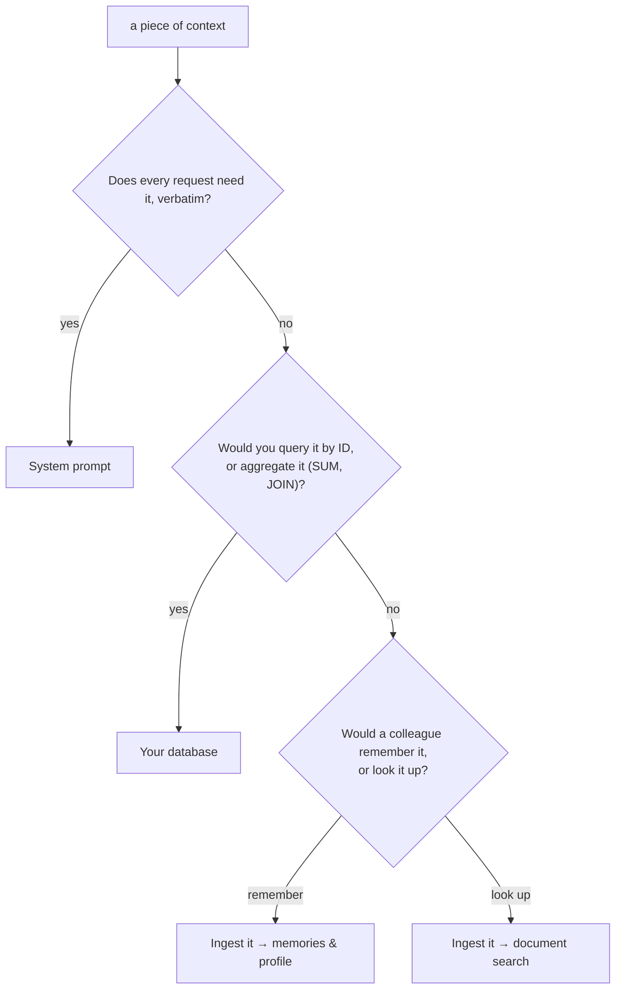

Every pattern in this section — multi-tenant SaaS, AI companions, agent fleets, company brains — is the same handful of primitives arranged differently. This page gives you the decision framework behind all of them: for any piece of context in your app, you'll know whether it belongs in supermemory, in your database, or in your prompt, and which pattern page to read next.

## Run the colleague test

Imagine hiring a sharp colleague who's worked with your user for a year. Three things are true about how they operate:

- **They remember.** The user prefers async updates, hates Jira, got promoted to VP of Product in March. Nobody wrote this down for them — it accumulated from working together.
- **They look things up.** The Q3 planning doc, the API changelog, that one thread about the pricing decision. They don't memorize documents; they know where to search.
- **They were told the rules once.** How the company talks to customers, what's confidential. That's onboarding, not memory.

Your AI has the same three slots. Remembering is memory search and [profiles](/concepts/user-profiles). Looking up is document search. The rules are your system prompt. Most context problems come from putting content in the wrong slot — stuffing remembered facts into the prompt, or asking a vector store to "remember" when all it can do is look up.

## Route each piece of context

Take any piece of context and run it through this:



Some real examples through the flowchart:

| Context | Test result | Where it goes |
| --- | --- | --- |
| "Sarah prefers async updates and is being promoted to VP of Product" | A colleague would remember this | supermemory — [memory search](/search) + profile |
| The Q3 planning doc, support tickets, the API changelog | A colleague would look it up by meaning | supermemory — ingested as documents, recalled with document search |
| Invoice #4821, total $1,340.50, status `paid` | Queried by ID, summed in reports | your database |
| "Answer in the user's language. Never quote internal pricing." | Every request needs it, verbatim | system prompt |

Two things about this table that trip people up.

**"Remember" and "look up" are both supermemory — but different reads.** You [ingest documents](/add-memories); the pipeline derives memories from them and maintains a profile per [container tag](/concepts/how-it-works). `search.memories` recalls the derived facts. `search.documents` recalls the source material itself. A support agent usually needs both: memories for "this customer runs self-hosted and already tried reinstalling", documents for the actual troubleshooting guide.

**Supermemory is not your system of record.** There's no SQL over memories — no joins, no aggregates, no querying by primary key. Keep transactional data in your database, and ingest the narrative *around* it ("the customer disputed invoice #4821 and churned over it") so your AI understands what the rows mean.

## Learn the shape every pattern shares

Every pattern page ahead reduces to one write path and one read path. Write: feed full content — whole conversations, whole documents — into a container, and let the memory model decide what's worth keeping. Read: pull the profile for standing context, then search for the specific question:

<CodeGroup>

```typescript TypeScript
import Supermemory from "supermemory";

const client = new Supermemory({ apiKey: process.env.SUPERMEMORY_API_KEY });

// write path: the full session, both sides of the conversation
await client.memories.add({
  content: sessionTranscript, // markdown ingests better than raw JSON
  containerTag: "user_4f8a",
  customId: "user_4f8a_session_0093",
});

// read path: profile for who they are, search for what you need right now
const { profile } = await client.profile({ containerTag: "user_4f8a" });

const results = await client.search.memories({
  q: "what's blocking Sarah's onboarding rollout?",
  containerTag: "user_4f8a",
  limit: 10,
});
```

```python Python
from supermemory import Supermemory

client = Supermemory()

# write path: the full session, both sides of the conversation
client.add(
    content=session_transcript,  # markdown ingests better than raw JSON
    container_tag="user_4f8a",
    custom_id="user_4f8a_session_0093",
)

# read path: profile for who they are, search for what you need right now
result = client.profile(container_tag="user_4f8a")

results = client.search.memories(
    q="what's blocking Sarah's onboarding rollout?",
    container_tag="user_4f8a",
    limit=10,
)
```

```bash cURL
# write path → POST /v3/documents
curl -X POST "https://api.supermemory.ai/v3/documents" \
  -H "Authorization: Bearer $SUPERMEMORY_API_KEY" \
  -H "Content-Type: application/json" \
  -d '{
    "content": "user: Sarah said the EU onboarding rollout slips a week...\nassistant: Got it — tracking the new date...",
    "containerTag": "user_4f8a",
    "customId": "user_4f8a_session_0093"
  }'

# read path → POST /v4/profile, then POST /v4/search
curl -X POST "https://api.supermemory.ai/v4/profile" \
  -H "Authorization: Bearer $SUPERMEMORY_API_KEY" \
  -H "Content-Type: application/json" \
  -d '{"containerTag": "user_4f8a"}'

curl -X POST "https://api.supermemory.ai/v4/search" \
  -H "Authorization: Bearer $SUPERMEMORY_API_KEY" \
  -H "Content-Type: application/json" \
  -d '{"q": "what is blocking the onboarding rollout?", "containerTag": "user_4f8a", "limit": 10}'
```

</CodeGroup>

<!-- CONFIRM: python — client.add signature mirrored from add-memories.mdx; verify custom_id kwarg is accepted -->

Notice what you *didn't* do: you never wrote a memory by hand. You don't decide what's worth remembering — the ingestion pipeline derives memories from what you feed it, connects them in the [graph](/concepts/graph-memory), and keeps the profile current. Your real design decisions are the ones this page is about: what to feed it, and how to partition it.

## Know the primitives

Four knobs show up in every pattern. Here's what each one is for:

| Primitive | What it's for | Rule of thumb |
| --- | --- | --- |
| `containerTag` | The isolation boundary — memories in one container never influence another. Also called a "space". | One per tenant, user, or project. If two things must never mix, they get different tags. |
| `metadata` | Dimensions *within* a boundary — agent role, channel, pipeline stage. Filterable at search time. | If you'd want to filter by it but not wall it off, it's metadata, not a new container. |
| `customId` | Your stable ID for a document. Re-ingesting with the same `customId` updates the document instead of creating a sibling. | Use it to group a session's turns into one document, and to make backfills re-runnable. |
| Scoped API keys | Keys restricted to specific container tags — the boundary enforced server-side, not by app code. | Any key that ships to an untrusted environment gets scoped. |

<Note>
Container tags are immutable after creation, so pick your partitioning scheme before you backfill. The [multi-tenant pattern](/patterns/multi-tenant-saas) walks through schemes that survive growth.
</Note>

## Pick your pattern

Each pattern page is a full worked system — the primitives above, arranged for one architecture. Read the one that matches yours:

<Columns cols={2}>
  <Card title="Multi-tenant SaaS" href="/patterns/multi-tenant-saas">
    You have many users and their memories must never mix. Per-user containers, scoped keys minted per session, the GDPR deletion path.
  </Card>
  <Card title="AI companion" href="/patterns/ai-companion">
    One user, one long-running relationship. Session-window ingestion, profile injection, and forgetting that works.
  </Card>
  <Card title="Multi-agent systems" href="/patterns/multi-agent">
    Several agents, one brain. A shared container with metadata dimensions per role, and handoff memories between agents.
  </Card>
  <Card title="Agent task memory" href="/patterns/agent-task-memory">
    Agents that do tasks, not conversations. Remembering how the world works — and regression-testing that recall stays right.
  </Card>
  <Card title="Company brain" href="/patterns/company-brain">
    Your team's knowledge, not your product's users. Connectors feed it; permissions come along from the sources.
  </Card>
  <Card title="Ingestion best practices" href="/patterns/ingestion">
    Read this whichever pattern you pick — how to feed the engine so recall stays sharp and ingestion stays cheap.
  </Card>
</Columns>

That's the whole framework: prompt for behavior, database for records, supermemory for everything a colleague would remember or search for by meaning. The rest of this section is arrangements of it.

## Where next

- [How supermemory works](/concepts/how-it-works) — the document → memory → graph → profile pipeline in detail
- [Ingestion best practices](/patterns/ingestion) — the write path done well, before you backfill anything
- [Hybrid search](/concepts/hybrid-search) — what actually happens when you call search, and the knobs you get
- [Permissioning](/concepts/permissioning) — container tags, metadata, and scoped keys as one security model
