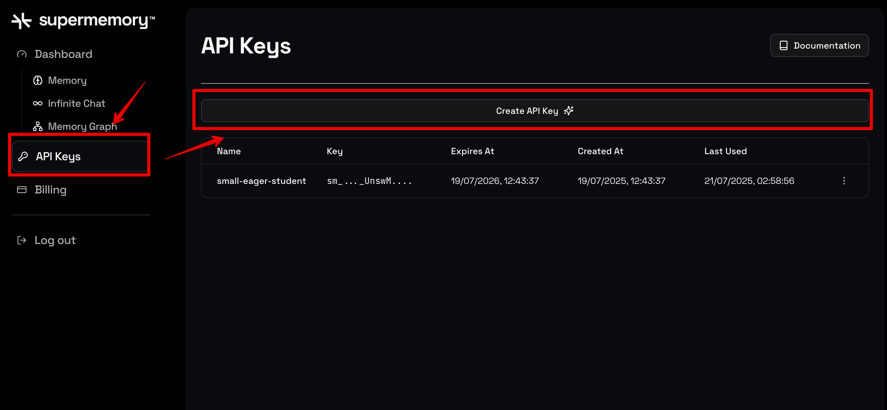

<Tip>
**Using Vercel AI SDK?** Check out the [AI SDK integration](/ai-sdk/overview) for the cleanest implementation with `@supermemory/tools/ai-sdk`.
</Tip>

## Memory API

**Step 1.** Sign up for [Supermemory's Developer Platform](http://console.supermemory.ai) to get the API key. Click on **API Keys -> Create API Key** to generate one.



**Step 2.** Install the SDK and set your API key:

<Tabs>
<Tab title="Python">
```bash
pip install supermemory
export SUPERMEMORY_API_KEY="YOUR_API_KEY"
```
</Tab>
<Tab title="TypeScript">
```bash
npm install supermemory
export SUPERMEMORY_API_KEY="YOUR_API_KEY"
```
</Tab>
</Tabs>

**Step 3.** Here's everything you need to add memory to your LLM:

<Tabs>
<Tab title="Python">
```python
from supermemory import Supermemory

client = Supermemory()
USER_ID = "dhravya"

conversation = [
    {"role": "assistant", "content": "Hello, how are you doing?"},
    {"role": "user", "content": "Hello! I am Dhravya. I am 20 years old. I love to code!"},
    {"role": "user", "content": "Can I go to the club?"},
]

# Get user profile + relevant memories for context
profile = client.profile(container_tag=USER_ID, q=conversation[-1]["content"])

context = f"""Static profile:
{"\n".join(profile.profile.static)}

Dynamic profile:
{"\n".join(profile.profile.dynamic)}

Relevant memories:
{"\n".join(r.content for r in profile.search_results.results)}"""

# Build messages with memory-enriched context
messages = [{"role": "system", "content": f"User context:\n{context}"}, *conversation]

# response = llm.chat(messages=messages)

# Store conversation for future context
client.add(
    content="\n".join(f"{m['role']}: {m['content']}" for m in conversation),
    container_tag=USER_ID,
)
```
</Tab>
<Tab title="TypeScript">
```typescript
import Supermemory from "supermemory";

const client = new Supermemory();
const USER_ID = "dhravya";

const conversation = [
  { role: "assistant", content: "Hello, how are you doing?" },
  { role: "user", content: "Hello! I am Dhravya. I am 20 years old. I love to code!" },
  { role: "user", content: "Can I go to the club?" },
];

// Get user profile + relevant memories for context
const profile = await client.profile({
  containerTag: USER_ID,
  q: conversation.at(-1)!.content,
});

const context = `Static profile:
${profile.profile.static.join("\n")}

Dynamic profile:
${profile.profile.dynamic.join("\n")}

Relevant memories:
${profile.searchResults.results.map((r) => r.content).join("\n")}`;

// Build messages with memory-enriched context
const messages = [{ role: "system", content: `User context:\n${context}` }, ...conversation];

// const response = await llm.chat({ messages });

// Store conversation for future context
await client.memories.add({
  content: conversation.map((m) => `${m.role}: ${m.content}`).join("\n"),
  containerTag: USER_ID,
});
```
</Tab>
</Tabs>

That's it! Supermemory automatically:
- Extracts memories from conversations
- Builds and maintains user profiles (static facts + dynamic context)
- Returns relevant context for personalized LLM responses

Learn more about [User Profiles](/user-profiles) and [Search](/search/overview).
