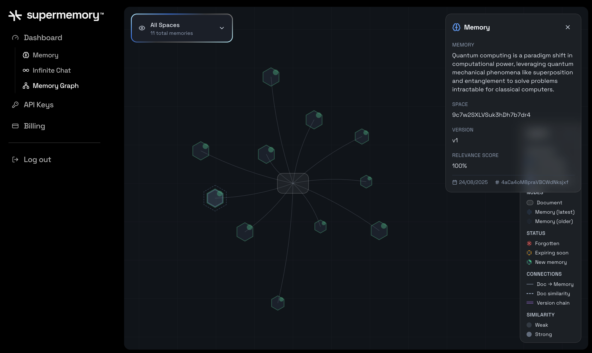

<Tip>
**Using Vercel AI SDK?** Check out the [AI SDK integration](/ai-sdk/overview) for the cleanest implementation with `@supermemory/tools/ai-sdk`.
</Tip>

## Memory API

**Step 1.** Sign up for [Supermemory’s Developer Platform](http://console.supermemory.ai) to get the API key. Click on **API Keys -> Create API Key** to generate one.


<Tabs>

    <Tab title="Python">
        **Step 2.** Install the Supermemory client

        ```python
        pip install supermemory
        ```

        **Step 3.** Run this in your terminal to create an environment variable with your API key:

        ```bash
        export SUPERMEMORY_API_KEY=“YOUR_API_KEY”
        ```

        **Step 4.** Import the module in your python file:

        ```python
        from supermemory import Supermemory
        import os


        client = Supermemory(api_key=os.environ.get("SUPERMEMORY_API_KEY"))
        ```

        **Step 5.** Add your first memory as follows:

        ```python
        # Create one rich memory about quantum computing applications
        memory_content = """Quantum computing represents a paradigm shift in computational power, leveraging quantum mechanical phenomena like superposition and entanglement to solve problems that are intractable for classical computers.


        The field emerged from theoretical work in the 1980s, when physicist Richard Feynman proposed that quantum systems could simulate other quantum systems more efficiently than classical computers. This insight led to the development of quantum algorithms like Shor's algorithm for factoring large numbers and Grover's algorithm for unstructured search problems.


        Today, quantum computing applications span multiple domains: in cryptography, quantum computers threaten current encryption standards while enabling new quantum-resistant protocols; in drug discovery, they can simulate molecular interactions with unprecedented accuracy; in optimization problems like logistics and financial modeling, they offer exponential speedups for certain classes of problems.


        Major tech companies including IBM, Google, and Microsoft have invested billions in quantum computing research, while startups like Rigetti Computing and IonQ focus on specific hardware approaches. The race for quantum advantage - demonstrating a quantum computer solving a problem faster than any classical computer - has become a key milestone in the field.


        Despite the promise, significant challenges remain: quantum decoherence, error correction, and scaling qubit counts while maintaining coherence. Researchers are exploring various approaches including superconducting qubits, trapped ions, topological qubits, and photonic systems, each with different trade-offs between coherence time, gate fidelity, and scalability."""


        # Add the memory to Supermemory
        response = client.memories.add(
            content=memory_content,
            container_tag="quantum-computing",
            metadata={
                "category": "technology-overview",
                "topic": "quantum-computing",
                "complexity": "intermediate",
                "word_count": len(memory_content.split())
            }
        )


        print(f"Memory added successfully!")
        print(f"Memory ID: {response.id}")
        print(f"Content length: {len(memory_content)} characters")
        ```

        Run your code. The output is as follows:

        ```bash
        Memory added successfully!
        Memory ID: uLtGU14SBDzfsvefYWbwe7
        Content length: 1701 characters
        ```

        **Step 6.** Search for this memory as follows:

        ```python
        results = client.search.memories(q="what are some applications of quantum computing?", limit=3)


        print(results)
        ```
        The output is as follows:

        ```bash
        SearchMemoriesResponse(
            results=[
                Result(
                    id="Bn1uc1yQdw3Huf8oitruwF",
                    memory="Quantum computing applications include cryptography (threatening current encryption standards, enabling quantum-resistant protocols), drug discovery (simulating molecular interactions), and optimization problems (logistics, financial modeling, offering exponential speedups).",
                    metadata=None,
                    similarity=0.7920647723809932,
                    updated_at=datetime.datetime(
                        2025, 8, 24, 5, 41, 55, 87000, tzinfo=datetime.timezone.utc
                    ),
                    context=ResultContext(children=[], parents=[]),
                    documents=None,
                    version=1.0,
                    updatedAt="2025-08-24T05:41:55.087Z",
                    rootMemoryId="Bn1uc1yQdw3Huf8oitruwF",
                ),
                Result(
                    id="4aCa4oM8praVBCWdNksjxf",
                    memory="Quantum computing is a paradigm shift in computational power, leveraging quantum mechanical phenomena like superposition and entanglement to solve problems intractable for classical computers.",
                    metadata=None,
                    similarity=0.7198909950191389,
                    updated_at=datetime.datetime(
                        2025, 8, 24, 5, 41, 55, 87000, tzinfo=datetime.timezone.utc
                    ),
                    context=ResultContext(children=[], parents=[]),
                    documents=None,
                    version=1.0,
                    updatedAt="2025-08-24T05:41:55.087Z",
                    rootMemoryId="4aCa4oM8praVBCWdNksjxf",
                ),
                Result(
                    id="8vzhZhBCuqyrLNXtzBDx7y",
                    memory="IBM, Google, and Microsoft have invested billions in quantum computing research.",
                    metadata=None,
                    similarity=0.6960905375426799,
                    updated_at=datetime.datetime(
                        2025, 8, 24, 5, 41, 55, 87000, tzinfo=datetime.timezone.utc
                    ),
                    context=ResultContext(children=[], parents=[]),
                    documents=None,
                    version=1.0,
                    updatedAt="2025-08-24T05:41:55.087Z",
                    rootMemoryId="8vzhZhBCuqyrLNXtzBDx7y",
                ),
            ],
            timing=214.0,
            total=3.0,
        )
        ```
        Awesome! Now that you’ve made your first request, explore all of Supermemory’s features in detail and how you can use them in your app.
    </Tab>

    <Tab title="Typescript">
        **Step 2.** Install the Supermemory dependency:

        ```bash
        npm install supermemory
        ```

        **Step 3.** Set the environment variable:

        ```bash
        export SUPERMEMORY_API_KEY="your_actual_api_key_here"
        ```
        **Step 4.** Create a `quickstart.ts` file and import the package:

        ```ts
        import 'dotenv/config';
        import Supermemory from 'supermemory';


        const client = new Supermemory({
        apiKey: process.env.SUPERMEMORY_API_KEY});
        ```

        **Step 5.** Add a memory:

        ```ts

        const memoryContent = `Quantum computing represents a paradigm shift in computational power, leveraging quantum mechanical phenomena like superposition and entanglement to solve problems that are intractable for classical computers.


        The field emerged from theoretical work in the 1980s, when physicist Richard Feynman proposed that quantum systems could simulate other quantum systems more efficiently than classical computers. This insight led to the development of quantum algorithms like Shor's algorithm for factoring large numbers and Grover's algorithm for unstructured search problems.


        Today, quantum computing applications span multiple domains: in cryptography, quantum computers threaten current encryption standards while enabling new quantum-resistant protocols; in drug discovery, they can simulate molecular interactions with unprecedented accuracy; in optimization problems like logistics and financial modeling, they offer exponential speedups for certain classes of problems.


        Major tech companies including IBM, Google, and Microsoft have invested billions in quantum computing research, while startups like Rigetti Computing and IonQ focus on specific hardware approaches. The race for quantum advantage - demonstrating a quantum computer solving a problem faster than any classical computer - has become a key milestone in the field.


        Despite the promise, significant challenges remain: quantum decoherence, error correction, and scaling qubit counts while maintaining coherence. Researchers are exploring various approaches including superconducting qubits, trapped ions, topological qubits, and photonic systems, each with different trade-offs between coherence time, gate fidelity, and scalability.`;


        async function addMemory() {
            try {
                const response = await client.memories.add({
                    content: memoryContent,
                    containerTag: "quantum-computing",
                    metadata: {
                    category: "technology-overview",
                    topic: "quantum-computing",
                    complexity: "intermediate",
                    wordCount: memoryContent.split(' ').length
                    }
                });
                console.log("Memory added successfully!");
                console.log(`Memory ID: ${response.id}`);
                return response.id
            } catch (error) {
                console.error("Error adding memory:", error);
                throw error;
            }
        }
        ```

        Running this code block gives the following output:

        ```bash

        Memory added successfully!
        Memory ID: adMxzQgSxo37jq6kjpsFMg
        ```

        **Step 6.** Search for your memory using natural language:

        ```ts
        async function searchMemories() {
            try {
                const results = await client.search.memories({
                    q: "what are some applications of quantum computing?",
                    limit: 3
                });

                console.log('Search results:', results);

                return results;
            } catch (error) {
                console.error('Error searching memories:', error);
            }
        }
        ```

        The output is as follows:

        ```bash
        Search results: {
            results: [
                {
                    id: 'Bn1uc1yQdw3Huf8oitruwF',
                    memory: 'Quantum computing applications include cryptography (threatening current encryption standards, enabling quantum-resistant protocols), drug discovery (simulating molecular interactions), and optimization problems (logistics, financial modeling, offering exponential speedups).',
                    metadata: null,
                    updatedAt: '2025-08-24T05:41:55.087Z',
                    version: 1,
                    rootMemoryId: 'Bn1uc1yQdw3Huf8oitruwF',
                    similarity: 0.7920647723809932,
                    context: [Object]
                },
                {
                    id: '4aCa4oM8praVBCWdNksjxf',
                    memory: 'Quantum computing is a paradigm shift in computational power, leveraging quantum mechanical phenomena like superposition and entanglement to solve problems intractable for classical computers.',
                    metadata: null,
                    updatedAt: '2025-08-24T05:41:55.087Z',
                    version: 1,
                    rootMemoryId: '4aCa4oM8praVBCWdNksjxf',
                    similarity: 0.7198909950191389,
                    context: [Object]
                },
                {
                    id: '8vzhZhBCuqyrLNXtzBDx7y',
                    memory: 'IBM, Google, and Microsoft have invested billions in quantum computing research.',
                    metadata: null,
                    updatedAt: '2025-08-24T05:41:55.087Z',
                    version: 1,
                    rootMemoryId: '8vzhZhBCuqyrLNXtzBDx7y',
                    similarity: 0.6960905375426799,
                    context: [Object]
                }
            ],
            timing: 216,
            total: 3
        }
        ```
        As you can see, Supermemory automatically chunked the main memory into smaller parts and returned them. You can visually see that in the graph in the console:

        

        Now that you’ve made your first request, explore all of Supermemory’s features in detail and how you can use them in your app.
    </Tab>

    <Tab title="cURL">
        **Step 2.** The base URL for requests is as follows:

        ```bash
        https://api.supermemory.ai/
        ```

        **Step 3.** Set the environment variable:

        ```bash
        export SUPERMEMORY_API_KEY="your_api_key"
        ```

        **Step 4.** Add a memory as follows:

        ```bash
        curl -X POST "https://api.supermemory.ai/v3/documents" \
          -H "Authorization: Bearer $SUPERMEMORY_API_KEY" \
          -H "Content-Type: application/json" \
          -d '{
            "content": "Quantum computing represents a paradigm shift in computational power, leveraging quantum mechanical phenomena like superposition and entanglement to solve problems that are intractable for classical computers. The field emerged from theoretical work in the 1980s, when physicist Richard Feynman proposed that quantum systems could simulate other quantum systems more efficiently than classical computers. This insight led to the development of quantum algorithms like Shor'\''s algorithm for factoring large numbers and Grover'\''s algorithm for unstructured search problems. Today, quantum computing applications span multiple domains: in cryptography, quantum computers threaten current encryption standards while enabling new quantum-resistant protocols; in drug discovery, they can simulate molecular interactions with unprecedented accuracy; in optimization problems like logistics and financial modeling, they offer exponential speedups for certain classes of problems. Major tech companies including IBM, Google, and Microsoft have invested billions in quantum computing research, while startups like Rigetti Computing and IonQ focus on specific hardware approaches. The race for quantum advantage - demonstrating a quantum computer solving a problem faster than any classical computer - has become a key milestone in the field. Despite the promise, significant challenges remain: quantum decoherence, error correction, and scaling qubit counts while maintaining coherence. Researchers are exploring various approaches including superconducting qubits, trapped ions, topological qubits, and photonic systems, each with different trade-offs between coherence time, gate fidelity, and scalability.",
            "containerTag": "quantum-computing",
            "metadata": {
              "category": "technology-overview",
              "topic": "quantum-computing",
              "complexity": "intermediate",
              "wordCount": 156
            }
          }'
        ```

        The response is as follows:

        ```json
        {"id":"D2Ar7Vo7ub83w3PRPZcaP1","status":"queued"}
        ```

        **Step 5.** Search for this memory using natural language:

        ```bash
        curl -X POST "https://api.supermemory.ai/v4/search" \
          -H "Authorization: Bearer $SUPERMEMORY_API_KEY" \
          -H "Content-Type: application/json" \
          -d '{
            "q": "what are some applications of quantum computing?",
            "limit": 3
          }'
        ```

        The result is as follows:

        ```json
        {
          "results": [
            {
              "id": "Bn1uc1yQdw3Huf8oitruwF",
              "memory": "Quantum computing applications include cryptography (threatening current encryption standards, enabling quantum-resistant protocols), drug discovery (simulating molecular interactions), and optimization problems (logistics, financial modeling, offering exponential speedups).",
              "metadata": null,
              "updatedAt": "2025-08-24T05:41:55.087Z",
              "version": 1,
              "rootMemoryId": "Bn1uc1yQdw3Huf8oitruwF",
              "similarity": 0.7920647723809932,
              "context": {
                "parents": [],
                "children": []
              }
            },
            {
              "id": "4aCa4oM8praVBCWdNksjxf",
              "memory": "Quantum computing is a paradigm shift in computational power, leveraging quantum mechanical phenomena like superposition and entanglement to solve problems intractable for classical computers.",
              "metadata": null,
              "updatedAt": "2025-08-24T05:41:55.087Z",
              "version": 1,
              "rootMemoryId": "4aCa4oM8praVBCWdNksjxf",
              "similarity": 0.7198909950191389,
              "context": {
                "parents": [],
                "children": []
              }
            },
            {
              "id": "8vzhZhBCuqyrLNXtzBDx7y",
              "memory": "IBM, Google, and Microsoft have invested billions in quantum computing research.",
              "metadata": null,
              "updatedAt": "2025-08-24T05:41:55.087Z",
              "version": 1,
              "rootMemoryId": "8vzhZhBCuqyrLNXtzBDx7y",
              "similarity": 0.6960905375426799,
              "context": {
                "parents": [],
                "children": []
              }
            }
          ],
          "timing": 363,
          "total": 3
        }
        ```

        And that's it! Good job!

    </Tab>
</Tabs>


## Memory Router
Learn how you can add the Memory Router to your existing LLM requests.

The memory router works as a proxy on top of LLM calls. When conversations get very long, it automatically chunks them for optimal performance, retrieves the most relevant information from the history, and balances token usage + cost.

The best part is that it requires no changes to your application logic. Here’s how to get started:

**Step 1.** Sign up for [Supermemory’s Developer Platform](http://console.supermemory.ai) to get the API key. Click on **API Keys -> Create API Key** to generate one.

**Step 2.** Get your LLM provider’s API key

- [OpenAI](https://help.openai.com/en/articles/4936850-where-do-i-find-my-openai-api-key)
- [Gemini](https://ai.google.dev/gemini-api/docs/api-key)
- [Anthropic](https://docs.anthropic.com/en/api/admin-api/apikeys/get-api-key)
- [Groq](https://console.groq.com/keys)

**Step 3.** Append Supermemory’s URL to your LLM provider’s OpenAI-compatible API URL:

<CodeGroup>

```bash OpenAI
https://api.supermemory.ai/v3/https://api.openai.com/v1/
```
```bash Anthropic
https://api.supermemory.ai/v3/https://api.anthropic.com/v1/
```

```bash Gemini
https://api.supermemory.ai/v3/https://generativelanguage.googleapis.com/v1beta/openai/
```

```bash Groq
https://api.supermemory.ai/v3/https://api.groq.com/openai/v1
```

```bash Others
https://api.supermemory.ai/v3/[openai-api-url-here]
```
</CodeGroup>

<Tabs>


<Tab title="Typescript">
    **Step 4.** Install the dependencies

    ```bash
    npm install openai
    ```

    **Step 5.** Set two environment variables in your environment: one for Supermemory, and one for your model provider.

    ```bash
    export SUPERMEMORY_API_KEY=“your_api_key_here”

    # export OPENAI_API_KEY/ANTHROPIC_API_KEY/GEMINI_API_KEY/GROQ_API_KEY=“api_key_here” (based on your model)
    ```

    **Step 6.** Send a request to the updated endpoint:

    <CodeGroup>

    ```ts OpenAI
    import OpenAI from 'openai';

    const client = new OpenAI({
    apiKey: process.env.OPENAI_API_KEY,
    baseURL: 'https://api.supermemory.ai/v3/https://api.openai.com/v1',
    defaultHeaders: {
        'x-supermemory-api-key': process.env.SUPERMEMORY_API_KEY!,
        'x-sm-user-id': 'user_123' // Your user identifier
    }
    });

    async function chatWithOpenAI() {
    try {
        const response = await client.chat.completions.create({
        model: 'gpt-4o',
        messages: [
            { role: 'user', content: 'Hello my name is Naman. How are you?' }
        ],
        max_tokens: 1000,
        temperature: 0.7
        });

        console.log('OpenAI Response:', response.choices[0].message.content);
        return response;
    } catch (error) {
        console.error('Error with OpenAI:', error);
    }
    }

    ```
    ```ts Anthropic
    import OpenAI from 'openai';

    const anthropicClient = new OpenAI({
    apiKey: process.env.ANTHROPIC_API_KEY,
    baseURL: 'https://api.supermemory.ai/v3/https://api.anthropic.com/v1',
    defaultHeaders: {
        'x-supermemory-api-key': process.env.SUPERMEMORY_API_KEY!,
        'x-sm-user-id': 'user_123'
    }
    });

    async function chatWithClaude() {
    try {
        const response = await anthropicClient.chat.completions.create({
        model: 'claude-3-sonnet-20240229',
        messages: [
            { role: 'user', content: 'Hello my name is Naman. How are you?' }
        ],
        max_tokens: 1000
        });

        console.log('Claude Response:', response.choices[0].message.content);
        return response;
    } catch (error) {
        console.error('Error with Claude:', error);
    }
    }
    ```

    ```ts Gemini

    import OpenAI from 'openai';

    const geminiClient = new OpenAI({
    apiKey: process.env.GEMINI_API_KEY,
    baseURL: 'https://api.supermemory.ai/v3/https://generativelanguage.googleapis.com/v1beta',
    defaultHeaders: {
        'x-supermemory-api-key': process.env.SUPERMEMORY_API_KEY!,
        'x-sm-user-id': 'user_123'
    }
    });

    async function chatWithGemini() {
    try {
        const response = await geminiClient.chat.completions.create({
        model: 'gemini-pro',
        messages: [
            { role: 'user', content: 'Hello my name is Naman. How are you?' }
        ],
        max_tokens: 1000
        });

        console.log('Gemini Response:', response.choices[0].message.content);
        return response;
    } catch (error) {
        console.error('Error with Gemini:', error);
    }
    }

    ```

    ```ts Groq

    import OpenAI from 'openai';

    const groqClient = new OpenAI({
    apiKey: process.env.GROQ_API_KEY,
    baseURL: 'https://api.supermemory.ai/v3/https://api.groq.com/openai/v1',
    defaultHeaders: {
        'x-supermemory-api-key': process.env.SUPERMEMORY_API_KEY!,
        'x-sm-user-id': 'user_123'
    }
    });

    async function chatWithGroq() {
    try {
        const response = await groqClient.chat.completions.create({
        model: 'mixtral-8x7b-32768',
        messages: [
            { role: 'user', content: 'Hello my name is Naman. How are you?' }
        ],
        max_tokens: 1000
        });

        console.log('Groq Response:', response.choices[0].message.content);
        return response;
    } catch (error) {
        console.error('Error with Groq:', error);
    }
    }


    ```

    </CodeGroup>

    Each of these code snippets changes the Base URL based on the OpenAI-compatible API URL given by the model providers. Some of the key parameters to note are:

    - `apiKey`: Your model provider’s API key
    - `x-supermemory-api-key`: Your Supermemory API key
    - `x-sm-user-id`: Scope conversations by user with a user ID. This will enable cross-conversation memory, meaning users can reference other chats and draw information from them.

    Additionally, while not shown in this quickstart, you can also pass an `x-sm-conversation-id` header.

    Then, you won’t have to send the entire array of messages to the LLM as conversation history. Supermemory will handle it.

    If you run the above code blocks, you’ll get an output from your LLM like this:

    ```
    “Hello, Naman! I'm just a computer program, so I don't have feelings, but I'm here and ready to help you. How can I assist you today?”
    ```

    After that, if you modify the request to ask, ‘What is my name?’ instead, you’ll get the following response:

    ```
    Your name is Naman.
    ```

    Thus, the memory router is working!
</Tab>

<Tab title="Python">
        **Step 4.** Install the Python dependency:

        ```
        pip install openai
        ```

        **Step 5.** Set two environment variables in your environment: one for Supermemory and one for your model provider.

        ```bash
        export SUPERMEMORY_API_KEY=“your_api_key_here”

        # export OPENAI_API_KEY/ANTHROPIC_API_KEY/GEMINI_API_KEY/GROQ_API_KEY=“api_key_here” (based on your model)
        ```

        **Step 6.** Send a request to the LLM with the updated base URL and parameters:

        <CodeGroup>

        ```python OpenAI
        import os
        from openai import OpenAI

        client = OpenAI(
            api_key=os.getenv("OPENAI_API_KEY"),
            base_url="https://api.supermemory.ai/v3/https://api.openai.com/v1",
            default_headers={
                "x-supermemory-api-key": os.getenv("SUPERMEMORY_API_KEY"),
                "x-sm-user-id": "user_123"
            }
        )

        def chat_with_openai():
            try:
                response = client.chat.completions.create(
                    model="gpt-4o",
                    messages=[
                        {"role": "user", "content": "Hello my name is Naman. How are you?"}
                    ],
                    max_tokens=1000,
                    temperature=0.7
                )

                print("OpenAI Response:", response.choices[0].message.content)
                return response
            except Exception as error:
                print(f"Error with OpenAI: {error}")

        ```
        ```python Anthropic
        from openai import OpenAI

        anthropic_client = OpenAI(
            api_key=os.getenv("ANTHROPIC_API_KEY"),
            base_url="https://api.supermemory.ai/v3/https://api.anthropic.com/v1",
            default_headers={
                "x-supermemory-api-key": os.getenv("SUPERMEMORY_API_KEY"),
                "x-sm-user-id": "user_123"
            }
        )

        def chat_with_claude():
            try:
                response = anthropic_client.chat.completions.create(
                    model="claude-3-sonnet-20240229",
                    messages=[
                        {"role": "user", "content": "Hello my name is Naman. How are you?"}
                    ],
                    max_tokens=1000
                )

                print("Claude Response:", response.choices[0].message.content)
                return response
            except Exception as error:
                print(f"Error with Claude: {error}")

        ```

        ```python Gemini
        from openai import OpenAI

        gemini_client = OpenAI(
            api_key=os.getenv("GEMINI_API_KEY"),
            base_url="https://api.supermemory.ai/v3/https://generativelanguage.googleapis.com/v1beta",
            default_headers={
                "x-supermemory-api-key": os.getenv("SUPERMEMORY_API_KEY"),
                "x-sm-user-id": "user_123"
            }
        )

        def chat_with_gemini():
            try:
                response = gemini_client.chat.completions.create(
                    model="gemini-pro",
                    messages=[
                        {"role": "user", "content": "Hello my name is Naman. How are you?"}
                    ],
                    max_tokens=1000
                )

                print("Gemini Response:", response.choices[0].message.content)
                return response
            except Exception as error:
                print(f"Error with Gemini: {error}")
        ```

        ```python Groq
        from openai import OpenAI

        groq_client = OpenAI(
            api_key=os.getenv("GROQ_API_KEY"),
            base_url="https://api.supermemory.ai/v3/https://api.groq.com/openai/v1",
            default_headers={
                "x-supermemory-api-key": os.getenv("SUPERMEMORY_API_KEY"),
                "x-sm-user-id": "user_123"
            }
        )

        def chat_with_groq():
            try:
                response = groq_client.chat.completions.create(
                    model="mixtral-8x7b-32768",
                    messages=[
                        {"role": "user", "content": "Hello my name is Naman. How are you?"}
                    ],
                    max_tokens=1000
                )

                print("Groq Response:", response.choices[0].message.content)
                return response
            except Exception as error:
                print(f"Error with Groq: {error}")
        ```

        </CodeGroup>

        Each of these code snippets changes the Base URL based on the OpenAI-compatible API URL given by the model providers. Some of the key parameters to note are:

        - `api_key`: Your model provider’s API key
        - `x-supermemory-api-key`: Your Supermemory API key
        - `x-sm-user-id`: Scope conversations by user with a user ID. This will enable cross-conversation memory, meaning users can reference other chats and draw information from them.

        Additionally, while not shown in this quickstart, you can also pass an `x-sm-conversation-id` header.

        Then, you won’t have to send the entire array of messages to the LLM as conversation history. Supermemory will handle it.

        If you run the above code blocks, you’ll get an output from your LLM like this:

        ```
        “Hello, Naman! I'm just a computer program, so I don't have feelings, but I'm here and ready to help you. How can I assist you today?”
        ```

        After that, if you modify the request to ask, ‘What is my name?’ instead, you’ll get the following response:

        ```
        Your name is Naman.
        ```

        Thus, the memory router is working!
    </Tab>
    <Tab title="cURL">
        **Step 4.** Set the environment variables:

        ```bash
        export SUPERMEMORY_API_KEY="your_supermemory_api_key"
        export OPENAI_API_KEY="your_openai_api_key"
        export ANTHROPIC_API_KEY="your_anthropic_api_key"
        export GEMINI_API_KEY="your_gemini_api_key"
        export GROQ_API_KEY="your_groq_api_key"
        ```

        **Step 5.** Send a request to the LLM with the updated base URL and parameters:

        <CodeGroup>
        ```bash OpenAI
        curl https://api.supermemory.ai/v3/https://api.openai.com/v1/chat/completions \
        -H "Content-Type: application/json" \
        -H "Authorization: Bearer $OPENAI_API_KEY" \
        -H "x-supermemory-api-key: $SUPERMEMORY_API_KEY" \
        -H "x-sm-user-id: user_123" \
        -d '{
            "model": "gpt-4o",
            "messages": [
            {"role": "user", "content": "Hello my name is Naman. How are you?"}
            ],
            "max_tokens": 1000,
            "temperature": 0.7
        }'
        ```

        ```bash Claude
        curl https://api.supermemory.ai/v3/https://api.anthropic.com/v1/messages \
        -H "Content-Type: application/json" \
        -H "Authorization: Bearer $ANTHROPIC_API_KEY" \
        -H "x-supermemory-api-key: $SUPERMEMORY_API_KEY" \
        -H "x-sm-user-id: user_123" \
        -d '{
            "model": "claude-3-sonnet-20240229",
            "messages": [
            {"role": "user", "content": "Hello my name is Naman. How are you?"}
            ],
            "max_tokens": 1000
        }'
        ```

        ```bash Gemini
        curl https://api.supermemory.ai/v3/https://generativelanguage.googleapis.com/v1beta/models/gemini-pro:generateContent \
        -H "Content-Type: application/json" \
        -H "Authorization: Bearer $GEMINI_API_KEY" \
        -H "x-supermemory-api-key: $SUPERMEMORY_API_KEY" \
        -H "x-sm-user-id: user_123" \
        -d '{
            "contents": [
            {
                "parts": [
                {"text": "Hello my name is Naman. How are you?"}
                ]
            }
            ],
            "generationConfig": {
            "maxOutputTokens": 1000
            }
        }'
        ```

        ```bash Groq
        curl https://api.supermemory.ai/v3/https://api.groq.com/openai/v1/chat/completions \
        -H "Content-Type: application/json" \
        -H "Authorization: Bearer $GROQ_API_KEY" \
        -H "x-supermemory-api-key: $SUPERMEMORY_API_KEY" \
        -H "x-sm-user-id: user_123" \
        -d '{
            "model": "mixtral-8x7b-32768",
            "messages": [
            {"role": "user", "content": "Hello my name is Naman. How are you?"}
            ],
            "max_tokens": 1000
        }'
        ```
        </CodeGroup>

        Each of these code snippets changes the Base URL based on the OpenAI-compatible API URL given by the model providers. Some of the key parameters to note are:

        - **Authorization header**: Your model provider’s API key
        - `x-supermemory-api-key`: Your Supermemory API key
        - `x-sm-user-id`: Scope conversations by user with a user ID. This will enable cross-conversation memory, meaning users can reference other chats and draw information from them.

        Additionally, while not shown in this quickstart, you can also pass an `x-sm-conversation-id` header.

        Then, you won’t have to send the entire array of messages to the LLM as conversation history. Supermemory will handle it.

        If you run the above code blocks, you’ll get an output from your LLM like this:

        ```
        “Hello, Naman! I'm just a computer program, so I don't have feelings, but I'm here and ready to help you. How can I assist you today?”
        ```

        After that, if you modify the request to ask, ‘What is my name?’ instead, you’ll get the following response:

        ```
        Your name is Naman.
        ```

        Thus, the memory router is working!
    </Tab>
</Tabs>


For additional reference, here are links to the model providers’ documentation:
- [OpenAI API Reference](https://platform.openai.com/docs/api-reference)
- [Anthropic Claude API](https://docs.anthropic.com/claude/reference)
- [Google Gemini API](https://ai.google.dev/docs)
- [Groq API Documentation](https://console.groq.com/docs)
