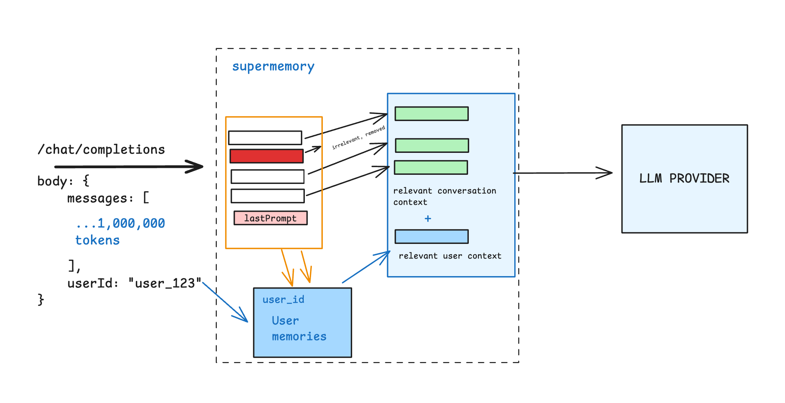

<Tip>
### <strong>TL;DR</strong>
- <strong>Memory API:</strong> You ingest/search/filter memories yourself and decide exactly what goes into the prompt. Maximum control for production apps and custom retrieval.  
- <strong>Memory Router:</strong> Keep your existing LLM client and just point it at Supermemory. We automatically fetch relevant memories and append them to your prompt.  

Both use the same memory engine underneath, and share a common key (`user_id`). Thus, anything you store via the API is available to the Router, and vice versa, as long as the `user_id` matches.
</Tip>

We’ll first explain how the Router works, because the API is quite straightforward.

You send a request to your LLM, and Supermemory acts as a proxy. The Router will automatically remove unnecessary context from the message, search the user’s memories for additional relevant context, append it to the prompt, and send it to the LLM. 

It also writes new memories asynchronously, so your context keeps expanding without any blockages. The Router is specifically built for conversational memory in chat applications, and its utility shows when your conversations get very long.

For you, it leads to:

- No code refactoring - just swap the base URL with one provided by Supermemory. Read the quickstart to learn more.
- Better chatbot performance due to long-thread retrieval, when conversations go beyond the model window.
- Cost savings due to our automatic chunking and context management.

The API, on the other hand, is a full-fledged API you can call in your app to ingest documents, create memories, search them, rerank, etc., with very granular control. The Router is built on top of our API.

Technically, you could build your own Memory Router too on top of our API, but it wouldn’t come with the same one-line integration, ease of use, minimal latency, and intelligent token budgeting.

Again, both use the same memory engine underneath the hood, so your memories are available across both products.

Here’s a quick 30-second flow to decide which one to use for your specific use case:

- <strong> Already have a working LLM chat and just want it to remember? </strong> Start with the Router.

- <strong> Building a new app or need strict tenancy, filters, ranking, or custom prompts? </strong> Go to the Memory API.

- <strong> Need both? </strong> Ingest via API, chat via Router; keep the user_id consistent.

- <strong> Still unsure? </strong> Pilot on the Router, then graduate parts of the flow to the API as you need more control.

Now, head over to the quickstart to integrate the API/Router in your app within 5 minutes.

## FAQs

<AccordionGroup>
  <Accordion title="Is the Router just calling the Memory API behind the scenes?">
    Conceptually, yes. The Router orchestrates the same Supermemory engine operations (retrieve, re-rank, budget, cite) and wraps them around your model call.
  </Accordion>
  <Accordion title="Does the Router store new memories automatically?">
    It can. The create-memory step is asynchronous, so the user’s response isn’t delayed.
  </Accordion>
  <Accordion title="What identifies the user’s memory across Router and API?">
    <code>user_id</code>. Keep it consistent across Router and API calls to share the same memory pool.
  </Accordion>
</AccordionGroup>

