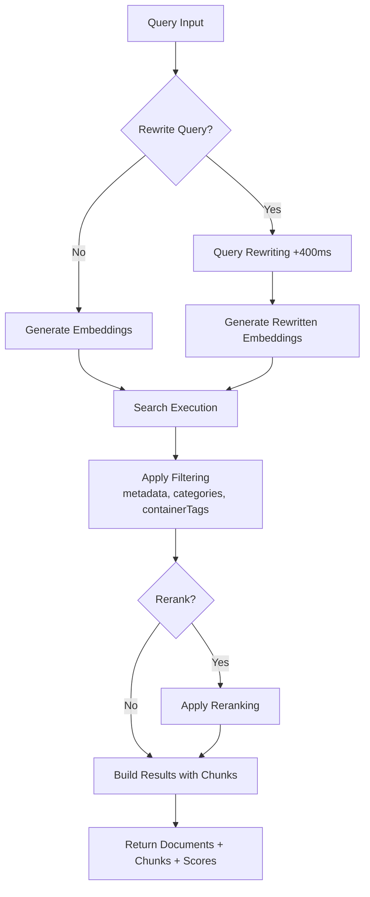
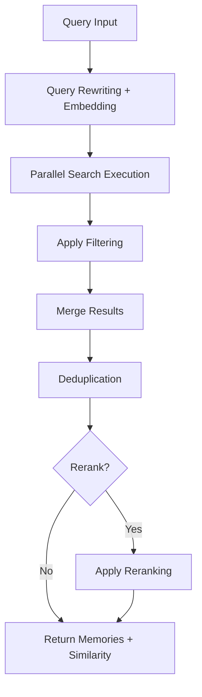

## Prerequisites

Before searching memories, you need to set up the Supermemory client:

- **Install the SDK** for your language
- **Get your API key** from [Supermemory Console](https://console.supermemory.ai)
- **Initialize the client** with your API key

<CodeGroup>

```bash npm
npm install supermemory
```

```bash pip
pip install supermemory
```

</CodeGroup>

<CodeGroup>

```typescript TypeScript
import Supermemory from 'supermemory';

const client = new Supermemory({
  apiKey: process.env.SUPERMEMORY_API_KEY!
});
```

```python Python
from supermemory import Supermemory
import os

client = Supermemory(
    api_key=os.environ.get("SUPERMEMORY_API_KEY")
)
```

</CodeGroup>

## Search Endpoints Overview

<CardGroup cols={2}>
  <Card title="Documents Search - Fast, Advanced RAG" icon="settings" href="/search/examples/document-search">
    **POST /v3/search**

    Full-featured search with extensive control over ranking, filtering, thresholds, and result structure. Searches through and returns relevant documents. More flexibility.
  </Card>

  <Card title="Memories Search" icon="zap" href="/search/examples/memory-search">
    **POST /v4/search**

    Minimal-latency search optimized for chatbots and conversational AI. Searches through and returns memories. Simple parameters, fast responses, easy to use.
  </Card>
</CardGroup>

## Documents vs Memories Search: What's the Difference?

The key difference between `/v3/search` and `/v4/search` is **documents vs memories**. `/v3/search` searches through the documents and returns matching chunks, whereas `/v4/search` searches through user's memories, preferences and history.

- **Documents:** Refer to the data you ingest like text, pdfs, videos, images, etc. They are sources of ground truth.
- **Memories:** They are automatically extracted from your documents by Supermemory. Smaller information chunks inferred from documents and related to each other.

Refer to the [ingestion guide](/memory-api/ingesting) to learn more about the difference between documents and memories.

### Documents Search (`/v3/search`)
**High quality documents search** - extensive parameters for fine-tuning search behavior:

- **Use cases**: Use this endpoint for use cases where "literal" document search is required.
  - Looking through legal/finance documents
  - Searching through items in google drive
  - Chat with documentation
- With this endpoint, you get **Full Control** over
   - Thresholds,
   - Filtering
   - Reranking
   - Query rewriting

<Tabs>
  <Tab title="TypeScript">
    ```typescript
    // Documents search
    const results = await client.search.documents({
      q: "machine learning accuracy",
      limit: 10,
      documentThreshold: 0.7,
      chunkThreshold: 0.8,
      rerank: true,
      rewriteQuery: true,
      includeFullDocs: true,
      includeSummary: true,
      onlyMatchingChunks: false,
      containerTags: ["research"],
      filters: {
        AND: [{ key: "category", value: "ai", negate: false }]
      }
    });
    ```
  </Tab>
  <Tab title="Python">
    ```python
    # Documents search
    results = client.search.documents(
        q="machine learning accuracy",
        limit=10,
        document_threshold=0.7,
        chunk_threshold=0.8,
        rerank=True,
        rewrite_query=True,
        include_full_docs=True,
        include_summary=True,
        only_matching_chunks=False,
        container_tags=["research"],
        filters={
            "AND": [{"key": "category", "value": "ai", "negate": False}]
        }
    )
    ```
  </Tab>
  <Tab title="cURL">
    ```bash
    curl -X POST "https://api.supermemory.ai/v3/search" \
      -H "Authorization: Bearer $SUPERMEMORY_API_KEY" \
      -H "Content-Type: application/json" \
      -d '{
        "q": "machine learning accuracy",
        "limit": 10,
        "documentThreshold": 0.7,
        "chunkThreshold": 0.8,
        "rerank": true,
        "rewriteQuery": true,
        "includeFullDocs": true,
        "includeSummary": true,
        "onlyMatchingChunks": false,
        "containerTags": ["research"],
        "filters": {
          "AND": [{"key": "category", "value": "ai", "negate": false}]
        }
      }'
    ```
  </Tab>
</Tabs>

```json Sample Response

{
  "results": [
    {
      "documentId": "doc_abc123",
      "title": "Machine Learning Fundamentals",
      "type": "pdf",
      "score": 0.89,
      "chunks": [
        {
          "content": "Machine learning is a subset of artificial intelligence...",
          "score": 0.95,
          "isRelevant": true
        }
      ],
      "metadata": {
        "category": "education",
        "author": "Dr. Smith",
        "difficulty": "beginner"
      },
      "createdAt": "2024-01-15T10:30:00Z",
      "updatedAt": "2024-01-20T14:45:00Z"
    }
  ],
  "timing": 187,
  "total": 1
}
```

The `/v3/search` endpoint returns the most relevant documents and chunks from those documents. Head over to the [response schema](/search/response-schema) page to understand more about the response structure.

### Memories Search (`/v4/search`)
**Search through user memories**:

- **Use cases**: Use this endpoint for use cases where understanding user context / preferences / memories is more important than literal document search.
  - Personalized chatbots (AI Companions)
  - Auto selecting based on what the user wants
  - Setting the tone of the conversation

Companies like Composio [Rube.app](https://rube.app) use memories search for letting the MCP automate better based on the user prompts before.

<Info>
  This endpoint works best for conversational AI use cases like chatbots.
</Info>

<Tabs>
  <Tab title="TypeScript">
    ```typescript
    // Memories search
    const results = await client.search.memories({
      q: "machine learning accuracy",
      limit: 5,
      containerTag: "research",
      threshold: 0.7,
      rerank: true
    });
    ```
  </Tab>
  <Tab title="Python">
    ```python
    # Memories search
    results = client.search.memories(
        q="machine learning accuracy",
        limit=5,
        container_tag="research",
        threshold=0.7,
        rerank=True
    )
    ```
  </Tab>
  <Tab title="cURL">
    ```bash
    curl -X POST "https://api.supermemory.ai/v4/search" \
      -H "Authorization: Bearer $SUPERMEMORY_API_KEY" \
      -H "Content-Type: application/json" \
      -d '{
        "q": "machine learning accuracy",
        "limit": 5,
        "containerTag": "research",
        "threshold": 0.7,
        "rerank": true
      }'
    ```
  </Tab>
</Tabs>


```json Sample Response
{
  "results": [
    {
      "id": "mem_xyz789",
      "memory": "Complete memory content about quantum computing applications...",
      "similarity": 0.87,
      "metadata": {
        "category": "research",
        "topic": "quantum-computing"
      },
      "updatedAt": "2024-01-18T09:15:00Z",
      "version": 3,
      "context": {
        "parents": [
          {
            "memory": "Earlier discussion about quantum theory basics...",
            "relation": "extends",
            "version": 2,
            "updatedAt": "2024-01-17T16:30:00Z"
          }
        ],
        "children": [
          {
            "memory": "Follow-up questions about quantum algorithms...",
            "relation": "derives",
            "version": 4,
            "updatedAt": "2024-01-19T11:20:00Z"
          }
        ]
      },
      "documents": [
        {
          "id": "doc_quantum_paper",
          "title": "Quantum Computing Applications",
          "type": "pdf",
          "createdAt": "2024-01-10T08:00:00Z"
        }
      ]
    }
  ],
  "timing": 156,
  "total": 1
}

```

The `/v4/search` endpoint searches through and returns memories.

## Direct Document Retrieval

If you don't need semantic search and just want to retrieve a specific document you've uploaded by its ID, use the GET document endpoint:

`GET /v3/documents/{id}`

This is useful when:
- You know the exact document ID
- You want to retrieve the full document content and metadata
- You need to check processing status or document details

<CodeGroup>

```typescript TypeScript
// Get a specific document by ID
const document = await client.memories.get("doc_abc123");

console.log(document.content);    // Full document content
console.log(document.status);     // Processing status
console.log(document.metadata);   // Document metadata
console.log(document.summary);    // AI-generated summary
```

```python Python
# Get a specific document by ID
document = client.memories.get("doc_abc123")

print(document.content)    # Full document content
print(document.status)     # Processing status
```

```bash cURL
curl -X GET "https://api.supermemory.ai/v3/documents/{YOUR-DOCUMENT-ID}" \
  -H "Authorization: Bearer $SUPERMEMORY_API_KEY"
```

</CodeGroup>

<Note>
This endpoint returns the complete document with all fields including content, metadata, containerTags, summary, and processing status. For more details, see the [API reference](/api-reference/manage-documents/get-document).
</Note>

## Search Flow Architecture

### Document Search (`/v3/search`) Flow



### Memory Search (`/v4/search`) Flow



## Key Concepts You Need to Understand

### 1. Thresholds (Sensitivity Control)

Thresholds control result quality vs quantity:

- **0.0** = Least sensitive (more results, lower quality)
- **1.0** = Most sensitive (fewer results, higher quality)

```typescript
// Different threshold strategies
const broadSearch = await client.search.documents({
  q: "machine learning",
  chunkThreshold: 0.2,      // Return more chunks
  documentThreshold: 0.1    // From more documents
});

const preciseSearch = await client.search.documents({
  q: "machine learning",
  chunkThreshold: 0.8,      // Only highly relevant chunks
  documentThreshold: 0.7    // From closely matching documents
});
```

### 2. Chunk Context vs Exact Matching

By default, Supermemory returns chunks **with context** (surrounding text):

```typescript
// Default: includes surrounding chunks for context
const contextualResults = await client.search.documents({
  q: "neural networks",
  onlyMatchingChunks: false  // Default
});

// Precise: only the exact matching text
const exactResults = await client.search.documents({
  q: "neural networks",
  onlyMatchingChunks: true
});
```

### 3. Query Rewriting & Reranking

**Query Rewriting** (+400ms latency):
- Expands your query to find more relevant results
- "ML" becomes "machine learning artificial intelligence"
- Useful for abbreviations and domain-specific terms

**Reranking**:
- Re-scores results using a different algorithm
- More accurate but slower
- Recommended for critical searches

### 4. Container Tags vs Metadata Filters

Two different filtering mechanisms:

When to use container tags:
  - The user understanding graph is built on top of container tags. **The graph is formed on top of container tags.**
  - Container tags are used for organizational grouping and exact matching.
  - They are useful for categorizing content and ensuring precise results.
When to use metadata filters:
  - When you need flexible conditions beyond exact matches.
  - Useful for filtering by attributes like date, author, or category.

```typescript
// Container tags: Organizational grouping (exact array matching)
const userContent = await client.search.documents({
  q: "python tutorial",
  containerTag "user_123"  // Must match exactly
});

// Metadata filters: SQL-based queries (flexible conditions)
const filteredContent = await client.search.documents({
  q: "python tutorial",
  filters: JSON.stringify({
    AND: [
      { key: "language", value: "python", negate: false },
      { key: "difficulty", value: "beginner", negate: false }
    ]
  })
});
```
