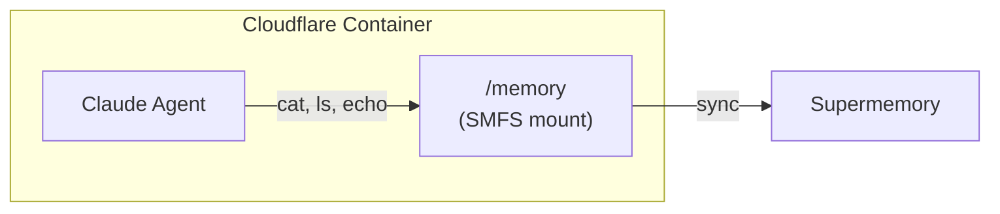
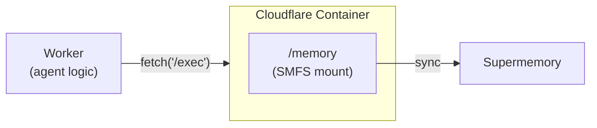

Mount a Supermemory container inside a
[Cloudflare Container](https://developers.cloudflare.com/containers/) so your
agent can read and write memory using standard filesystem commands.

## How it works

There are two ways to wire SMFS into a Cloudflare Container — pick the one that
fits your architecture.

### Agent inside the container

The agent process runs inside the container with direct access to the SMFS
mount. The entrypoint sets up the mount and starts the agent.



### Agent outside the container

The agent runs in a Cloudflare Worker and sends commands to the container over
HTTP. The container exposes a simple exec endpoint.



## Prerequisites

- A [Supermemory API key](https://supermemory.ai)
- An [Anthropic API key](https://console.anthropic.com)
- A [Cloudflare account](https://dash.cloudflare.com) with Containers enabled
- [Wrangler CLI](https://developers.cloudflare.com/workers/wrangler/install-and-update/)

---

## Pattern A: Agent inside the container

SMFS and the Claude Agent SDK are baked into the container image. On startup,
the entrypoint mounts memory and runs the agent.

### Dockerfile

```dockerfile Dockerfile
FROM python:3.12-slim

RUN apt-get update && apt-get install -y fuse3 curl bash && rm -rf /var/lib/apt/lists/*
RUN echo 'user_allow_other' >> /etc/fuse.conf

RUN curl -fsSL https://smfs.ai/install | bash -s -- 0.0.1-rc2
ENV PATH="/root/.local/bin:$PATH"
RUN pip install claude-agent-sdk

COPY agent.py /app/agent.py
COPY entrypoint.sh /entrypoint.sh
RUN chmod +x /entrypoint.sh

ENTRYPOINT ["/entrypoint.sh"]
```

### Entrypoint

```bash entrypoint.sh
#!/bin/bash
set -e

smfs login --key "$SUPERMEMORY_API_KEY"
smfs mount my_agent --ephemeral --path /memory --foreground &
sleep 3

exec python3 /app/agent.py
```

### Agent code

```python agent.py
import asyncio
from claude_agent_sdk import query, ClaudeAgentOptions

MEMORY = "/memory"

async def main():
    async for message in query(
        prompt=f"You have a persistent memory filesystem at {MEMORY}. "
               "Read profile.md to learn about the user, then create "
               "session_notes.md summarizing what you found.",
        options=ClaudeAgentOptions(
            allowed_tools=["Bash", "Read", "Write"],
            cwd=MEMORY,
        ),
    ):
        print(message)

asyncio.run(main())
```

### Deploy

```toml wrangler.toml
name = "memory-agent"
main = "worker.ts"

[[containers]]
class_name = "MY_CONTAINER"
image = "./Dockerfile"
max_instances = 5
```

```bash
wrangler secret put SUPERMEMORY_API_KEY
wrangler secret put ANTHROPIC_API_KEY
wrangler deploy
```

---

## Pattern B: Agent outside the container

The agent logic lives in a Worker. The container just runs SMFS and exposes an
HTTP endpoint for executing commands against the mount.

### Container (exec server)

```dockerfile Dockerfile
FROM python:3.12-slim

RUN apt-get update && apt-get install -y fuse3 curl bash && rm -rf /var/lib/apt/lists/*
RUN echo 'user_allow_other' >> /etc/fuse.conf

RUN curl -fsSL https://smfs.ai/install | bash -s -- 0.0.1-rc2
ENV PATH="/root/.local/bin:$PATH"
RUN pip install flask

COPY server.py /app/server.py
COPY entrypoint.sh /entrypoint.sh
RUN chmod +x /entrypoint.sh

ENTRYPOINT ["/entrypoint.sh"]
```

```bash entrypoint.sh
#!/bin/bash
set -e

smfs login --key "$SUPERMEMORY_API_KEY"
smfs mount my_agent --ephemeral --path /memory --foreground &
sleep 3

exec python3 /app/server.py
```

```python server.py
import subprocess
from flask import Flask, request, jsonify

app = Flask(__name__)

@app.route("/exec", methods=["POST"])
def exec_command():
    cmd = request.json["command"]
    result = subprocess.run(
        cmd, shell=True, capture_output=True, text=True, cwd="/memory", timeout=10
    )
    return jsonify(stdout=result.stdout, stderr=result.stderr, code=result.returncode)

app.run(host="0.0.0.0", port=8080)
```

### Worker (agent logic)

```typescript worker.ts
export default {
  async fetch(request: Request, env: any) {
    const container = await env.MY_CONTAINER.start();

    const profile = await container
      .fetch("/exec", {
        method: "POST",
        body: JSON.stringify({ command: "cat /memory/profile.md" }),
        headers: { "Content-Type": "application/json" },
      })
      .then((r: Response) => r.json());

    return Response.json({ profile: profile.stdout });
  },
};
```

---

## Tips

- Use `--ephemeral` for container mounts — keeps the cache in memory only, but
  writes still push to Supermemory
- Use `smfs grep 'query'` for semantic search across all files
