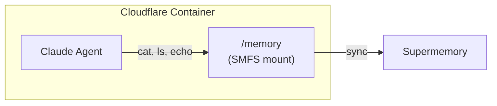
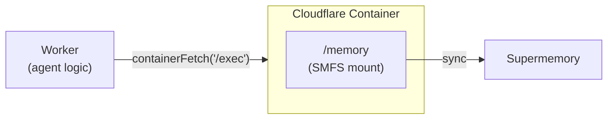

Mount a Supermemory container inside a
[Cloudflare Container](https://developers.cloudflare.com/containers/) so your
agent can read and write memory using standard filesystem commands.

## How it works

There are two ways to wire SMFS into a Cloudflare Container — pick the one that
fits your architecture.

### Agent inside the container

The agent process runs inside the container with direct access to the SMFS
mount. The entrypoint sets up the mount and starts the agent.



### Agent outside the container

The agent runs in a Cloudflare Worker and sends commands to the container over
HTTP. The container exposes a simple exec endpoint.



## Prerequisites

- A [Supermemory API key](https://supermemory.ai)
- An [Anthropic API key](https://console.anthropic.com)
- A [Cloudflare account](https://dash.cloudflare.com) with Containers enabled (Workers Paid plan)
- [Wrangler CLI](https://developers.cloudflare.com/workers/wrangler/install-and-update/)
- The [`@cloudflare/containers`](https://www.npmjs.com/package/@cloudflare/containers) package: `npm install @cloudflare/containers`

<Note>
  Cloudflare Containers are implemented as container-enabled Durable Objects.
  You declare a `Container` subclass, bind it as a Durable Object, and
  reference its image in the `containers` array. Worker secrets are **not**
  automatically visible inside the container — you have to pass them through
  `envVars` when starting the container (see below).
</Note>

---

## Pattern A: Agent inside the container

SMFS and the Claude Agent SDK are baked into the container image. On startup,
the entrypoint mounts memory and runs the agent.

### Dockerfile

```dockerfile Dockerfile
FROM python:3.12-slim

RUN apt-get update && apt-get install -y fuse3 curl bash && rm -rf /var/lib/apt/lists/*
RUN echo 'user_allow_other' >> /etc/fuse.conf

RUN curl -fsSL https://smfs.ai/install | bash -s -- 0.0.1-rc2
ENV PATH="/root/.local/bin:$PATH"
RUN pip install claude-agent-sdk

COPY agent.py /app/agent.py
COPY entrypoint.sh /entrypoint.sh
RUN chmod +x /entrypoint.sh

ENTRYPOINT ["/entrypoint.sh"]
```

### Entrypoint

```bash entrypoint.sh
#!/bin/bash
set -e

smfs login --key "$SUPERMEMORY_API_KEY"
smfs mount my_agent --ephemeral --path /memory --foreground &
sleep 3

exec python3 /app/agent.py
```

### Agent code

```python agent.py
import asyncio
from claude_agent_sdk import query, ClaudeAgentOptions

MEMORY = "/memory"

async def main():
    async for message in query(
        prompt=f"You have a persistent memory filesystem at {MEMORY}. "
               "Read profile.md to learn about the user, then create "
               "session_notes.md summarizing what you found.",
        options=ClaudeAgentOptions(
            allowed_tools=["Bash", "Read", "Write"],
            cwd=MEMORY,
        ),
    ):
        print(message)

asyncio.run(main())
```

### Worker

The Worker defines the `Container` subclass and forwards Worker secrets into
the container via `envVars`:

```typescript worker.ts
import { Container, getContainer } from "@cloudflare/containers";

export class MyAgentContainer extends Container {
  defaultPort = 8080;
  // Forward Worker secrets into the container at start time.
  // `this.env` is the Worker env object, populated from wrangler secrets.
  envVars = {
    SUPERMEMORY_API_KEY: this.env.SUPERMEMORY_API_KEY,
    ANTHROPIC_API_KEY: this.env.ANTHROPIC_API_KEY,
  };
}

export default {
  async fetch(request: Request, env: Env) {
    // The container runs the agent and exits; this Worker route just kicks
    // it off (e.g. on a queue message or scheduled trigger).
    const container = getContainer(env.MY_CONTAINER, "agent-singleton");
    return container.fetch(request);
  },
};

interface Env {
  MY_CONTAINER: DurableObjectNamespace<MyAgentContainer>;
  SUPERMEMORY_API_KEY: string;
  ANTHROPIC_API_KEY: string;
}
```

### Config

```jsonc wrangler.jsonc
{
  "name": "memory-agent",
  "main": "worker.ts",
  "compatibility_date": "2025-04-03",
  "containers": [
    {
      "class_name": "MyAgentContainer",
      "image": "./Dockerfile",
      "max_instances": 5
    }
  ],
  "durable_objects": {
    "bindings": [
      { "name": "MY_CONTAINER", "class_name": "MyAgentContainer" }
    ]
  },
  "migrations": [
    { "tag": "v1", "new_sqlite_classes": ["MyAgentContainer"] }
  ]
}
```

```bash
wrangler secret put SUPERMEMORY_API_KEY
wrangler secret put ANTHROPIC_API_KEY
wrangler deploy
```

---

## Pattern B: Agent outside the container

The agent logic lives in a Worker. The container just runs SMFS and exposes an
HTTP endpoint for executing commands against the mount.

<Warning>
  The `/exec` endpoint below runs arbitrary shell commands inside the
  container. **Only call it from your Worker** — never expose it publicly,
  and never pass user input straight into `command` without validation.
  Cloudflare Containers are addressable only through their Worker by default,
  so this is safe as long as you don't add a public route that proxies to
  `/exec`.
</Warning>

### Container (exec server)

The Dockerfile and entrypoint are nearly identical to Pattern A — the only
differences are the Python deps (`flask` instead of `claude-agent-sdk`) and
the file we exec at the end.

```dockerfile Dockerfile
FROM python:3.12-slim

RUN apt-get update && apt-get install -y fuse3 curl bash && rm -rf /var/lib/apt/lists/*
RUN echo 'user_allow_other' >> /etc/fuse.conf

RUN curl -fsSL https://smfs.ai/install | bash -s -- 0.0.1-rc2
ENV PATH="/root/.local/bin:$PATH"
RUN pip install flask gunicorn

COPY server.py /app/server.py
COPY entrypoint.sh /entrypoint.sh
RUN chmod +x /entrypoint.sh

ENTRYPOINT ["/entrypoint.sh"]
```

The entrypoint differs from Pattern A only in the final `exec` line — we run
gunicorn against the Flask app instead of `python3 agent.py`:

```bash entrypoint.sh
#!/bin/bash
set -e

smfs login --key "$SUPERMEMORY_API_KEY"
smfs mount my_agent --ephemeral --path /memory --foreground &
sleep 3

exec gunicorn -b 0.0.0.0:8080 --chdir /app server:app
```

```python server.py
import subprocess
from flask import Flask, request, jsonify

app = Flask(__name__)

@app.route("/exec", methods=["POST"])
def exec_command():
    cmd = request.json["command"]
    result = subprocess.run(
        cmd, shell=True, capture_output=True, text=True, cwd="/memory", timeout=10
    )
    return jsonify(stdout=result.stdout, stderr=result.stderr, code=result.returncode)
```

<Note>
  We use gunicorn instead of `app.run(...)` because Flask's built-in dev
  server isn't meant for production traffic. If you'd rather just see it
  work, you can replace the `exec` line with
  `exec python3 /app/server.py` and add `app.run(host="0.0.0.0", port=8080)`
  to `server.py` — but switch back to gunicorn before you ship.
</Note>

### Worker (agent logic)

```typescript worker.ts
import { Container, getContainer } from "@cloudflare/containers";

export class ExecContainer extends Container {
  defaultPort = 8080;
  envVars = {
    SUPERMEMORY_API_KEY: this.env.SUPERMEMORY_API_KEY,
  };
}

export default {
  async fetch(_request: Request, env: Env) {
    const container = getContainer(env.MY_CONTAINER, "agent-singleton");

    const profile = await container
      .fetch(new Request("http://container/exec", {
        method: "POST",
        body: JSON.stringify({ command: "cat /memory/profile.md" }),
        headers: { "Content-Type": "application/json" },
      }))
      .then((r) => r.json<{ stdout: string }>());

    return Response.json({ profile: profile.stdout });
  },
};

interface Env {
  MY_CONTAINER: DurableObjectNamespace<ExecContainer>;
  SUPERMEMORY_API_KEY: string;
}
```

### Config

```jsonc wrangler.jsonc
{
  "name": "memory-exec",
  "main": "worker.ts",
  "compatibility_date": "2025-04-03",
  "containers": [
    {
      "class_name": "ExecContainer",
      "image": "./Dockerfile",
      "max_instances": 5
    }
  ],
  "durable_objects": {
    "bindings": [
      { "name": "MY_CONTAINER", "class_name": "ExecContainer" }
    ]
  },
  "migrations": [
    { "tag": "v1", "new_sqlite_classes": ["ExecContainer"] }
  ]
}
```

```bash
wrangler secret put SUPERMEMORY_API_KEY
wrangler deploy
```

---

## Tips

- Use `--ephemeral` for container mounts — keeps the cache in memory only, but
  writes still push to Supermemory
- Use `smfs grep 'query'` for semantic search across all files
- Worker secrets aren't automatically visible inside the container. Pass each
  one through the `envVars` field on your `Container` subclass (see the Worker
  snippets above)
- Use `containerFetch` from within a Container class method (e.g., lifecycle
  hooks) to call the container's own HTTP server. From the Worker, use the
  stub's `.fetch()` method instead
