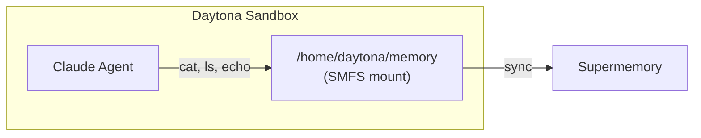
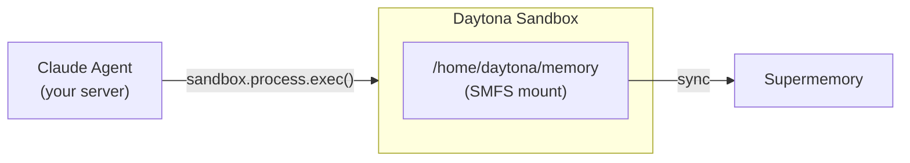

Mount a Supermemory container inside a [Daytona](https://daytona.io) sandbox so
your agent can read and write memory using standard filesystem commands.

<Warning>
  Daytona sandboxes currently cannot reach `api.supermemory.ai` due to network
  restrictions from their datacenter IPs. The SMFS binary installs and the FUSE
  mount starts, but it cannot sync data. We're working with Daytona to resolve
  this. In the meantime, use [E2B](/smfs/providers/e2b) or a
  [local mount](/smfs/providers/vercel) instead.
</Warning>

## How it works

There are two ways to wire SMFS into a Daytona sandbox — pick the one that fits
your architecture.

### Agent inside the sandbox

The agent process runs inside the sandbox and accesses the SMFS mount directly.



### Agent outside the sandbox

The agent runs in your orchestrating code and executes commands inside the
sandbox remotely.



## Prerequisites

- A [Supermemory API key](https://supermemory.ai)
- A [Daytona API key](https://app.daytona.io) — go to **API Keys** in the sidebar
- An [Anthropic API key](https://console.anthropic.com)

---

## Pattern A: Agent inside the sandbox

### Agent code

```python agent.py
import asyncio
from claude_agent_sdk import query, ClaudeAgentOptions

MEMORY = "/home/daytona/memory"

async def main():
    async for message in query(
        prompt=f"You have a persistent memory filesystem at {MEMORY}. "
               "Read profile.md to learn about the user, then create "
               "session_notes.md summarizing what you found.",
        options=ClaudeAgentOptions(
            allowed_tools=["Bash", "Read", "Write"],
            cwd=MEMORY,
        ),
    ):
        print(message)

asyncio.run(main())
```

### Orchestration

<Tabs>
  <Tab title="Python">
    ```python run.py
    import os
    from daytona_sdk import Daytona, DaytonaConfig

    daytona = Daytona(DaytonaConfig(
        api_key=os.environ["DAYTONA_API_KEY"],
    ))
    sandbox = daytona.create(
        env_vars={
            "SUPERMEMORY_API_KEY": os.environ["SUPERMEMORY_API_KEY"],
            "ANTHROPIC_API_KEY": os.environ["ANTHROPIC_API_KEY"],
        },
    )

    # Install SMFS (from GitHub releases — smfs.ai is unreachable from Daytona)
    sandbox.process.exec(
        "mkdir -p $HOME/.local/bin && "
        "curl -sL https://github.com/supermemoryai/smfs/releases/download/"
        "v0.0.1-rc2/smfs-linux-x64 -o $HOME/.local/bin/smfs && "
        "chmod +x $HOME/.local/bin/smfs"
    )

    # Fix FUSE config and install agent SDK
    sandbox.process.exec(
        "echo 'user_allow_other' | sudo tee -a /etc/fuse.conf > /dev/null"
    )
    sandbox.process.exec("pip install claude-agent-sdk")

    # Mount memory
    sandbox.process.exec("$HOME/.local/bin/smfs login --key $SUPERMEMORY_API_KEY")
    sandbox.process.exec(
        "bash -c '$HOME/.local/bin/smfs mount my_agent --ephemeral"
        " --path /home/daytona/memory --foreground &' && sleep 3"
    )

    # Run the agent
    result = sandbox.process.exec("python3 agent.py")
    print(result.result)

    daytona.delete(sandbox)
    ```
  </Tab>
  <Tab title="TypeScript">
    ```typescript run.ts
    import { Daytona } from "@daytonaio/sdk";

    const daytona = new Daytona({
      apiKey: process.env.DAYTONA_API_KEY!,
    });
    const sandbox = await daytona.create({
      envVars: {
        SUPERMEMORY_API_KEY: process.env.SUPERMEMORY_API_KEY!,
        ANTHROPIC_API_KEY: process.env.ANTHROPIC_API_KEY!,
      },
    });

    // Install SMFS (from GitHub releases — smfs.ai is unreachable from Daytona)
    await sandbox.process.exec(
      "mkdir -p $HOME/.local/bin && " +
      "curl -sL https://github.com/supermemoryai/smfs/releases/download/" +
      "v0.0.1-rc2/smfs-linux-x64 -o $HOME/.local/bin/smfs && " +
      "chmod +x $HOME/.local/bin/smfs"
    );

    // Fix FUSE config and install agent SDK
    await sandbox.process.exec(
      "echo 'user_allow_other' | sudo tee -a /etc/fuse.conf > /dev/null"
    );
    await sandbox.process.exec("pip install claude-agent-sdk");

    // Mount memory
    await sandbox.process.exec(
      "$HOME/.local/bin/smfs login --key $SUPERMEMORY_API_KEY"
    );
    await sandbox.process.exec(
      "bash -c '$HOME/.local/bin/smfs mount my_agent --ephemeral " +
      "--path /home/daytona/memory --foreground &' && sleep 3"
    );

    // Upload and run the agent
    const result = await sandbox.process.exec("python3 agent.py");
    console.log(result.result);

    await daytona.delete(sandbox);
    ```
  </Tab>
</Tabs>

---

## Pattern B: Agent outside the sandbox

The agent runs in your server process and executes commands inside the sandbox
remotely via `sandbox.process.exec()`.

<Tabs>
  <Tab title="Python">
    ```python run.py
    import os
    from daytona_sdk import Daytona, DaytonaConfig

    daytona = Daytona(DaytonaConfig(
        api_key=os.environ["DAYTONA_API_KEY"],
    ))
    sandbox = daytona.create(
        env_vars={
            "SUPERMEMORY_API_KEY": os.environ["SUPERMEMORY_API_KEY"],
        },
    )

    # Install and mount SMFS
    sandbox.process.exec(
        "mkdir -p $HOME/.local/bin && "
        "curl -sL https://github.com/supermemoryai/smfs/releases/download/"
        "v0.0.1-rc2/smfs-linux-x64 -o $HOME/.local/bin/smfs && "
        "chmod +x $HOME/.local/bin/smfs"
    )
    sandbox.process.exec(
        "echo 'user_allow_other' | sudo tee -a /etc/fuse.conf > /dev/null"
    )
    sandbox.process.exec("$HOME/.local/bin/smfs login --key $SUPERMEMORY_API_KEY")
    sandbox.process.exec(
        "bash -c '$HOME/.local/bin/smfs mount my_agent --ephemeral"
        " --path /home/daytona/memory --foreground &' && sleep 3"
    )

    # Agent runs here — executes commands in the sandbox
    profile = sandbox.process.exec("cat /home/daytona/memory/profile.md")
    print("Profile:", profile.result)

    sandbox.process.exec(
        "bash -c 'echo \"Session started at $(date)\" > /home/daytona/memory/session_notes.md'"
    )

    files = sandbox.process.exec("ls /home/daytona/memory")
    print("Files:", files.result)

    daytona.delete(sandbox)
    ```
  </Tab>
  <Tab title="TypeScript">
    ```typescript run.ts
    import { Daytona } from "@daytonaio/sdk";

    const daytona = new Daytona({
      apiKey: process.env.DAYTONA_API_KEY!,
    });
    const sandbox = await daytona.create({
      envVars: {
        SUPERMEMORY_API_KEY: process.env.SUPERMEMORY_API_KEY!,
      },
    });

    // Install and mount SMFS
    await sandbox.process.exec(
      "mkdir -p $HOME/.local/bin && " +
      "curl -sL https://github.com/supermemoryai/smfs/releases/download/" +
      "v0.0.1-rc2/smfs-linux-x64 -o $HOME/.local/bin/smfs && " +
      "chmod +x $HOME/.local/bin/smfs"
    );
    await sandbox.process.exec(
      "echo 'user_allow_other' | sudo tee -a /etc/fuse.conf > /dev/null"
    );
    await sandbox.process.exec(
      "$HOME/.local/bin/smfs login --key $SUPERMEMORY_API_KEY"
    );
    await sandbox.process.exec(
      "bash -c '$HOME/.local/bin/smfs mount my_agent --ephemeral " +
      "--path /home/daytona/memory --foreground &' && sleep 3"
    );

    // Agent runs here — executes commands in the sandbox
    const profile = await sandbox.process.exec("cat /home/daytona/memory/profile.md");
    console.log("Profile:", profile.result);

    await sandbox.process.exec(
      `bash -c 'echo "Session started at $(date)" > /home/daytona/memory/session_notes.md'`
    );

    const files = await sandbox.process.exec("ls /home/daytona/memory");
    console.log("Files:", files.result);

    await daytona.delete(sandbox);
    ```
  </Tab>
</Tabs>

---

## Tips

- FUSE is available in Daytona sandboxes but `user_allow_other` needs to be
  added to `/etc/fuse.conf`
- The binary installs to `~/.local/bin/` which isn't on PATH by default in
  Daytona's zsh — use the full path or `export PATH=$HOME/.local/bin:$PATH`
- Use `pip install claude-agent-sdk` to install the agent SDK (PyPI is reachable)

<Note>
  Daytona sandboxes can't reach `smfs.ai`, so the install downloads the binary
  directly from GitHub releases. The SMFS binary and Claude Agent SDK both
  install successfully — only the Supermemory API connection is blocked.
</Note>
