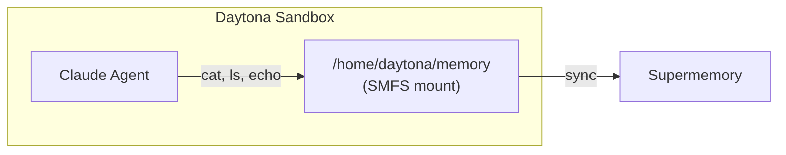
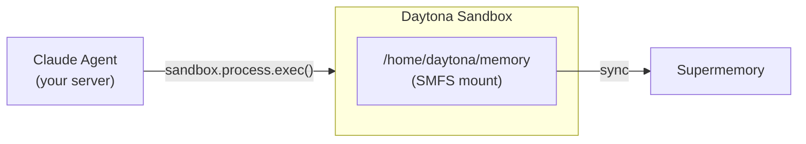

Mount a Supermemory container inside a [Daytona](https://daytona.io) sandbox so
your agent can read and write memory using standard filesystem commands.

<Warning>
  Daytona sandboxes currently cannot reach `api.supermemory.ai` from their
  datacenter IPs. The SMFS binary still installs (we download it directly from
  GitHub Releases), the FUSE mount still starts, and `pip install
  claude-agent-sdk` still works — but the runtime sync to Supermemory fails. We're
  working with Daytona to resolve this. In the meantime, use
  [E2B](/smfs/providers/e2b) or a [self-hosted mount](/smfs/providers/vercel).
</Warning>

## How it works

There are two ways to wire SMFS into a Daytona sandbox — pick the one that fits
your architecture.

### Agent inside the sandbox

The agent process runs inside the sandbox and accesses the SMFS mount directly.



### Agent outside the sandbox

The agent runs in your orchestrating code and executes commands inside the
sandbox remotely.



## Prerequisites

- A [Supermemory API key](https://supermemory.ai)
- A [Daytona API key](https://app.daytona.io) — go to **API Keys** in the sidebar
- An [Anthropic API key](https://console.anthropic.com)

---

## Install SMFS in a Daytona sandbox

Both patterns below run the same setup snippet inside the sandbox before
mounting. Daytona can't reach `smfs.ai`, so we download the binary directly
from GitHub Releases and add `~/.local/bin` to PATH.

<Tabs>
  <Tab title="Python">
    ```python
    SMFS_INSTALL = (
        "mkdir -p $HOME/.local/bin && "
        "curl -sL https://github.com/supermemoryai/smfs/releases/download/"
        "v0.0.1-rc2/smfs-linux-x64 -o $HOME/.local/bin/smfs && "
        "chmod +x $HOME/.local/bin/smfs && "
        "echo 'user_allow_other' | sudo tee -a /etc/fuse.conf > /dev/null && "
        "pip install claude-agent-sdk"
    )
    ```
  </Tab>
  <Tab title="TypeScript">
    ```typescript
    const SMFS_INSTALL =
      "mkdir -p $HOME/.local/bin && " +
      "curl -sL https://github.com/supermemoryai/smfs/releases/download/" +
      "v0.0.1-rc2/smfs-linux-x64 -o $HOME/.local/bin/smfs && " +
      "chmod +x $HOME/.local/bin/smfs && " +
      "echo 'user_allow_other' | sudo tee -a /etc/fuse.conf > /dev/null && " +
      "pip install claude-agent-sdk";
    ```
  </Tab>
</Tabs>

---

## Pattern A: Agent inside the sandbox

### Agent code

```python agent.py
import asyncio
from claude_agent_sdk import query, ClaudeAgentOptions

MEMORY = "/home/daytona/memory"

async def main():
    async for message in query(
        prompt=f"You have a persistent memory filesystem at {MEMORY}. "
               "Read profile.md to learn about the user, then create "
               "session_notes.md summarizing what you found.",
        options=ClaudeAgentOptions(
            allowed_tools=["Bash", "Read", "Write"],
            cwd=MEMORY,
        ),
    ):
        print(message)

asyncio.run(main())
```

### Orchestration

<Tabs>
  <Tab title="Python">
    ```python run.py
    import os
    from pathlib import Path
    from daytona_sdk import Daytona, DaytonaConfig

    daytona = Daytona(DaytonaConfig(
        api_key=os.environ["DAYTONA_API_KEY"],
    ))
    sandbox = daytona.create(
        env_vars={
            "SUPERMEMORY_API_KEY": os.environ["SUPERMEMORY_API_KEY"],
            "ANTHROPIC_API_KEY": os.environ["ANTHROPIC_API_KEY"],
        },
    )

    # See "Install SMFS in a Daytona sandbox" above
    sandbox.process.exec(SMFS_INSTALL)

    # Mount memory
    sandbox.process.exec("$HOME/.local/bin/smfs login --key $SUPERMEMORY_API_KEY")
    sandbox.process.exec(
        "bash -c '$HOME/.local/bin/smfs mount my_agent --ephemeral"
        " --path /home/daytona/memory --foreground &' && sleep 3"
    )

    # Upload and run the agent
    sandbox.fs.upload_file(Path("agent.py").read_bytes(), "agent.py")
    result = sandbox.process.exec("python3 agent.py")
    print(result.result)

    daytona.delete(sandbox)
    ```
  </Tab>
  <Tab title="TypeScript">
    ```typescript run.ts
    import { Daytona } from "@daytonaio/sdk";
    import { readFileSync } from "fs";

    const daytona = new Daytona({
      apiKey: process.env.DAYTONA_API_KEY!,
    });
    const sandbox = await daytona.create({
      envVars: {
        SUPERMEMORY_API_KEY: process.env.SUPERMEMORY_API_KEY!,
        ANTHROPIC_API_KEY: process.env.ANTHROPIC_API_KEY!,
      },
    });

    // See "Install SMFS in a Daytona sandbox" above
    await sandbox.process.exec(SMFS_INSTALL);

    // Mount memory
    await sandbox.process.exec(
      "$HOME/.local/bin/smfs login --key $SUPERMEMORY_API_KEY"
    );
    await sandbox.process.exec(
      "bash -c '$HOME/.local/bin/smfs mount my_agent --ephemeral " +
      "--path /home/daytona/memory --foreground &' && sleep 3"
    );

    // Upload and run the agent
    await sandbox.fs.uploadFile(readFileSync("agent.py"), "agent.py");
    const result = await sandbox.process.exec("python3 agent.py");
    console.log(result.result);

    await daytona.delete(sandbox);
    ```
  </Tab>
</Tabs>

---

## Pattern B: Agent outside the sandbox

The agent runs in your server process and executes commands inside the sandbox
remotely via `sandbox.process.exec()`.

<Tabs>
  <Tab title="Python">
    ```python run.py
    import os
    from daytona_sdk import Daytona, DaytonaConfig

    daytona = Daytona(DaytonaConfig(
        api_key=os.environ["DAYTONA_API_KEY"],
    ))
    sandbox = daytona.create(
        env_vars={
            "SUPERMEMORY_API_KEY": os.environ["SUPERMEMORY_API_KEY"],
        },
    )

    # See "Install SMFS in a Daytona sandbox" above
    sandbox.process.exec(SMFS_INSTALL)
    sandbox.process.exec("$HOME/.local/bin/smfs login --key $SUPERMEMORY_API_KEY")
    sandbox.process.exec(
        "bash -c '$HOME/.local/bin/smfs mount my_agent --ephemeral"
        " --path /home/daytona/memory --foreground &' && sleep 3"
    )

    # Agent runs here — executes commands in the sandbox
    profile = sandbox.process.exec("cat /home/daytona/memory/profile.md")
    print("Profile:", profile.result)

    sandbox.process.exec(
        "bash -c 'echo \"Session started at $(date)\" > /home/daytona/memory/session_notes.md'"
    )

    files = sandbox.process.exec("ls /home/daytona/memory")
    print("Files:", files.result)

    daytona.delete(sandbox)
    ```
  </Tab>
  <Tab title="TypeScript">
    ```typescript run.ts
    import { Daytona } from "@daytonaio/sdk";

    const daytona = new Daytona({
      apiKey: process.env.DAYTONA_API_KEY!,
    });
    const sandbox = await daytona.create({
      envVars: {
        SUPERMEMORY_API_KEY: process.env.SUPERMEMORY_API_KEY!,
      },
    });

    // See "Install SMFS in a Daytona sandbox" above
    await sandbox.process.exec(SMFS_INSTALL);
    await sandbox.process.exec(
      "$HOME/.local/bin/smfs login --key $SUPERMEMORY_API_KEY"
    );
    await sandbox.process.exec(
      "bash -c '$HOME/.local/bin/smfs mount my_agent --ephemeral " +
      "--path /home/daytona/memory --foreground &' && sleep 3"
    );

    // Agent runs here — executes commands in the sandbox
    const profile = await sandbox.process.exec("cat /home/daytona/memory/profile.md");
    console.log("Profile:", profile.result);

    await sandbox.process.exec(
      `bash -c 'echo "Session started at $(date)" > /home/daytona/memory/session_notes.md'`
    );

    const files = await sandbox.process.exec("ls /home/daytona/memory");
    console.log("Files:", files.result);

    await daytona.delete(sandbox);
    ```
  </Tab>
</Tabs>

---

## Tips

- FUSE is available in Daytona sandboxes but `user_allow_other` needs to be
  added to `/etc/fuse.conf`
- We invoke SMFS as `$HOME/.local/bin/smfs` in the examples because Daytona's
  default zsh PATH doesn't include `~/.local/bin`. Alternatively, prepend it
  once with `export PATH=$HOME/.local/bin:$PATH`
- Use `pip install claude-agent-sdk` to install the agent SDK (PyPI is reachable)
