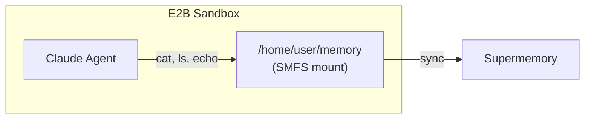
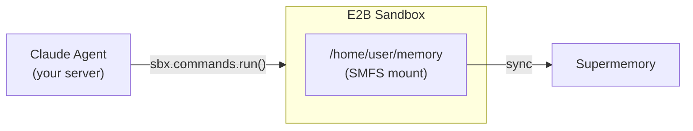

Mount a Supermemory container inside an [E2B](https://e2b.dev) sandbox so your
agent can read and write memory using standard filesystem commands.

## How it works

There are two ways to wire SMFS into an E2B sandbox — pick the one that fits
your architecture.

### Agent inside the sandbox

The agent process runs inside the sandbox and accesses the SMFS mount directly.
Your orchestrating code just boots the sandbox and kicks off the agent.



### Agent outside the sandbox

The agent runs in your orchestrating code and executes commands inside the
sandbox remotely. Useful when you want to keep the agent loop in your own
infra.



## Prerequisites

- A [Supermemory API key](https://supermemory.ai)
- An [E2B API key](https://e2b.dev)
- An [Anthropic API key](https://console.anthropic.com)

## 1. Create a custom template

Bake SMFS and the Claude Agent SDK into a template so sandboxes start ready:

```dockerfile e2b.Dockerfile
FROM e2b/code-interpreter:latest

RUN apt-get update && apt-get install -y fuse3 && rm -rf /var/lib/apt/lists/*
RUN echo 'user_allow_other' >> /etc/fuse.conf
RUN curl -fsSL https://smfs.ai/install | bash -s -- 0.0.1-rc2
ENV PATH="/root/.local/bin:$PATH"
RUN pip install claude-agent-sdk
```

```bash
e2b template build -d e2b.Dockerfile
```

---

## Pattern A: Agent inside the sandbox

The agent runs inside the sandbox as a Python script. Your orchestrating code
just sets up the mount and starts it.

### Agent code

```python agent.py
import asyncio
from claude_agent_sdk import query, ClaudeAgentOptions

MEMORY = "/home/user/memory"

async def main():
    async for message in query(
        prompt=f"You have a persistent memory filesystem at {MEMORY}. "
               "Read profile.md to learn about the user, then create "
               "session_notes.md summarizing what you found.",
        options=ClaudeAgentOptions(
            allowed_tools=["Bash", "Read", "Write"],
            cwd=MEMORY,
        ),
    ):
        print(message)

asyncio.run(main())
```

### Orchestration

<Tabs>
  <Tab title="Python">
    ```python run.py
    import os
    from pathlib import Path
    from e2b_code_interpreter import Sandbox

    sbx = Sandbox.create(
        template="your-template-id",
        timeout=300,
        envs={
            "SUPERMEMORY_API_KEY": os.environ["SUPERMEMORY_API_KEY"],
            "ANTHROPIC_API_KEY": os.environ["ANTHROPIC_API_KEY"],
        },
    )

    # /dev/fuse exists in E2B but is root-only by default. chmod once per sandbox.
    sbx.commands.run("sudo chmod 666 /dev/fuse")

    # Mount memory. We background the foreground daemon so this command returns,
    # then sleep briefly to let the FUSE mount come up before the agent reads it.
    sbx.commands.run("smfs login --key $SUPERMEMORY_API_KEY")
    sbx.commands.run(
        "bash -c 'smfs mount my_agent --ephemeral"
        " --path /home/user/memory --foreground &' && sleep 3"
    )

    # Upload and run the agent
    sbx.files.write("/home/user/agent.py", Path("agent.py").read_text())
    result = sbx.commands.run("python3 /home/user/agent.py", timeout=120)
    print(result.stdout)

    sbx.kill()
    ```
  </Tab>
  <Tab title="TypeScript">
    ```typescript run.ts
    import { Sandbox } from "@e2b/code-interpreter";
    import { readFileSync } from "fs";

    const sbx = await Sandbox.create({
      template: "your-template-id",
      timeoutMs: 300_000,
      envs: {
        SUPERMEMORY_API_KEY: process.env.SUPERMEMORY_API_KEY!,
        ANTHROPIC_API_KEY: process.env.ANTHROPIC_API_KEY!,
      },
    });

    // /dev/fuse exists in E2B but is root-only by default. chmod once per sandbox.
    await sbx.commands.run("sudo chmod 666 /dev/fuse");

    // Mount memory. We background the foreground daemon so this command returns,
    // then sleep briefly to let the FUSE mount come up before the agent reads it.
    await sbx.commands.run("smfs login --key $SUPERMEMORY_API_KEY");
    await sbx.commands.run(
      "bash -c 'smfs mount my_agent --ephemeral --path /home/user/memory --foreground &' && sleep 3"
    );

    // Upload and run the agent
    await sbx.files.write("/home/user/agent.py", readFileSync("agent.py", "utf-8"));
    const result = await sbx.commands.run("python3 /home/user/agent.py", {
      timeoutMs: 120_000,
    });
    console.log(result.stdout);

    await sbx.kill();
    ```
  </Tab>
</Tabs>

---

## Pattern B: Agent outside the sandbox

The agent runs in your server process and executes commands inside the sandbox
remotely via `sbx.commands.run()`. The SMFS mount lives inside the sandbox —
the agent never touches the filesystem directly.

<Note>
  The FUSE mount is owned by root inside the sandbox. When writing to it from
  outside the agent, wrap the command in `sudo bash -c '…'` so the redirect
  runs with the right permissions. You'll see this in the write examples below.
</Note>

<Tabs>
  <Tab title="Python">
    ```python run.py
    import os
    from e2b_code_interpreter import Sandbox

    sbx = Sandbox.create(
        template="your-template-id",
        timeout=300,
        envs={
            "SUPERMEMORY_API_KEY": os.environ["SUPERMEMORY_API_KEY"],
        },
    )

    # Set up SMFS inside the sandbox
    sbx.commands.run("sudo chmod 666 /dev/fuse")
    sbx.commands.run("smfs login --key $SUPERMEMORY_API_KEY")
    sbx.commands.run(
        "bash -c 'smfs mount my_agent --ephemeral"
        " --path /home/user/memory --foreground &' && sleep 3"
    )

    # Agent runs here — executes commands in the sandbox
    profile = sbx.commands.run("cat /home/user/memory/profile.md").stdout
    print("Profile:", profile)

    sbx.commands.run(
        "sudo bash -c 'echo \"Session started at $(date)\" > /home/user/memory/session_notes.md'"
    )

    files = sbx.commands.run("ls /home/user/memory").stdout
    print("Files:", files)

    sbx.kill()
    ```
  </Tab>
  <Tab title="TypeScript">
    ```typescript run.ts
    import { Sandbox } from "@e2b/code-interpreter";

    const sbx = await Sandbox.create({
      template: "your-template-id",
      timeoutMs: 300_000,
      envs: {
        SUPERMEMORY_API_KEY: process.env.SUPERMEMORY_API_KEY!,
      },
    });

    // Set up SMFS inside the sandbox
    await sbx.commands.run("sudo chmod 666 /dev/fuse");
    await sbx.commands.run("smfs login --key $SUPERMEMORY_API_KEY");
    await sbx.commands.run(
      "bash -c 'smfs mount my_agent --ephemeral --path /home/user/memory --foreground &' && sleep 3"
    );

    // Agent runs here — executes commands in the sandbox
    const profile = await sbx.commands.run("cat /home/user/memory/profile.md");
    console.log("Profile:", profile.stdout);

    await sbx.commands.run(
      `sudo bash -c 'echo "Session started at $(date)" > /home/user/memory/session_notes.md'`
    );

    const files = await sbx.commands.run("ls /home/user/memory");
    console.log("Files:", files.stdout);

    await sbx.kill();
    ```
  </Tab>
</Tabs>

---

## Tips

- Use `--ephemeral` for sandbox mounts — keeps the cache in memory only, but
  writes still push to Supermemory
- Use `smfs grep 'query'` for semantic search across all files in the container
- Without a custom template, add the install steps to your run script:
  ```python
  sbx.commands.run("curl -fsSL https://smfs.ai/install | bash -s -- 0.0.1-rc2", timeout=60)
  sbx.commands.run("pip install claude-agent-sdk", timeout=60)
  ```
