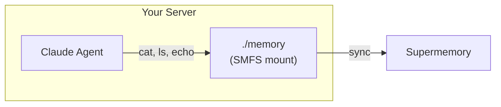
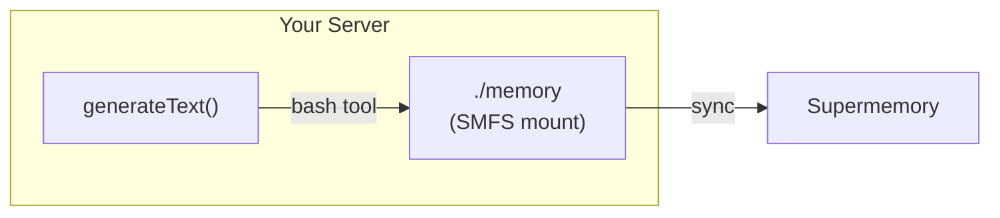

Mount a Supermemory container on your server and let a Claude agent read and
write memory using standard filesystem commands.

## How it works

There are two ways to wire SMFS into a Vercel-based agent — pick the one that
fits your architecture.

### Claude Agent SDK (agent has full filesystem access)

The agent runs as a separate process with direct access to the SMFS mount.
Best when you want the agent to have full bash, read, and write capabilities.



### Vercel AI SDK (agent uses a tool)

The agent runs inside `generateText` and accesses memory through a bash tool
you define. Best when you're building an API route and want to keep everything
in one TypeScript process.



## Prerequisites

- A [Supermemory API key](https://supermemory.ai)
- An [Anthropic API key](https://console.anthropic.com)
- SMFS installed: `curl -fsSL https://smfs.ai/install | bash`

## Mount memory

Start the mount once when your server boots — not per-request:

```bash
smfs login --key $SUPERMEMORY_API_KEY
smfs mount my_agent --path ./memory
```

---

## Pattern A: Claude Agent SDK

Write a standalone agent script. Nothing server-specific — just Python that
reads and writes files.

```python agent.py
import asyncio
from claude_agent_sdk import query, ClaudeAgentOptions

MEMORY = "./memory"

async def main():
    async for message in query(
        prompt=f"You have a persistent memory filesystem at {MEMORY}. "
               "Read profile.md to learn about the user, then create "
               "session_notes.md summarizing what you found.",
        options=ClaudeAgentOptions(
            allowed_tools=["Bash", "Read", "Write"],
            cwd=MEMORY,
        ),
    ):
        print(message)

asyncio.run(main())
```

```bash
python3 agent.py
```

---

## Pattern B: Vercel AI SDK

Expose the memory filesystem as a bash tool inside an API route. The agent
calls the tool to run commands against the mount.

```typescript api/agent.ts
import { generateText, tool } from "ai";
import { anthropic } from "@ai-sdk/anthropic";
import { z } from "zod";
import { execSync } from "child_process";

const MEMORY = "./memory";

export async function POST(req: Request) {
  const { prompt } = await req.json();

  const result = await generateText({
    model: anthropic("claude-sonnet-4-20250514"),
    tools: {
      bash: tool({
        description: `Run a bash command. Memory filesystem is at ${MEMORY}.`,
        parameters: z.object({ command: z.string() }),
        execute: async ({ command }) => {
          try {
            return execSync(command, {
              cwd: MEMORY,
              encoding: "utf-8",
              timeout: 10_000,
            });
          } catch (e: any) {
            return e.stderr || e.message;
          }
        },
      }),
    },
    maxSteps: 10,
    prompt,
  });

  return Response.json({ text: result.text });
}
```

---

## Tips

- Mount SMFS once when your server starts, not per-request
- Use `smfs grep 'query'` for semantic search across all files
- Use `--ephemeral` if you don't need a local cache on the server
