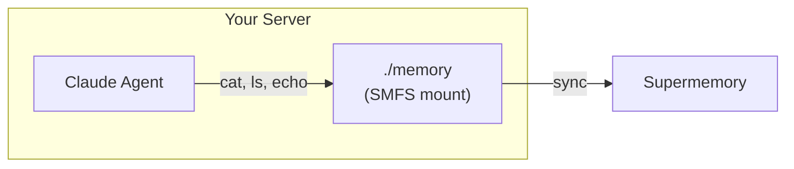
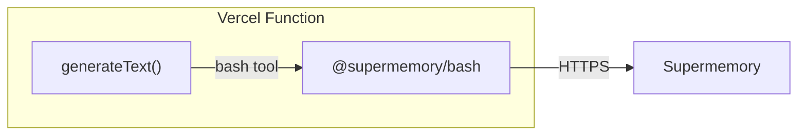

This guide is about the [Vercel AI SDK](https://ai-sdk.dev) — the TypeScript
agent framework — not Vercel hosting. The choice of pattern depends on where
your code actually runs:

- **Self-hosted Node** (your own VM, ECS, Fly.io, Railway, a Vercel Sandbox,
  etc.): you can mount SMFS as a real filesystem on the server.
- **Vercel Functions / serverless / edge**: there's no long-lived process to
  hold a FUSE mount, so use the [Bash Tool](/smfs/bash-tool)
  (`@supermemory/bash`) instead. The container becomes the filesystem; no mount
  needed.

## How it works

### Self-hosted Node (real mount)

The agent runs as a separate process with direct access to the SMFS mount.
Best when you want full bash, read, and write capabilities and your server is
long-lived.



### Vercel Functions / serverless (Bash Tool)

The agent runs inside `generateText` and accesses memory through `@supermemory/bash`,
which proxies bash commands to your Supermemory container over HTTP. No mount,
no FUSE, no long-lived process required.



## Prerequisites

- A [Supermemory API key](https://supermemory.ai)
- An [Anthropic API key](https://console.anthropic.com)
- For Pattern A only: SMFS installed on your server (`curl -fsSL https://smfs.ai/install | bash`)

---

## Pattern A: Claude Agent SDK on self-hosted Node

Use this when the Vercel AI SDK is just the orchestrator and your real workload
is a Claude agent running on a long-lived server you control.

Start the mount once when your server boots — not per-request:

```bash
smfs login --key $SUPERMEMORY_API_KEY
smfs mount my_agent --path ./memory
```

<Note>
  This won't work on Vercel Functions or any serverless runtime: there's no
  process between requests to hold the mount, and FUSE isn't available. For
  those targets, jump to Pattern B.
</Note>

Write a standalone agent script. Nothing server-specific — just Python that
reads and writes files:

```python agent.py
import asyncio
from claude_agent_sdk import query, ClaudeAgentOptions

MEMORY = "./memory"

async def main():
    async for message in query(
        prompt=f"You have a persistent memory filesystem at {MEMORY}. "
               "Read profile.md to learn about the user, then create "
               "session_notes.md summarizing what you found.",
        options=ClaudeAgentOptions(
            allowed_tools=["Bash", "Read", "Write"],
            cwd=MEMORY,
        ),
    ):
        print(message)

asyncio.run(main())
```

```bash
python3 agent.py
```

---

## Pattern B: Vercel AI SDK + Bash Tool (serverless-friendly)

`@supermemory/bash` exposes your Supermemory container as a single agent tool
— `run_bash(command)` — without mounting anything. It runs anywhere TypeScript
runs, including Vercel Functions, edge runtimes, and Lambda.

```bash
npm install @supermemory/bash ai @ai-sdk/anthropic zod
```

```typescript api/agent.ts
import { generateText, tool } from "ai";
import { anthropic } from "@ai-sdk/anthropic";
import { createBash } from "@supermemory/bash";
import { z } from "zod";

export async function POST(req: Request) {
  const { prompt } = await req.json();

  const { bash, toolDescription } = await createBash({
    apiKey: process.env.SUPERMEMORY_API_KEY!,
    containerTag: "my_agent",
  });

  const result = await generateText({
    model: anthropic("claude-sonnet-4-5"),
    tools: {
      bash: tool({
        description: toolDescription,
        inputSchema: z.object({ cmd: z.string() }),
        execute: async ({ cmd }) => bash.exec(cmd),
      }),
    },
    maxSteps: 10,
    prompt,
  });

  return Response.json({ text: result.text });
}
```

A few things worth calling out:

- **`maxSteps: 10`** lets the agent chain multiple bash calls per request
  (read `profile.md`, then `cat` a few notes, then write a summary). Bump it
  if your agent needs deeper chains; lower it to cap cost per request.
- **`toolDescription`** is a pre-written description of the available bash
  surface (semantic `sgrep`, `cat`, `ls`, redirects, etc.). Hand it straight
  to the model — don't roll your own.
- **No timeout/abort plumbing.** `bash.exec` already runs against the
  container over HTTPS, so it returns when the command returns. No event-loop
  blocking and no FUSE.

See the [Bash Tool reference](/smfs/bash-tool) for the full command surface,
memory path configuration, and other framework integrations.

---

## Tips

- **Pattern A**: mount SMFS once when your server starts, not per-request.
  Use `--ephemeral` if you don't need a local cache on the server.
- **Pattern B**: configure memory paths once at startup with
  `configureMemoryPaths(["/notes/", "/journal.md"])` to control which files
  get distilled into Supermemory memories.
- Both: use `smfs grep 'query'` (Pattern A) or `sgrep 'query'` inside the
  bash tool (Pattern B) for semantic search across all files.
